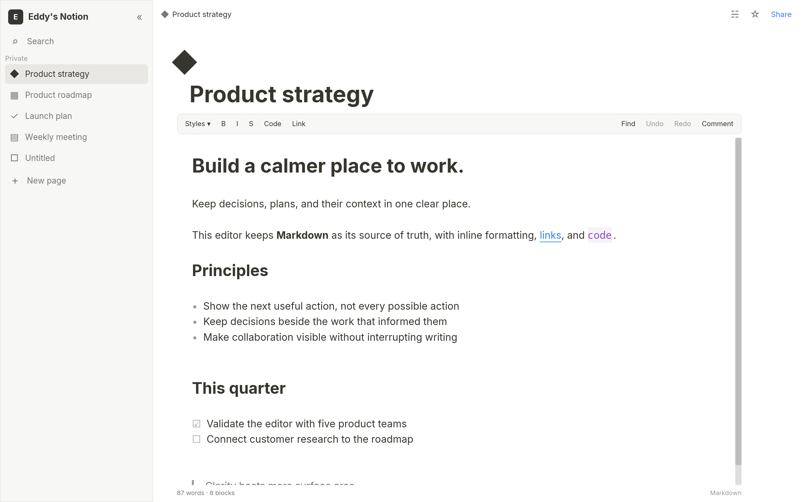

# Ice

Ice is a small, statically checked frontend language that compiles to
[iced](https://iced.rs/). Humans write the screen and interaction flow in
compact `.ice` files; Rust keeps domain rules, I/O, and custom platform code.

```text
.ice source -> parser -> semantic checker -> checked AST -> iced Rust backend
```

There is no runtime interpreter. `ui_lang::include_app!` is only the thin Cargo
adapter that includes a file and emits ordinary Rust.

Successful analysis produces a nominal `CheckedDocument`; only the checker can
construct it, and the Iced backend has no unchecked `Document` entry point.
Generated applications also declare `ui-lang-runtime = "=0.1.0"` directly
because generated Rust refers to its public crate path.

## Taste of the language

```ice
app Tasks
  title "Ice Tasks"
  window
    size 960 720
    min-size 480 360
    position centered

use "extern/backend.ice"
use "theme.ice"
use "components/panel.ice"

state
  draft = ""
  loading = false

derived
  normalized_draft = trim(draft)
  can_submit = !loading && !empty(normalized_draft)

on submit
  let title = normalized_draft
  return if !can_submit
  loading = true
  run create_task(title) -> created _ | failed _

view
  col w=fill h=fill p=24.0 gap=16.0 @bg-bg
    Panel title="Create task" #create-task
      row w=fill gap=12.0
        input "New task" #new-task <-> draft w=fill p=12.0 @bg-surface
        button "Add" disabled=!can_submit p=12.0 @bg-primary text-white -> submit
```

`use` resolves relative to the importing file. Imported declarations share the
same checked app graph. File-backed errors point to the fragment that caused
them and include the offending source line and caret. Keep typed Rust boundary
declarations in an `extern/` fragment so app and view files only need the
one-line `use`.

Use an alias when a component or design-system fragment needs an explicit
namespace:

```ice
use "ducktape-ui/default.ice" as ui

ui::Panel title="Settings"
```

Aliased components, recipes, extern functions/types, and fonts use `::`;
theme tokens intentionally remain app-global. A bare `use` continues to merge
one application fragment without qualification.

The punctuation has one job each:

- indentation is the tree;
- `@` starts checked semantic color, font-emphasis, and design-token utilities;
- `#name` is a scoped component/widget identity;
- `<->` is a two-way state or explicit `bind` component-prop binding;
- `->` routes a widget or async result to a handler;
- `_` is the payload supplied by that route.

`derived` names pure read-only expressions over app state; they are recomputed
when read and create no runtime signal graph. Handler-local `let` bindings are
immutable and scoped to that handler invocation.

Themes declare semantic names once and fill them with one or more complete
palettes. The app can select a palette from state; semantic token styles and the
generated Iced theme change together.

```ice
app Tasks
  palette active_palette

theme contract ProductTheme
  bg
  fg
  primary
  danger
  surface

palette light for ProductTheme
  bg #fdfdfb
  fg #171717
  primary #7c3aed
  danger #dc2626
  surface #ffffff

palette dark for ProductTheme
  bg #161615
  fg #f5f5f4
  primary #a78bfa
  danger #fb7185
  surface #20201e

state
  active_palette:palette[ProductTheme] = ProductTheme.light
```

Components may keep instance-scoped UI state and local handlers. A handler may
end with `run` or a widget operation scoped to its own rendered subtree;
`run latest` discards an older Future completion from the same component scope
and call site without aborting it. `run replace` aborts and replaces the prior
Future at that scope and call site, while ordinary `run` delivers every
completion. Component state is retained by default; `lifetime mounted` drops
it and any replace-task handle when the instance leaves the rendered tree.
Ordinary component props are read-only. Declare writable inputs with
`component Field(bind value:str)` and pass a direct state explicitly as
`Field value<->draft`; app state, component-local state, and another `bind`
prop are the only accepted sources.
Component props may use a closed, pure default such as
`component Panel(title:str, elevated:bool=false)`; a call omits only props that
declare defaults, and defaults cannot capture state or other parameters.
Named slots may be optional (`slot Footer?`); `provided(Footer)` conditionally
removes wrappers when the caller omits that slot. Long component or widget
metadata may move into a first-child `with` block with one checked property or
`@` utility per line.
Literal `match` arms retain first-match behavior, with `_` as an optional final
fallback:

Reusable components are closed over app handlers. Declare named events in the
component contract and route every event in the caller's scope:

```ice
component ConfirmDialog(title:str)
  emits
    confirm
    cancel
  col
    text title
    row
      button "Cancel" -> emit(cancel)
      button "Confirm" -> emit(confirm)

ConfirmDialog title="Delete page?"
  events
    confirm -> delete_page
    cancel -> close_dialog
```

Events may carry ordered typed payloads. The existing
`component Toggle(...) -> bool` plus call-site `-> changed _` form is the
intentional shorthand for one default event.

An enclosing component can forward an identically named event with the same
payload signature without restating an identity route:

```ice
PageItem page="roadmap"
  forward
    navigate
```

```ice
component Counter()
  state
    count = 0
  on increment
    count = count + 1
  col
    button "Increment" -> increment
    match count
      0
        text "Start"
      _
        text count
```

Options, results, and UI-local enums use payload patterns with exhaustive
checking. Payload names exist only inside their arm:

```ice
enum RequestState
  idle
  loading
  ready([Task])
  failed(AppError)

state
  request:RequestState = RequestState.idle

view
  col
    match request
      RequestState.idle
        button "Load" -> load
      RequestState.loading
        text "Loading…"
      RequestState.ready(tasks)
        TaskList tasks=tasks
      RequestState.failed(error)
        ErrorPanel message=error.message
```

`some(value)`/`none` and `ok(value)`/`err(error)` use the same exhaustive arm
rules. `_` is allowed as the final catch-all. UI enums are non-generic and
non-recursive, and payloads must be ordinary cloneable Ice data. Fieldless UI
enums also support `==` and `!=`; payload-carrying enums use exhaustive
`match` instead of comparison.

Native interaction styles inherit their `active` fields, so hovered, pressed,
focused, opened, dragged, and disabled blocks only declare their differences.

Semantic recipes can use the fixed four-pixel spacing scale or exact logical
pixels. Exact utilities carry a `px` suffix, for example `px-16px`,
`py-11px`, `rounded-9px`, and `text-13.5px`; the checker rejects fractional
spacing/radius values and non-positive or non-finite text sizes.
Recipes may specialize one same-target base with
`recipe danger_action for button extends action`. The base expands first, the
child overrides it, and direct typed node properties remain the final override.

`box` and `flex` provide a checked CSS-like flexbox. `flex` supports reverse
directions, wrapping, `justify`, `items`, `content`, and axis-specific gaps.
Direct `box` children support order, grow, shrink, basis,
self-alignment, and auto/fixed/percentage margins:

```ice
flex w=fill gap=8.0 justify=space-between items=center
  box grow=1.0 p=12.0 @bg-surface
    text "Sidebar"
  box grow=2.0 p=12.0 @bg-bg
    text "Content"
```

## Accessibility

Ice lowers a small Core surface into a deterministic AccessKit tree:

| Ice node | AccessKit role | Exported state |
| --- | --- | --- |
| `text` | `Label` | visible text value |
| `input` | `TextInput`, or `PasswordInput` when `secure=true` | current value for non-secure input; passwords never export their value |
| `button` | `Button` | name, description, disabled state, focus/click actions |
| `checkbox` | `CheckBox` | name, description, checked/disabled state, focus/click actions |
| labeled `image` | `Image` | name and description |

`label=` and `description=` accept checked `str` expressions. An input's first
string, a compact button's string, and a checkbox's visible label are their
default accessible names; explicit `label=` overrides that default. A button
with child content must declare `label=`, and an image enters the semantic tree
only when it has `label=`. Unlabeled images are decorative, and
`description=` without `label=` is rejected for media.

```ice
input "Name" label="Full name" description="Profile name" <-> name
button #help label="Open help" description="Keyboard help" -> show_help
  text "?"
image "help.ppm" label="Help diagram" description="The keyboard flow"
```

Enabled controls use source/view-tree order for Tab and Shift+Tab; disabled
controls are skipped. Enter or Space activates a focused button, Space
activates a focused checkbox, and wrapper-focused controls draw a visible
two-pixel outline. There is no numeric focus-order syntax.

The tree, focus, and action mapping are deterministic on every target. Native
screen-reader export covers single-window Linux and Windows applications
through AccessKit's AT-SPI and UI Automation adapters. On Windows, Iced's
automatically created initial main window starts hidden, windowed, and
non-maximized. The bootstrap resolves its ID with `window::oldest()`, waits for
the UI Automation subclass, then restores its configured mode and releases the
selected boot or preset task alongside queued messages, preserving queue order.
Named windows retain their configured settings and remain outside native
export. Other targets, daemon and multi-window adapters, and exact desktop
screen-coordinate bounds are not available through stock Iced 0.14.0. Rich
text and advanced widgets do not gain accessibility claims from this Core
contract.

## Run the examples

```bash
cargo run -p iced-app
cargo run -p apple-music-example
cargo run -p notion-example
cargo run -p showcase
```

`notion-example` starts as a Markdown-first editor: one Bear-style inline
surface backed by CommonMark and GFM source. Formatting markers stay hidden
while reading and reveal only in the active block; rich headings, inline
styles, links, code, document-wide selection, IME, shortcuts, undo/redo, and
source-preserving block movement all stay in the same editing surface. Its
page shell, comments, and workspace navigation demonstrate the later
transition into a Notion-like product without interrupting writing.



`apple-music-example` recreates the core macOS Music flows with original cover
art, a real-time liquid-glass player, and a local mock API for discovery,
library browsing, search, sign-in, queueing, and playback controls.
`showcase` exercises the default `ducktape-ui` component catalog through Ice.
The library lives in [`crates/ui`](crates/ui), including its workspace-local
Ice interface, default theme, and semantic recipes; the runnable app in
[`examples/showcase`](examples/showcase) consumes that same interface instead
of carrying a second control style system. Its catalog uses
`grid min-cell=...` for CSS-like responsive wrapping, while the shared panel
recipe applies `@overflow-hidden` so retained content cannot bleed into a
neighboring cell. `cargo test -p showcase` discovers the first-class Ice test
in that same source graph as an ordinary generated Rust test. `cargo ice test`
checks every Ice app graph before running `cargo test --workspace`.

```ice
test counter_contract
  preset test
  viewport 320 240
  timeout 2s
  mount
    Counter #counter

  target root = #counter/root
  target increment = #counter/increment
  target result = #counter/result

  expect root.width ~= 240.0
  click increment
  expect text "1" within result
```

Tests use the same checked components, handlers, presets, expressions, and Rust
extern boundary as production code. IDs select rendered widgets after real
Iced layout. A component call ID is a scope rather than a synthetic layout box,
so a test selects an identified descendant such as `#counter/root`. Target
aliases may reuse an earlier target as a path prefix, while `#` paths remain
absolute. Geometry assertions use logical-pixel bounds; paint assertions
inspect unambiguous tiny-skia quad or text commands for backgrounds, borders,
radii, shadows, colors, fonts, sizes, and line heights without comparing
screenshots.

Interactions replay emitted messages through generated update code and drain
real tasks recursively before the next statement. Checked `sync` and task
externs therefore call the same Rust functions used by the app. Deterministic
test behavior belongs behind a named preset or Rust `cfg(test)` boundary; Ice
does not add a mock layer. Subscriptions are re-established around simulated
events; intentionally infinite timer/I/O subscriptions are sampled rather than
awaited as finite work. See the layout and interaction contracts in
[`component_state.ice`](examples/iced-app/src/ui/component_state.ice).

The runnable task app is intentionally small and split by concern:

```text
src/
├── main.rs                   app entry point
├── backend/                  production Rust boundary
├── tests/                    example behavior tests by feature
└── ui/
    ├── tasks.ice             app and view
    ├── extern/               typed Rust boundaries by feature
    ├── state.ice             UI state
    ├── theme.ice             color tokens
    ├── components/           reusable views
    └── handlers/tasks.ice    transitions and effects
```

[`showcase.ice`](examples/iced-app/src/ui/showcase.ice) is the compile-tested
extended-surface fixture; focused `.ice` and Rust modules exercise individual
native surfaces without bloating the readable task app.

## Agent skill

Install the repository's detailed Ice authoring skill with the open
[`skills`](https://github.com/vercel-labs/skills) CLI:

```bash
npx skills add byeongsu-hong/ducktape-ui-lang --skill design-ice-ui
```

Use `-g` for a global install, or install from a local checkout while developing
the skill:

```bash
npx skills add . --skill design-ice-ui
```

Then ask your agent to `Use $design-ice-ui` when designing, writing, reviewing,
or debugging `.ice` files. The skill teaches Ice's design and program model
instead of translating React/JSX assumptions, and includes focused references
for the design workflow, language, views and styling, typed Rust boundaries,
the extended native surface, and live LSP/tooling.

## Tooling

This repository includes a local Cargo alias, so these work from the repo root:

```bash
cargo ice fmt
cargo ice fmt --check
cargo ice check
cargo ice test
cargo ice clippy
cargo ice compat
cargo ice expand examples/iced-app/src/ui/tasks.ice
cargo ice schema
cargo ice lsp
scripts/a11y-smoke.sh
scripts/a11y-windows-check.sh
```

`cargo ice test` analyzes every discovered app graph before invoking workspace
Cargo tests. Ordinary `cargo test` discovers the same generated `#[test]`
functions; generated Ice tests need no Rust wrapper, registration, or direct
`iced_test` dependency in the application. Arguments after `test` pass through to Cargo, so
`cargo ice test render_contract -- --nocapture` runs one generated contract.

`cargo ice schema` prints a generative JSON description of each Core
construct's context, syntax, child shape, typed properties, binding, and route,
plus the first-class test grammar, target fields, execution and renderer
inspection contracts, language revision, and backend contract. LSP completion
is derived from the same construct table.

`cargo ice lsp` is a stdio server with full-document synchronization, UTF-16
diagnostics, whole-document formatting, and cursor-aware completion for
declarations, handlers, views, typed match arms, widget statuses, component
contracts, theme contracts, and tests. Its structural cursor context comes from
the error-tolerant core editor model shared with the language frontends rather
than a second indentation parser in the server.
Component hover/signature help exposes read/bind/default props, output, named
events, and required/optional slots; recipe hover shows base-first expansion.
Workspace-edit code actions repair component bindings and event routes, create
handler/error-route skeletons, label child-content buttons, extract repeated
inline utilities into recipes, close direct app-handler captures through named
events, and expand long node metadata into a `with` block. They also add every
missing explicit Option/Result/UI-enum match arm and qualify an unresolved
component, recipe, extern, or type reference when exactly one import alias
makes the complete source graph check. For an existing app file it overlays
every open buffer in the
import graph, reanalyzes
all open app roots after buffer changes, and publishes imported errors at the
imported URI. Checked component, app-handler, recipe, and test-target symbols
support definition and collision-checked rename against those current buffers
and every closed app root under the initialized workspace. Test-target aliases
are scoped to one test, so the same alias may be reused elsewhere. Closing a
buffer falls back to disk. Component-local handlers are lexical implementation
details and are not offered as workspace navigation symbols.

Plain components and compound-family roots rename; renaming a family root
updates its dotted descendants, while direct dotted descendants and the
implicit `mount` handler are definition-only. Rename is offered only when every
reference has an exact retained source span and every workspace app root
checks.

The LSP is live and intended for editor use. Configure any custom LSP client
with:

```json
{
  "languageId": "ice",
  "extensions": [".ice"],
  "command": "cargo",
  "args": ["ice", "lsp"],
  "cwd": "<Cargo-workspace-root>",
  "transport": "stdio"
}
```

Keep the importing `app` or `daemon` root open while editing a fragment; Ice
checks fragments as part of their source graph instead of treating them as
standalone programs. Initialize the Cargo workspace folder to enable safe
cross-file rename. Running `cargo ice lsp` directly waits quietly for
Content-Length-framed JSON-RPC, so launch it through the editor rather than
typing into its terminal.

`cargo ice compat` analyzes every app graph, checks the exact `iced 0.14.0`,
`iced_widget 0.14.2`, `ui-lang-runtime`, and AccessKit lockfile baseline,
verifies the direct reference-app and runtime manifest pins—including the
target-scoped Unix and Windows adapters—and runs the app tests.

On Linux, `scripts/a11y-smoke.sh` creates an isolated D-Bus/AT-SPI session and
checks that the native tree is discoverable and an AT-SPI action reaches the
Iced bridge. `scripts/a11y-windows-check.sh` cross-compiles the Windows runtime
and both production and test forms of the generated reference app. Headless
tests cover dispatch from the bridge to the app message.

`cargo ice fmt` normalizes indentation and blank lines. It does not translate
removed vocabulary; old syntax fails analysis.

Normal Cargo commands work too because the proc macro participates in the
standard compilation graph:

```bash
cargo build -p iced-app
cargo check --workspace
cargo clippy --workspace --all-targets --no-deps
cargo fmt --all
```

Core end-to-end cases use the built-in Rust test runner and paired fixture
files under `crates/ui-lang-core/tests/cases`:

```text
cases/<suite>/<case>/
├── as-is.ice   input
└── to-be.*     exact formatted output or expected diagnostic/Rust fragments
```

The `format`, `diagnostic`, and `compile` suites are auto-discovered, so a new
case needs no Rust test function. Focused AST and edge-case assertions remain
next to their parser, checker, or code generator module.

## Status

Ice 2.0 Preview is an executable language candidate, not an attempt to replace iced.
Its implemented authoring Core is app/state/derived/component/handler/view structure,
component-local state, `match`, common layout and widgets, checked event
routing, typed Rust effects, and first-class headless tests over generated
programs and mounted components. The extended native surface remains available,
while typed
`Element`, `Task`, `Subscription`, style, and component boundaries cover unusual
native behavior without growing Core merely for API parity.

Language revisions and Cargo package versions are intentionally separate. The
specification is the 2.0 Preview candidate; the workspace packages currently use pre-1.0
SemVer `0.1.0`.

[`SPEC.md`](SPEC.md) defines the Core and backend boundary.
[`COVERAGE.md`](COVERAGE.md) inventories the existing iced 0.14 surface; it is
not a roadmap for adding missing native syntax.
