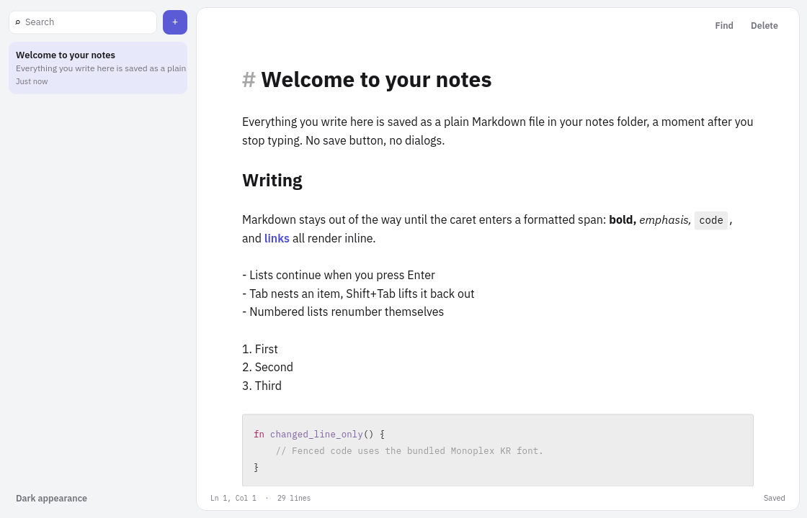

# Ice

Ice is a small, statically checked frontend language that compiles to
[iced](https://iced.rs/). Humans write the screen and interaction flow in
compact `.ice` files; Rust keeps domain rules, I/O, and custom platform code.

```text
.ice source -> parser -> semantic checker -> checked AST -> generated Rust -> iced
```

Normal builds have no source parser or general runtime interpreter.
`ui-lang-build` compiles app roots from `build.rs` into Cargo's `OUT_DIR`, and
`ui_lang::include_app!` includes that ordinary generated Rust. Development
restarts use the same ahead-of-time build path; applications never parse or
interpret Ice source at runtime.

Successful analysis produces a nominal `CheckedDocument`; only the checker can
construct it, and the Iced backend has no unchecked `Document` entry point.
Generated applications also declare `iced = "=0.14.0"` and
`ui-lang-runtime = "=0.1.0"` directly because generated Rust refers to their
public crate paths, plus
`ui-lang-build = "=0.1.0"` as a build dependency.

The standard Cargo setup generates every app or daemon root below `src/ui`:

```toml
[dependencies]
iced = "=0.14.0"
ui-lang = "=0.1.0"
ui-lang-runtime = "=0.1.0"

[build-dependencies]
ui-lang-build = "=0.1.0"
```

```rust
// build.rs
fn main() {
    ui_lang_build::compile_dir("src/ui").expect("compile Ice sources");
}
```

Application Rust includes a generated root by its manifest-relative source
path:

```rust
ui_lang::include_app!("src/ui/tasks.ice");
```

The generated app exposes `App::default_font()` so Rust adapters and native
component themes can reuse the effective Ice application font instead of
repeating its family descriptor.

Generated files live below `OUT_DIR/ui-lang-generated`, are isolated per Cargo
package/profile/target, and are removed by `cargo clean`. Each Rust filename is
the full SHA-256 of its normalized manifest-relative Ice root, so filesystem
component length is independent of source depth; `manifest.json` records the
canonical hash-to-source mapping and generated-content digest. Publication is
serialized by an output-directory lock: every changed Rust file and the
manifest are staged and synced, outputs are atomically replaced, and the
manifest is committed last. Interrupted or corrupt output caches regenerate
automatically, while byte-identical generation preserves existing mtimes.
Generated items suppress backend-only Rust and Clippy warnings, so normal
consumer lint output contains only actionable source warnings; generated
errors remain visible.

## Taste of the language

```ice
app Tasks
  title "Ice Tasks"
  window
    size 960 720
    min-size 480 360
    position centered

use "extern/backend.ice"
use "theme.ice"
use "components/panel.ice"

state
  draft = ""
  loading = false

derived
  normalized_draft = trim(draft)
  can_submit = !loading && !empty(normalized_draft)

on submit
  let title = normalized_draft
  return if !can_submit
  loading = true
  run create_task(title) -> created _ | failed _

view
  col w=fill h=fill p=24.0 gap=16.0 @bg-bg
    Panel title="Create task" #create-task
      row w=fill gap=12.0
        input "New task" #new-task <-> draft w=fill p=12.0 @bg-surface
        button "Add" disabled=!can_submit p=12.0 @bg-primary text-white -> submit
```

`use` resolves relative to the importing file. Imported declarations share the
same checked app graph. File-backed errors point to the fragment that caused
them and include the offending source line and caret. Keep typed Rust boundary
declarations in an `extern/` fragment so app and view files only need the
one-line `use`.

Use an alias when a component or design-system fragment needs an explicit
namespace:

```ice
use "ducktape-ui/default.ice" as ui

ui::Panel title="Settings"
```

Aliased components, recipes, extern functions/types, and fonts use `::`;
theme tokens intentionally remain app-global. A bare `use` continues to merge
one application fragment without qualification.

The punctuation has one job each:

- indentation is the tree;
- `@` starts checked semantic color, font-emphasis, and design-token utilities;
- `#name` is a scoped component/widget identity;
- `<->` is a two-way state or explicit `bind` component-prop binding;
- `->` routes a widget or async result to a handler;
- `_` is the payload supplied by that route.

`derived` names pure read-only expressions over app state; they are recomputed
when read and create no runtime signal graph. Handler-local `let` bindings are
immutable and scoped to that handler invocation.

Themes declare semantic names once and fill them with one or more complete
palettes. The app can select a palette from state; semantic token styles and the
generated Iced theme change together.

```ice
app Tasks
  palette active_palette

theme contract ProductTheme
  bg
  fg
  primary
  danger
  surface

palette light for ProductTheme
  bg #fdfdfb
  fg #171717
  primary #7c3aed
  danger #dc2626
  surface #ffffff

palette dark for ProductTheme
  bg #161615
  fg #f5f5f4
  primary #a78bfa
  danger #fb7185
  surface #20201e

state
  active_palette:palette[ProductTheme] = ProductTheme.light
```

Components may keep instance-scoped UI state and local handlers. A handler may
end with `run` or a widget operation scoped to its own rendered subtree;
`run latest` discards an older Future completion from the same component scope
and call site without aborting it. `run replace` aborts and replaces the prior
Future at that scope and call site, while ordinary `run` delivers every
completion. Component state is retained by default; `lifetime mounted` drops
it and any replace-task handle when the instance leaves the rendered tree.
Ordinary component props are read-only. Declare writable inputs with
`component Field(bind value:str)` and pass a direct state explicitly as
`Field value<->draft`; app state, component-local state, and another `bind`
prop are the only accepted sources.
Component props may use a closed, pure default such as
`component Panel(title:str, elevated:bool=false)`; a call omits only props that
declare defaults, and defaults cannot capture state or other parameters.
Named slots may be optional (`slot Footer?`); `provided(Footer)` conditionally
removes wrappers when the caller omits that slot. Long component or widget
metadata may move into a first-child `with` block with one checked property or
`@` utility per line.
Literal `match` arms retain first-match behavior, with `_` as an optional final
fallback:

Reusable components are closed over app handlers. Declare named events in the
component contract and route every event in the caller's scope:

```ice
component ConfirmDialog(title:str)
  emits
    confirm
    cancel
  col
    text title
    row
      button "Cancel" -> emit(cancel)
      button "Confirm" -> emit(confirm)

ConfirmDialog title="Delete page?"
  events
    confirm -> delete_page
    cancel -> close_dialog
```

Multi-payload widget routes can emit those events directly; for example,
`sensor show=emit(measured, _, _)` forwards its measured width and height.

Events may carry ordered typed payloads. The existing
`component Toggle(...) -> bool` plus call-site `-> changed _` form is the
intentional shorthand for one default event.

An enclosing component can forward an identically named event with the same
payload signature without restating an identity route:

```ice
PageItem page="roadmap"
  forward
    navigate
```

```ice
component Counter()
  state
    count = 0
  on increment
    count = count + 1
  col
    button "Increment" -> increment
    match count
      0
        text "Start"
      _
        text count
```

Options, results, and UI-local enums use payload patterns with exhaustive
checking. Payload names exist only inside their arm:

```ice
enum RequestState
  idle
  loading
  ready([Task])
  failed(AppError)

state
  request:RequestState = RequestState.idle

view
  col
    match request
      RequestState.idle
        button "Load" -> load
      RequestState.loading
        text "Loading…"
      RequestState.ready(tasks)
        TaskList tasks=tasks
      RequestState.failed(error)
        ErrorPanel message=error.message
```

`some(value)`/`none` and `ok(value)`/`err(error)` use the same exhaustive arm
rules. `_` is allowed as the final catch-all. UI enums are non-generic and
non-recursive, and payloads must be ordinary cloneable Ice data. Fieldless UI
enums also support `==` and `!=`; payload-carrying enums use exhaustive
`match` instead of comparison.

Native interaction styles inherit their `active` fields, so hovered, pressed,
focused, opened, dragged, and disabled blocks only declare their differences.

Semantic recipes can use the fixed four-pixel spacing scale or exact logical
pixels. Exact utilities carry a `px` suffix, for example `px-16px`,
`py-11px`, `rounded-9px`, and `text-13.5px`; the checker rejects fractional
spacing/radius values and non-positive or non-finite text sizes.
Recipes may specialize one same-target base with
`recipe danger_action for button extends action`. The base expands first, the
child overrides it, and direct typed node properties remain the final override.
On button recipes, `text-*`, `leading-*`, and `font-*` style the generated text
of a compact string label; arbitrary child content keeps ownership of its own
typography. This lets one semantic action recipe own both control geometry and
label metrics without an extra label component.
Button state utilities support semantic `disabled:bg-*` and
`disabled:text-*` colors as well as `disabled:opacity-*`.

`box` and `flex` provide a checked CSS-like flexbox. `flex` supports reverse
directions, wrapping, `justify`, `items`, `content`, and axis-specific gaps.
Direct `box` children support order, grow, shrink, basis,
self-alignment, and auto/fixed/percentage margins:

```ice
flex w=fill gap=8.0 justify=space-between items=center
  box grow=1.0 p=12.0 @bg-surface
    text "Sidebar"
  box grow=2.0 p=12.0 @bg-bg
    text "Content"
```

## Accessibility

Ice lowers a small Core surface into a deterministic AccessKit tree:

| Ice node | AccessKit role | Exported state |
| --- | --- | --- |
| `text` | `Label` | visible text value |
| `input` | `TextInput`, or `PasswordInput` when `secure=true` | current value for non-secure input; passwords never export their value |
| `button` | `Button` | name, description, disabled state, focus/click actions |
| `checkbox` | `CheckBox` | name, description, checked/disabled state, focus/click actions |
| `toggler` | `Switch` | name, description, checked/disabled state, focus/click actions |
| `slider` | `Slider` | default name, current value, focus action |
| `progress` | `ProgressIndicator` | default name and current value |
| `pick`, `combo` | `ComboBox` | placeholder name, selected value, focus action |
| `editor` | `MultilineTextInput` | placeholder/default name, current value, disabled state, focus action |
| labeled `image` | `Image` | name and description |

`label=` and `description=` accept checked `str` expressions. An input's first
string, a compact button's string, and a checkbox or toggler's visible label are
their default accessible names; explicit `label=` overrides that default.
Pick, combo, and editor controls use their placeholder, while sliders and
progress indicators use stable default names. A button with child content must
declare `label=`, and an image enters the semantic tree only when it has
`label=`. Unlabeled images are decorative, and `description=` without `label=`
is rejected for media.

```ice
input "Name" label="Full name" description="Profile name" <-> name
button #help label="Open help" description="Keyboard help" -> show_help
  text "?"
toggler "Online" label="Online state" checked=online -> online_changed _
image "help.ppm" label="Help diagram" description="The keyboard flow"
```

Enabled controls use source/view-tree order for Tab and Shift+Tab; disabled
controls are skipped. Enter or Space activates a focused button, Space
activates a focused checkbox or toggler, and wrapper-focused controls draw a
visible two-pixel outline. There is no numeric focus-order syntax.

The tree, focus, and action mapping are deterministic on every target. Native
screen-reader export covers single-window Linux and Windows applications
through AccessKit's AT-SPI and UI Automation adapters. On Windows, Iced's
automatically created initial main window starts hidden, windowed, and
non-maximized. The bootstrap resolves its ID with `window::oldest()`, waits for
the UI Automation subclass, then restores its configured mode and releases the
selected boot or preset task alongside queued messages, preserving queue order.
Named windows retain their configured settings and remain outside native
export. Other targets, daemon and multi-window adapters, exact desktop
screen-coordinate bounds, rich text, and widgets not listed above are not
covered by this Core accessibility contract.

## Run the examples

```bash
cargo run -p iced-app
cargo run -p music-example
cargo run -p browser-example
cargo run -p markdown-example
cargo run -p terminal-example
cargo run -p showcase
cargo run -p ice-starter
```

`browser-example` demonstrates a native Chromium Embedded Framework child
inside an iced app whose toolbar and state are written in Ice. Its default build
shows the Ice shell without downloading Chromium; follow
[`examples/cef-browser/README.md`](examples/cef-browser/README.md) to build the
CEF-enabled bundle.

`markdown-example` is a full-window native Markdown editor with inline
styling, scaled headings, surfaced code blocks, caret-local syntax markers,
platform-standard group and line deletion, Korean-capable IBM Plex Sans KR and
Monoplex KR fonts, stable inline IME composition, file open/save, bounded
undo/redo, find, formatting shortcuts, dirty-close protection, and links that
open in the default browser. See its
[design notes](examples/markdown-editor/DESIGN.md) for the project layout and
native editing path.



`terminal-example` embeds a native PTY terminal behind Ice's typed component
and subscription boundary. It launches a local shell, OpenSSH, Claude Code, or
Codex with ANSI rendering, interactive keyboard and mouse input, selection,
clipboard bindings, scrolling, and live resize propagation. See the
[`terminal example`](examples/terminal/README.md) for usage and architecture.

`music-example` recreates the core macOS Music flows with original cover
art, a real-time liquid-glass player, and a local mock API for discovery,
library browsing, search, sign-in, queueing, and playback controls.
`ice-starter` is the minimal copyable build/include/test path; see
[`examples/starter`](examples/starter).
`showcase` exercises the default `ducktape-ui` component catalog through Ice.
The library lives in [`crates/ui`](crates/ui), including its workspace-local
Ice interface, default theme, and semantic recipes; the runnable app in
[`examples/showcase`](examples/showcase) consumes that same interface instead
of carrying a second control style system. Its catalog uses
`grid min-cell=...` for CSS-like responsive wrapping, while the shared panel
recipe applies `@overflow-hidden` so retained content cannot bleed into a
neighboring cell. `cargo test -p showcase` discovers the first-class Ice test
in that same source graph as an ordinary generated Rust test. `cargo ice test`
checks every Ice app graph before running `cargo test --workspace`.

```ice
test counter_contract
  preset test
  viewport 320 240
  timeout 2s
  mount
    Counter #counter

  target root = #counter/root
  target increment = #counter/increment
  target result = #counter/result

  expect root.width ~= 240.0
  click increment
  expect text "1" within result
```

The test driver is a semantic boundary over Iced rather than a public generated
application event enum. Ice steps and Rust harnesses share the std-like
`ui_lang_runtime::testing::Action` enum and
`Driver::perform_action(Action, Location)` entry point, so adapters can replay
the same input without depending on private generated messages. A conformance
case can pin its environment and drive the same input, window, accessibility,
and renderer paths used by the application:

```ice
test dark_keyboard_and_focus
  viewport 800 600
  theme dark
  scale 2.0
  locale "ko-KR"
  platform linux
  reduced-motion true
  target field = #form/name
  target submit = #form/submit

  focus field
  replace "Ice"
  chord control enter
  hover submit
  expect a11y submit role "button"
  expect a11y submit action click
  capture dark_keyboard_and_focus
```

`theme` replaces the headless program theme result with `Theme::default(mode)`;
it does not switch application-owned palette state, which should be selected
through a preset or `dispatch`. `scale` overrides the headless program scale
result. Locale, platform, and reduced-motion pin test metadata and driver
context; they do not invent application state or an OS setting event. Rust
harnesses can pin the independent boot OS preference with
`Config::system_theme`; an Ice `system-theme` step is a later notification.
Semantic steps cover pointer buttons and coordinates, drag/drop, exact focus,
held keys/modifiers and chords, selection and IME composition, scrolling,
multi-touch, window/system/file events, bounded waiting and redraw-time
advancement, named RGBA capture, and AccessKit actions/assertions. The driver
keeps cursor, focus, modifiers, touches, viewport, and widget-local state in
sync with the native events it emits. `advance` controls deterministic redraw
timestamps but does not virtualize arbitrary `iced::time` futures. `capture`
writes a PNG and structured JSON frame manifest to
`target/ice-test-artifacts/<sanitized-test-name>/` while retaining RGBA output
for a Rust harness. `ICE_TEST_ARTIFACT_DIR` replaces the artifact root, and the
runtime `Config::artifact_dir` sets an exact per-test directory. Capture does
not impose exact pixel equality. It records configured, resolved-render, and
system theme fields separately and limits physical output to 16,777,216 pixels
(64 MiB RGBA8). A task-issued window open replaces the single headless current
window with fresh widget/focus/input state while retaining application state.
Each target generated from an Ice view also records its originating `.ice`
path, line, and column. A target constructed wholly inside a Rust widget may
report no finer provenance. `cargo ice inspect` exposes the same real headless
app `Program` without requiring an authored test capture, while
`cargo ice diff` compares two manifests and their PNGs outside the runtime.
`cargo ice review` runs selected first-class Ice tests and packages their
captures, diagnostics, accessibility inventory, baseline diffs, and
source-mapped changes into one JSON/HTML evidence bundle.

Tests use the same checked components, handlers, presets, expressions, and Rust
extern boundary as production code. IDs select rendered widgets after real
Iced layout. A component call ID is a scope rather than a synthetic layout box,
so a test selects an identified descendant such as `#counter/root`. Target
aliases may reuse an earlier target as a path prefix, while `#` paths remain
absolute. Geometry assertions use logical-pixel bounds; paint assertions
inspect unambiguous tiny-skia quad or text commands for backgrounds, borders,
radii, shadows, colors, fonts, sizes, and line heights without comparing
screenshots. Primitive counts, text/image bounds, shaped text baseline,
scale-aware pixel alignment, focus, and accessibility fields are also available
when a conformance report needs more than the single-primitive convenience
accessors.

Interactions replay emitted messages through generated update code and drain
real tasks recursively before the next statement. Checked `sync` and task
externs therefore call the same Rust functions used by the app. Deterministic
test behavior belongs behind a named preset or Rust `cfg(test)` boundary; Ice
does not add a mock layer. Subscriptions are re-established around simulated
events; intentionally infinite timer/I/O subscriptions are sampled rather than
awaited as finite work. See the layout and interaction contracts in
[`component_state.ice`](examples/iced-app/src/ui/component_state.ice).

The runnable task app is intentionally small and split by concern:

```text
src/
├── main.rs                   app entry point
├── backend/                  production Rust boundary
├── tests/                    example behavior tests by feature
└── ui/
    ├── tasks.ice             app and view
    ├── extern/               typed Rust boundaries by feature
    ├── state.ice             UI state
    ├── theme.ice             color tokens
    ├── components/           reusable views
    └── handlers/tasks.ice    transitions and effects
```

[`showcase.ice`](examples/iced-app/src/ui/showcase.ice) is the compile-tested
extended-surface fixture; focused `.ice` and Rust modules exercise individual
native surfaces without bloating the readable task app.

## Agent skill

Install the repository's detailed Ice authoring skill with the open
[`skills`](https://github.com/vercel-labs/skills) CLI:

```bash
npx skills add byeongsu-hong/ducktape-ui --skill design-ice-ui
```

Use `-g` for a global install, or install from a local checkout while developing
the skill:

```bash
npx skills add . --skill design-ice-ui
```

Then ask your agent to `Use $design-ice-ui` when designing, writing, reviewing,
or debugging `.ice` files. The skill teaches Ice's design and program model
instead of translating React/JSX assumptions, and includes focused references
for the design workflow, language, views and styling, typed Rust boundaries,
the extended native surface, and live LSP/tooling.

## Tooling

This repository includes a local Cargo alias, so these work from the repo root:

```bash
cargo ice fmt
cargo ice fmt --check
cargo ice check
cargo ice test
cargo ice clippy
cargo ice compat
cargo ice expand examples/iced-app/src/ui/tasks.ice
cargo ice dev examples/showcase/src/ui/app.ice -- -p showcase
cargo ice inspect examples/showcase/src/ui/app.ice --viewport 1440x900 --theme light --name showcase_light
cargo ice diff baseline/showcase_light.json target/ice-inspect/examples_showcase_src_ui_app/showcase_light.json
cargo ice api crates/ui/src/ice/default.ice > target/ducktape-ui-api.json
cargo ice api diff api/baselines/ducktape-ui.json target/ducktape-ui-api.json
cargo ice review examples/showcase/src/ui/app.ice --test smooth_chart_surface --output review
cargo ice schema
cargo ice lsp
scripts/a11y-smoke.sh
scripts/a11y-windows-check.sh
```

`cargo ice test` analyzes every discovered app graph before invoking workspace
Cargo tests. Ordinary `cargo test` discovers the same generated `#[test]`
functions; generated Ice tests need no Rust wrapper, registration, or direct
`iced_test` dependency in the application. Arguments after `test` pass through to Cargo, so
`cargo ice test render_contract -- --nocapture` runs one generated contract.

`cargo ice inspect ROOT.ice` selects the Cargo package containing that root,
runs its generated headless inspection entry, and prints absolute PNG and JSON
paths. Pin inputs with `--viewport WIDTHxHEIGHT`, `--preset`, `--theme`,
`--system-theme`, `--scale`, `--locale`, `--platform`, and
`--reduced-motion`; `--output`, `--name`, and `--package` control artifact and
package selection. `cargo ice diff BASE.json CURRENT.json` writes
`report.json` and `diff.png`, then fails when structured values differ or the
changed-pixel ratio exceeds explicit `--pixel-threshold`,
`--max-changed-ratio`, or `--value-tolerance` settings.

`cargo ice review ROOT.ice` runs every declared Ice test in the root graph, or
only repeated `--test NAME` selections. Captures are collected below a unique
run directory without deleting older evidence. `--baseline DIR` accepts a
previous review directory (or a capture directory), compares captures by their
stable `test-name/capture-name.json` key, and treats changed, new, removed, or
unreadable evidence as a failed review. A report baseline must be a successful
`ice_review_bundle`; capture-diff reports and failed or structurally incomplete
review reports are rejected. With explicit `--test` selections, baseline keys
are filtered before manifest paths are resolved or read, so evidence belonging
to unselected tests is outside that run while a full review validates every
entry. Capture manifests use schema 2 and review/diff reports use schema 1 with
distinct artifact kinds. Direct diff and review share one structural manifest
validator covering the published required fields, source provenance, nested
geometry/accessibility/paint shapes, and sibling PNG identity. Every failure
after opening an output directory publishes a new run-ID failure bundle; an
already-written detailed failure report for that run is retained.
`--package`, `--output`, and the same pixel/ratio/value tolerance flags control
execution and policy. The output contains `report.json`, `report.html`,
`diagnostics.json`, test logs, current PNGs/manifests, and per-capture
`diff.png`/`report.json` files.

`cargo ice dev FILE -- <cargo-build-args> [-- <app-args>]` builds and launches
one native app or daemon, watches its complete Ice and Cargo input graph, and
uses native filesystem notifications to trigger content verification. If native
notifications cannot be installed, it reports
`ice dev: native notifications unavailable; using polling safety mode` and
checks the relevant metadata inventory every 750 milliseconds instead. Idle
native waits and fallback metadata polls do not reread file contents; a complete
content rescan runs every 30 seconds as a safety net for lost or metadata-invisible
events. Ordinary edits to known files reuse the accepted input inventory
and content stamps, then reread only the paths named by the notification.
New untracked files, deletions, renames, and directory events refresh the
metadata inventory before hashing new or affected files. A changed snapshot
must remain identical across two reads before the background rebuild starts.
Every accepted edit starts a shadow candidate through the ordinary generated
Rust path. The current process remains open until the candidate reports that
its first root widget draw completed. Parse, check, build, startup, or readiness
failure leaves that last-known-good process running. A successful candidate
replaces the old process, so application, window, and widget state intentionally
restart instead of relying on a second runtime interpreter. A daemon reports
readiness through its first drawn window; a windowless daemon candidate cannot
satisfy this draw boundary and is rejected after the 30-second readiness timeout
without replacing the current process.

`cargo ice api ROOT.ice` checks an ordinary app root or a declaration-only
interface root and prints a versioned deterministic JSON fingerprint. The
fingerprint records the containing Cargo package and independent Ice language
revision plus checked components, flattened recipes, theme tokens, UI/extern
types, and every typed extern boundary. Imported declarations keep their
qualified alias identity; absolute source paths and codegen/HIR internals are
not part of the hash. `cargo ice api diff BASE.json CURRENT.json` prints a
human report by default, or versioned JSON with `--format json`, classifying
changes as `breaking`, `behavioral_review`, or `additive`. Breaking changes
exit nonzero. The reviewed public baseline for `ducktape-ui` lives at
`api/baselines/ducktape-ui.json`.

`cargo ice schema` prints a generative JSON description of each Core
construct's context, syntax, child shape, typed properties, binding, and route,
plus the first-class test grammar, target fields, execution and renderer
inspection contracts, language revision, and backend contract. LSP completion
is derived from the same construct table.

`cargo ice lsp` is a stdio server with full-document synchronization, UTF-16
diagnostics, whole-document formatting, and cursor-aware completion for
declarations, handlers, views, typed match arms, widget statuses, component
contracts, theme contracts, and tests. Its structural cursor context comes from
the error-tolerant core editor model shared with the language frontends rather
than a second indentation parser in the server.
Component hover/signature help exposes read/bind/default props, output, named
events, and required/optional slots; recipe hover shows base-first expansion.
Workspace-edit code actions repair component bindings and event routes, create
handler/error-route skeletons, label child-content buttons, extract repeated
inline utilities into recipes, close direct app-handler captures through named
events, and expand long node metadata into a `with` block. They also add every
missing explicit Option/Result/UI-enum match arm and qualify an unresolved
component, recipe, extern, or type reference when exactly one import alias
makes the complete source graph check. For an existing app file it overlays
every open buffer in the import graph, reanalyzes only reverse-dependent or
previously failed app roots after buffer changes, and publishes imported errors
at the imported URI. Checked component, app-handler, recipe, and test-target symbols
support definition and collision-checked rename against those current buffers
and every closed app root under the initialized workspace. Test-target aliases
are scoped to one test, so the same alias may be reused elsewhere. Closing a
buffer falls back to disk. Component-local handlers are lexical implementation
details and are not offered as workspace navigation symbols.

Plain components and compound-family roots rename; renaming a family root
updates its dotted descendants, while direct dotted descendants and the
implicit `mount` handler are definition-only. Rename is offered only when every
reference has an exact retained source span and every workspace app root
checks.

Analysis also reports unreachable component and handler declarations, state
with no reachable reader or writer, immediate and effect-driven handler cycles
that can refresh forever, repeated-stream feedback that can multiply work,
unfiltered raw-event redraw feedback, position-based stateful component
identity, and retained state under unbounded dynamic identities. `cargo ice`
also reports `.ice` sources outside every root import graph. Unused derived and
handler bindings, constant no-ops and dead gates, unreachable statements, and
duplicate subscriptions are diagnosed at their Ice source lines. Component and
handler reachability is combined across every discovered app root, subscription,
preset, implicit mount, and first-class test mount or dispatch, so shared
libraries are warned only when no root uses the definition. All language-checker
warnings appear in the LSP; the workspace-orphan `W010` remains `cargo ice`-only.
Generated Rust errors from `cargo ice check` and
`clippy` are mapped back to the responsible root or imported `.ice` syntax;
`test` and `compat` run the same source-mapped check preflight before invoking
Cargo's normal test runner. The generated Rust coordinate remains available as
a note for backend debugging.
The LSP also exposes a `Run Ice lint` source action backed by the `ice.lint`
workspace command. It runs workspace Clippy and publishes generated Rust
diagnostics at their responsible `.ice` URI, line, and column; ordinary Rust
diagnostics remain owned by the Rust language server. The action publishes
error-level generated diagnostics, including type and extern-contract failures.
Warning-level Rust and Clippy findings from backend output are suppressed
because they are not actionable Ice diagnostics; Ice's non-CLI-only semantic
warnings (`W001-W009` and `W011-W015`) continue to appear directly from the
language checker.

All file-backed frontends share `ui_lang_core::AnalysisDb`, a process-local
incremental analysis API. Its parsed-file key contains the canonical path,
SHA-256 content hash, Ice language revision, and compiler feature set. The DB
retains parsed files, direct and reverse import edges, and checked roots. A
changed overlay or disk file invalidates only roots reachable through reverse
imports; byte-identical updates keep checked roots reusable. Missing imports
and failed roots remain tracked so creating or repairing a dependency retries
the owning root. It also exposes per-session counters for files and bytes
loaded and hashed, files scanned for imports, roots checked/reused, symbols
indexed, codegen roots, and load/check/codegen elapsed time.

The cache lifetime is explicit: the LSP owns one DB for its server lifetime,
`cargo ice dev` owns one for its rebuild loop, `cargo ice check` owns one for a
command, and `ui-lang-build` owns one for a build-script compilation batch.
There is no global singleton, background daemon, Salsa dependency, or
process-persistent cache. Library callers that need the same behavior create
and retain their own DB:

```rust
let mut db = ui_lang_core::AnalysisDb::default();
db.set_overlay("src/ui/part.ice", unsaved_source)?;
let checked = db.analyze_root("src/ui/app.ice")?;
let metrics = db.take_metrics();
```

The LSP is live and intended for editor use. Configure any custom LSP client
with:

```json
{
  "languageId": "ice",
  "extensions": [".ice"],
  "command": "cargo",
  "args": ["ice", "lsp"],
  "cwd": "<Cargo-workspace-root>",
  "transport": "stdio"
}
```

Clients that support source actions can invoke `Run Ice lint` from an open
`.ice` file. A client may also send `workspace/executeCommand` with command
`ice.lint` and no arguments. Save every open Ice buffer first so Cargo and the
published source ranges describe the same source revision.

Keep the importing `app` or `daemon` root open while editing a fragment; Ice
checks fragments as part of their source graph instead of treating them as
standalone programs. Initialize the Cargo workspace folder to enable safe
cross-file rename. Running `cargo ice lsp` directly waits quietly for
Content-Length-framed JSON-RPC, so launch it through the editor rather than
typing into its terminal.

`cargo ice compat` analyzes every app graph, checks the exact `iced 0.14.0`,
`iced_widget 0.14.2`, `ui-lang-build`, `ui-lang-runtime`, and AccessKit
lockfile baseline, verifies the direct reference-app and runtime manifest
pins—including the target-scoped Unix and Windows adapters—and runs the app
tests.

On Linux, `scripts/a11y-smoke.sh` creates an isolated D-Bus/AT-SPI session and
checks that the native tree is discoverable and an AT-SPI action reaches the
Iced bridge. `scripts/a11y-windows-check.sh` cross-compiles the Windows runtime
and both production and test forms of the generated reference app. Headless
tests cover dispatch from the bridge to the app message.

`cargo ice fmt` normalizes indentation and blank lines. It does not translate
removed vocabulary; old syntax fails analysis.

Normal Cargo commands work too because the build script and proc macro
participate in the standard compilation graph:

```bash
cargo build -p iced-app
cargo check --workspace
cargo clippy --workspace --all-targets --no-deps
cargo fmt --all
```

Core end-to-end cases use the built-in Rust test runner and paired fixture
files under `crates/ui-lang-core/tests/cases`:

```text
cases/<format|diagnostic|warning|compile>/<case>/
├── as-is.ice   input
└── to-be.*     exact formatted output or expected diagnostic/Rust fragments
```

The `format`, `diagnostic`, `warning`, and `compile` suites are auto-discovered, so a new
case needs no Rust test function. Focused AST and edge-case assertions remain
next to their parser, checker, or code generator module.

## Status

Ice 2.0 Preview is an executable language candidate, not an attempt to replace iced.
Its implemented authoring Core is app/state/derived/component/handler/view structure,
component-local state, `match`, common layout and widgets, checked event
routing, typed Rust effects, and first-class headless tests over generated
programs and mounted components. The extended native surface remains available,
while typed
`Element`, `Task`, `Subscription`, style, and component boundaries cover unusual
native behavior without growing Core merely for API parity.

Language revisions and Cargo package versions are intentionally separate. The
specification is the 2.0 Preview candidate; the workspace packages currently use pre-1.0
SemVer `0.1.0`.

[`SPEC.md`](SPEC.md) defines the Core and backend boundary.
[`COVERAGE.md`](COVERAGE.md) inventories the existing iced 0.14 surface; it is
not a roadmap for adding missing native syntax.
[`docs/decisions`](docs/decisions) records the accepted compiler, layer,
generation, runtime-widget, and release boundaries. `Accepted` records a
normative direction, not by itself an implementation or support claim; current
support remains documented here and in [`COVERAGE.md`](COVERAGE.md). The matching
[`feature evidence contracts`](docs/feature-evidence-contracts.md) define what
each layer must prove before an epic is complete.
[`RELEASING.md`](RELEASING.md) defines lockstep package versions, packaged
artifact verification, registry order, and the generated-code compatibility
boundary.
