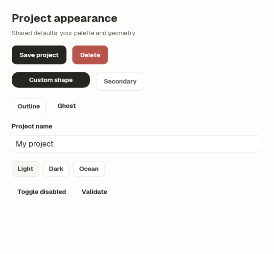
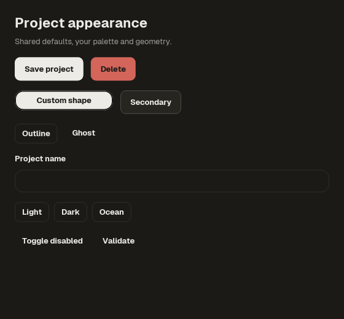
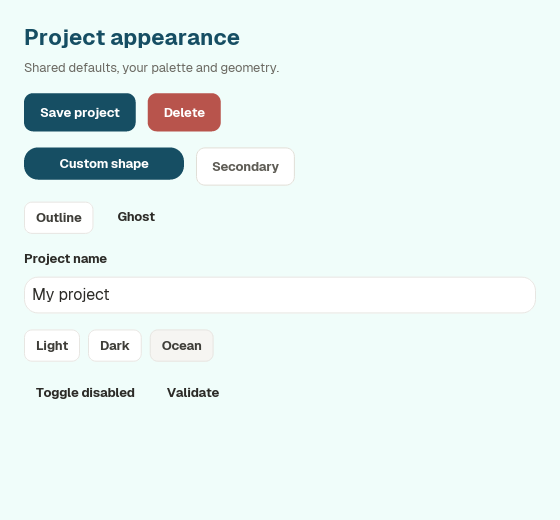

# ui-lang-components

Default, composable UI components for [Ice](https://github.com/byeongsu-hong/ui-lang-components) and [iced](https://github.com/iced-rs/iced).

Ice is the canonical application authoring surface: `.ice` owns layout, state, routes, styles, and accessibility. The feature-gated Rust modules remain the typed native boundary for retained widgets whose behavior is intentionally lower-level than Ice.

Core controls remain native Ice nodes so its accessibility tree stays intact;
`ui-lang-components` supplies their checked semantic recipes. Widgets with opaque
retained state cross typed `extern` boundaries instead.

The workspace follows that split:

- [`../../examples/showcase/src/ui/app.ice`](../../examples/showcase/src/ui/app.ice) is the complete showcase application.
- [`src/ice/components.ice`](src/ice/components.ice) contains the reusable Ice-native composition.
- [`../../examples/showcase/src/adapters.rs`](../../examples/showcase/src/adapters.rs) and [`../../examples/showcase/src/ui/extern/adapters.ice`](../../examples/showcase/src/ui/extern/adapters.ice) contain the catalog-only retained-widget adapters.
- [`../../examples/showcase/src/main.rs`](../../examples/showcase/src/main.rs) only compiles and runs the Ice app.

## Ice interface in this workspace

Ice `use` paths are relative to the importing `.ice` file; Cargo packages do
not currently provide package-aware Ice imports. The workspace showcase uses
the checked source interface directly:

```ice
app App

use "../../../../crates/ui-lang-components/src/ice/default.ice"

state
  email = ""

on save

view
  col @page
    PageHeader title="Account" description="Manage the address used for product updates."
    Panel title="Profile" description="Fields and actions use the shared component contract."
      Field label="Email" description="We only use this address for product updates."
        input "Email" <-> email hint="you@example.com" @control
      button "Save" @primary_action -> save
```

Outside this source workspace, vendor the `src/ice` directory at a stable
application-relative path or use the Rust library below. The workspace entry
file [`src/ice/default.ice`](src/ice/default.ice) imports only the default
theme, reusable recipes, the shared Ice components in
[`src/ice/components.ice`](src/ice/components.ice), and the retained-widget
frames in [`src/ice/virtual-list.ice`](src/ice/virtual-list.ice) and
[`src/ice/tree-view.ice`](src/ice/tree-view.ice). Visual
variants use checked compound names such as `Alert.Success`, `Badge.Warning`,
and `Typography.Caption`; there are no free-form variant strings that can silently
render an empty component. Its Ice tokens are checked against the retained Rust
`LIGHT` and `DARK` palettes, so the default path needs no repeated accent argument or
parallel control-style callbacks. Custom retained themes use the Rust component
API, where callers pass a complete `Theme`; the Ice interface intentionally
does not expose partial accent-only theming. Applications that need retained
widgets define a small typed `extern` boundary for their own data and events;
the showcase adapter interface is not part of the default application surface.

The default source supplies `AppTheme.app` (light) and `AppTheme.dark`.
Select them through ordinary application state:

```ice
app Settings
  palette active_palette

state
  active_palette:palette[AppTheme] = AppTheme.app

on choose_palette(next)
  active_palette = next
```

Import `default.ice` as above, then route a control to
`choose_palette AppTheme.dark`. For a product palette, declare every token in
`palette ocean for AppTheme` and select `AppTheme.ocean`; the same components
and recipes follow it. The [theme/state fixture](../../examples/showcase/tests/cases/ui/theme_state_defaults.ice)
shows all three choices with an editable field and customized controls.
Palette selection does not automatically change a typed Rust extern's theme;
pass its complete retained `Theme` through that application's boundary.

Default action recipes own their keyboard focus color: filled primary/danger
buttons use their contrasting foreground ink, while secondary/outline/ghost
buttons use `ring`. A geometry override retains hover, pressed, disabled and
keyboard-focus behavior. The [native state fixture](../../examples/showcase/tests/cases/ui/theme_state_defaults.ice)
checks a 160px-wide action with 8px padding and a 14px radius, plus a customized
`TextField` with focused, error-label and disabled states. A field error adds a
semantic error label; it does not imply an automatic red input border.





Large fixed-row collections use the feature-gated
[`VirtualList`](docs/virtual-list.md). Its state/event API lives in
`ui-lang-runtime`, `ui-lang-components` applies semantic theme tokens, and
`VirtualList.Frame` provides the reusable Ice composition around an
application-owned typed extern. [`TreeView`](docs/tree-view.md) adds retained
hierarchy, expansion, lazy loading, rename state, and tree accessibility on the
same fixed-row engine; `TreeView.Frame` is its Ice composition. Give either
extern slot a bounded height outside any vertical scrollable ancestor; the
retained collection owns vertical scrolling. These are intentionally runtime
widgets, not new Core syntax.

Append-only build output, agent traces, and service logs use the feature-gated
[`LogTimeline`](docs/log-timeline.md). It composes `VirtualListState` for the
same bounded fixed-row rendering, stable keys, selection, keyboard, headless,
and AccessKit behavior, then adds default tail-follow, pause-on-history
navigation, unread append counts, and explicit resume. It does not replace
`MessageScroller`: transcripts retain variable-height measurement, message
anchors, prepend restoration, and jump-control behavior.

## Page edges and surface padding

Use `Page` once at the root of an ordinary bounded screen or pane. It fills the
available space, paints the semantic background, and supplies 24px of outer
padding by default:

```ice
Page
  Panel title="Profile"
    text "Your profile information" @body
```

`Page(padding=24.0)` accepts one content root. For multiple sections, place a
`col w=fill gap=16.0` inside it. `Page padding=12.0` provides a denser screen;
`Page padding=0.0` explicitly permits edge-to-edge content. Children still obey
the constraints and size policy of their own layouts.

Page owns the distance from the viewport to the content surface. Panel keeps
its own 20px interior padding; these are different boundaries. Do not add Page
around every card or nest it around Form, which already owns its outer padding.
Page does not scroll or choose a readable maximum width. A long ordinary page
can put one scroll viewport inside Page; Form provides the bounded scrolling
composition for forms. An intentionally full-bleed region may live outside Page.

## Input with a trailing action

Let `Field` own the label above the control, and let `InputGroup` own the input
and trailing action on the same line:

```ice
Field label="Project slug"
  InputGroup
    row w=fill gap=6.0 align=center
      input "" <-> slug label="Project slug" w=fill p=6.0
      button "Apply" @secondary_action -> apply slug
```

`fill` receives the space left by its siblings. Putting another long label or
origin string on that line can leave an editable but unreadable input. Keep
that context in the field label or description when narrow widths are supported.
Page supplies the outer inset; this pattern needs no extra page padding around
the input group.

The [complete compiling example](../../examples/showcase/tests/cases/ui/compact_input.ice)
includes application state, a bound reusable field, the action route and Geist
font loading. Its tests check the whole painted input value and actual Apply
click at 280px and 640px, including custom Page padding.

## List item sizing

`Item(title, description, meta)` keeps its leading content at its chosen size.
The title/description and trailing metadata share constrained space using their
content sizes; metadata keeps its natural width when the row has enough room.
Long text wraps rather than giving all remaining width to the trailing value.
The leading slot accepts caller-owned content, including interactive controls,
without replacing their routes. Use the existing `flex` and `box` primitives
for a different content allocation policy.

## Form defaults and customization

Import `src/ice/default.ice` and declare a form with application-owned state:

```ice
Form
  FormSection title="Profile"
    TextField label="Display name" value<->name
```

`Form(max_width=640.0, padding=24.0)` owns vertical scrolling and centers its
bounded content. `FormSection(title, description="", padding=20.0, radius=11.0)`
provides a section surface and heading. Each accepts one content root; use a
`col w=fill gap=20.0` for multiple fields. Text wraps rather than using fixed
row heights. Do not wrap Form in another vertical scroll container.

To keep a heading and Save action visible in a short window, make them siblings
of Form inside a bounded `col w=fill h=fill`. Form receives the remaining
height; only its content scrolls:

```ice
col w=fill h=fill
  box p=24.0 w=fill
    text "Project settings" @section_title
  Form
    col w=fill gap=20.0
      TextField label="Display name" value<->name
  box p=24.0 w=fill
    button "Save" @primary_action -> save
```

Keep the Form instance and its identity stable when state changes. Putting the
whole column inside another scroll also makes its heading and actions scroll.
The [complete scroll example](../../examples/showcase/tests/cases/ui/scroll_ownership.ice)
checks reaching the final control with a wheel and preserving the reading
position through an actual Save click. This pattern covers a single body
scroller; nested panes and anchoring during inserted content are separate cases.

`TextField(label, bind value, description="", error="", placeholder="",
disabled=false, secure=false, padding=11.0, radius=10.0)` supplies the native
input and default control recipe. Change just geometry when needed:

```ice
TextField label="Workspace" value<->workspace radius=4.0 padding=14.0
```

Colors continue to follow the existing semantic palette. Geometry changes do
not replace binding, focus or accessibility. Errors are visible wrapping text
with polite live announcements; callers supply validation policy. The input's
accessible name is its label and its description is the supplied help text.

For a different control or a complete input-style override, use
`Field(label, description="", error="")` and its content slot. The caller
sets that custom control's label and styles. Empty help/error strings add no
text node or spacer row. Field's `root`, `label`, `description`, and `error`
IDs and TextField's `field/root/input` path support semantic inspection.

The [settings example](../../examples/settings/README.md) demonstrates default
and custom geometry, a checkbox slot, narrow layouts and validation feedback.
These are reusable Ice components, not new language keywords or automatic
platform-native controls.

## Controlled state and focus

Apply controlled-widget events to the current app state in the same handler
that receives them. `Task::done(next_state)` still delivers its value later:
several input messages can read the same old state before any completion runs.
This can erase a selection, reopen a dismissed overlay, or discard an unrelated
edit. Changing task ordering does not make those snapshots current.

For a reducer with no effects, return its state directly through a `pure`
extern. The showcase's toast timer and reduced-motion handler use this pattern.
When an update also returns native focus operations, assign its state first,
then run those operations without sending state back. The showcase
[focus adapters](../../examples/showcase/src/adapters.rs) return an immediate
`FocusTransition<State>` containing the state and a cloneable, once-consumed
focus task. The [Ice handlers](../../examples/showcase/src/ui/handlers/app.ice)
assign `transition.state` before launching `apply_focus(transition.focus)`.
Keep decisions that depend on previous visibility in that single update;
re-running the reducer to reconstruct focus can lose an opening/closing edge.

If follow-up work produces new widget events, route those events through the
current reducer, as in the transcript example below. A native event that itself
contains a complete replacement state retains that component's replacement
semantics; this adapter pattern does not turn it into a field-level patch.

## Reading position in a changing transcript

Use `MessageScroller` with stable item IDs when a capped list inserts and
removes rows while someone is reading. `anchor-y=keep` observes height growth;
it cannot identify a retained row when the total height stays constant.

The [Ice transcript example](../../examples/showcase/tests/cases/ui/scroll_reading_anchor.ice)
and its [Rust boundary](../../examples/showcase/tests/scroll_reading_anchor.rs)
exercise variable-height rows, prepending while dropping the tail, and removing
the first row while appending at the tail. The surviving reading row stays at
the same screen coordinate.

Apply each controlled-widget event synchronously to the current state. The
showcase [transition adapter](../../examples/showcase/src/message_scroller_adapter.rs)
returns the updated state immediately and a separately consumed follow-up task.
Assign the state first, then route task events back through that same reducer.
Returning state snapshots from asynchronous tasks can lose one of the multiple
events a single wheel produces. The example protects this integration boundary.
When the anchoring row is deleted, it preserves the first surviving row that was
visible before the change. If none survives, native offset/clamping applies.

## A bounded scroll area inside a document

Prefer one vertical scroll owner for ordinary forms. When a document needs an
independently scrollable preview, give that inner `scroll` an explicit height;
the outer document still needs its own bounded viewport. Do not nest two
unbounded fill-height scrollers and expect either to choose a useful height.

The [complete nested preview example](../../examples/showcase/tests/cases/ui/nested_scroll.ice)
uses Page for the inset, an outer fill-height scroll and a 120px inner preview.
With the pinned native renderer, a wheel sequence stays with the inner preview
even when it reaches its end. After the pointer leaves the window and returns
to the preview, fresh wheel input at that edge can move the outer document. This keeps the document
from jumping during a continuing inner scroll. The example tests both offsets
and the actual final preview action. This is native wheel behavior; touch,
timeout-based handoff and Tree hosts have separate evidence requirements.

## Optional header descriptions

`PageHeader(title, description="")` and `Panel(title, description="")` omit the
description node and its spacing when the description is empty. A title-only
header therefore occupies only its title's natural height. Titles and supplied
descriptions fill the available content width and wrap at word boundaries;
they grow vertically instead of requiring a fixed header height.

```ice
PageHeader title="Settings"
Panel title="Profile"
  text "Your profile information" @body
```

Both expose `root/title` and, when present, `root/description` for semantic
inspection. Panel retains its existing content slot and padding/section spacing.

## Responsive sidebar and detail layouts

Use the [responsive workspace guide](docs/responsive-workspace.md) and its
[executable Ice example](../../examples/showcase/tests/cases/ui/responsive_workspace.ice)
for compact navigation, independent project drafts, and actions that remain
reachable in a short window. The tests resize the same application across the
breakpoint and continue typing, covering native editing state as well as bound
values. The example also demonstrates customized page insets, sidebar width,
and a breakpoint measured from the available content space.

## Rust library quick start

Each component remains individually feature-gated, and enabling one also enables its internal component dependencies.

```toml
[dependencies]
ui-lang-components = { git = "https://github.com/byeongsu-hong/ui-lang-components", features = ["button", "input", "card"] }
iced = "=0.14.0"
```

`ui-lang-components` does not silently choose an iced renderer or platform. Consumers
that use it without a separate default-featured `iced` dependency opt into
`wgpu` or `tiny-skia` and then `x11` or `wayland`; either standalone native
platform feature includes iced's minimal thread-pool executor. The executor is
also available as a direct `thread-pool` passthrough, while wasm consumers
leave the native platform features disabled and select the renderer appropriate
to their target.

```rust
use ui_lang_components::ui::{
    button::{Button, ButtonVariant},
    theme::{LIGHT, SHADCN_LIGHT},
};
use iced::widget::{row, text};

#[derive(Debug, Clone)]
enum Message {
    Save,
}

fn view() -> iced::Element<'static, Message> {
    Button::new(row![text("★"), text("Save")].spacing(8), &LIGHT)
        .variant(ButtonVariant::Default)
        .on_press(Message::Save)
        .into()
}
```

`Button::new` accepts any iced element; `button("Save", &theme)` is the text-label convenience. Its builder also exposes `height`, `padding`, and a native iced `style` callback. The same pattern is used across the library: application state and messages stay with the caller, composable components accept caller-owned content slots, and every visual component receives a `Theme`.

All theme fields are public, so an application can swap a complete visual
profile or derive its own tokens without copying library source. `LIGHT` and
`DARK` retain the approved Ducktape contract; `SHADCN_LIGHT` and
`SHADCN_DARK` apply a neutral shadcn-style palette, radius, spacing,
typography, and control geometry to the same component APIs.

```rust
let mut theme = SHADCN_LIGHT;
theme.radius.button = 4.0;
theme.spacing.lg = 20.0;
```

Radius roles are named `chip`, `row`, `button`, `card`, and `modal`; control
metrics cover button sizes and padding plus input padding; typography
uses the design roles from `display` through `badge` instead of generic size
aliases. `Theme::glass` exposes the exact thin, regular, and sheet alpha colors
without claiming a blur implementation, while `Theme::elevation` provides the
popover, toast, modal, and two-layer application-window shadows.

The source success color on its tint measures 2.86:1, so status labels use the
neutral foreground and keep success as a redundant dot/icon. Avatar initials
remain text: the default `#4f4d47` foreground clears 4.5:1 against the avatar
fill.

Default Ducktape text roles share their sizes, weights, line heights and
semantic colors between the Rust and Ice APIs. Rust themes start with generic
`Font::DEFAULT` and `Font::MONOSPACE`; use `Theme::with_fonts` to bind named application-loaded
families. This crate does not bundle font assets. Ice apps likewise load bytes
through app `font` settings and select their default family with a font
declaration; `font-mono` recipes select the loaded monospace family.

The [spacing and typography guide](docs/design-metrics.md) shows compact recipe
inheritance, explicit Korean font loading, and the native role comparisons.
Its [workspace example](../../examples/showcase/tests/cases/ui/design_metrics.ice)
checks longer copy, Korean glyph metrics, control hit areas, centered labels,
and pointer/keyboard editing at standard and compact densities.

## Custom content

Convenience APIs keep the stock shadcn-style presentation. Every component that otherwise owns fixed visible UI also exposes a caller-rendered path:

- segmented controls, pagination, and carousel controls/indicators use their `*_with_content` functions
- Select and Date Picker replace their full trigger with `.trigger(...)`
- Calendar localizes labels with `CalendarLabels` and replaces navigation content with `.controls(...)`
- Input OTP replaces group separators with `.separator(...)`
- Alert Dialog accepts full cancel/action elements through `alert_dialog_with_controls`
- Command replaces empty and result rows through `.empty_content(...)` and `.item_content(...)`
- Message Scroller uses `controlled_message_scroller_with_end_content` for its jump control
- Sonner uses `sonner_with_content`; each `SonnerControl` supplies a stable ID and message for fully custom controls, plus `.content(...)` for the stock control treatment

Text-only convenience arguments remain customizable strings, while structural content is passed as `iced::Element`. Existing default functions delegate to these composable paths, so adopting the library does not require source copies.

Use the `full` feature for the complete catalog. The individual feature names and their transitive relationships are listed in [`Cargo.toml`](Cargo.toml). Full shadcn/ui behavior coverage is tracked in [the parity matrix](docs/parity.md).

## Showcase

```bash
cargo run -p showcase
```

The showcase compiles the same shared components imported by applications and
crosses typed Rust boundaries only for retained native behavior such as menus,
charts, modal focus, transcript measurement, and resizable panels. Its local
Ice file contains demos, not a second component library. The full Rust feature
set is compiled and exercised by the test suite. The same
[`app.ice`](../../examples/showcase/src/ui/app.ice) graph declares a
first-class `test app_behavior`: it boots the `test` preset, selects rendered
controls by scoped ID, drives click, typing, keys, and checked handler dispatch,
then asserts generated state and visible content. `cargo test -p showcase`
discovers that generated test normally; `cargo ice test` checks every Ice graph
before running the workspace tests. No separate case format, Rust registration,
or image snapshot is required.

## Development

```bash
cargo ice fmt --check
cargo ice test
cargo fmt --all -- --check
cargo clippy --workspace --all-targets --all-features -- -D warnings
cargo test --workspace --all-targets --all-features
cargo check -p ui-lang-components --no-default-features --features button,x11
cargo check -p ui-lang-components --target wasm32-unknown-unknown --no-default-features --features button
```

## Component-owned action layout

`Card.Footer`, `Dialog.Actions`, and `ButtonGroup` accept ordinary buttons
as direct children. The component owns the row and its wrapping policy:

```ice
Card.Footer
  button "Discard all changes" @secondary_action -> cancel
  button "Save workspace settings" @primary_action -> save
```

Card.Footer uses a 9px gap; Dialog.Actions uses an 8px gap and right-aligns each
wrapped line. Their `gap` prop changes spacing on both axes. ButtonGroup retains
zero spacing inside its shared border. Narrow space moves whole buttons to the
next line instead of assigning the remaining width only to the last button.

These are multi-child slots (`slot children*`). Callers retain native buttons,
custom content, conditions and iteration. An explicit nested layout remains a
single grouped child, so a custom composition can keep its own internal layout.
Use such grouping intentionally; a wrapper around all actions gives that wrapper
responsibility for arranging its descendants again.

The [action example](../../examples/showcase/tests/cases/ui/action_layout.ice)
and [slot interaction tests](../../examples/showcase/tests/cases/ui/multi_child_slots.ice)
exercise the actual shared components. Page still owns screen insets; action
layout does not add a second page boundary.
