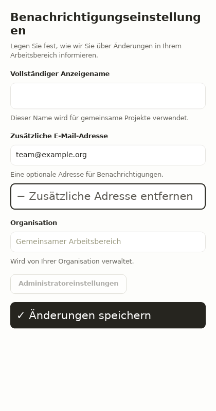
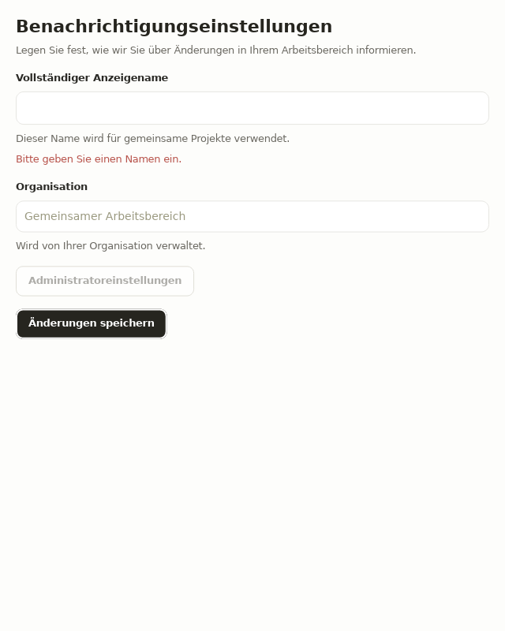
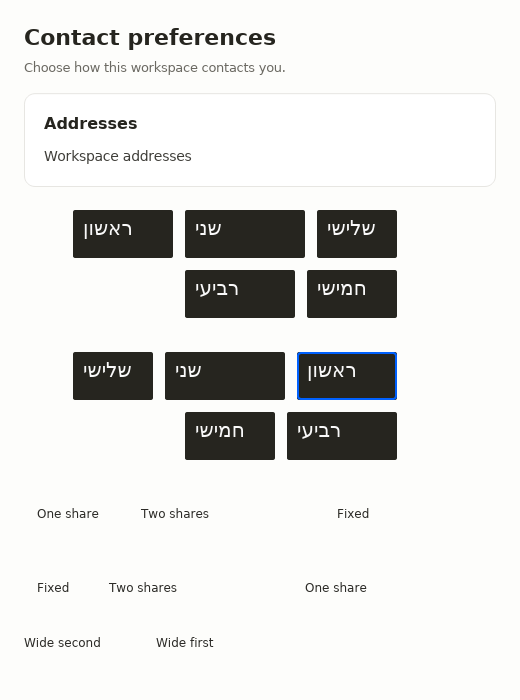
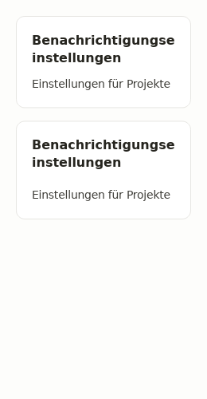

# Keyboard, semantics and localized defaults

The native example in
[`accessible_localized_defaults.ice`](../../../examples/showcase/tests/cases/ui/accessible_localized_defaults.ice)
combines default form components with custom button content. Its German labels
are actual copy, and its custom input and actions use 21px text. A 420px viewport
therefore tests real larger content, independently of scale or locale metadata.

## Keep the keyboard route explicit

Use native inputs and buttons for interactive content. `Field` supplies visible
label, help and error text; a raw input in its slot still needs its own `label=`
and `description=`. `TextField` forwards these properties to its input. A custom
button containing an icon and text needs a meaningful `label=` as well.

When an action removes the focused subtree, choose the next useful control and
focus its rendered ID in the same handler. `ContactForm.remove` removes the
optional address and focuses the primary name input. The form tests drive Tab,
Enter and Shift-Tab, check that disabled controls are skipped, submit an empty
name, read the polite error output, correct the name and activate Save. They do
not use handler dispatch as evidence of a working widget route.

`disabled=true` removes activation and keyboard participation while retaining the
control's name and description. `Field.error` uses `live=polite`; the fixture
checks the actual retained error value and live-region property. This proves
native semantic output, not a screen reader announcement or automatic association
of an error with an arbitrary slotted control.

## Give the document real headings

`PageHeader` exports heading level 1. `Panel` and `FormSection` export level 2.
Their titles and descriptions use `wrap=word-or-glyph`, retaining whole words
when possible and breaking a word that cannot fit on a line. Long German
compound titles are checked at 260px and 420px widths.

These are default document roles. For a different hierarchy, compose a native
`text` with the existing explicit `heading=1..6` property and the appropriate
text recipe. The first-class test target's `accessibility_level` reads the
retained one-based level; inspecting a target without a level fails instead of
inventing a zero level.

## Load fonts and choose direction deliberately

The example explicitly loads `DejaVuSans.ttf` and `DejaVuSans-Bold.ttf`, then
selects `font multilingual family="DejaVu Sans" default=true`. Both bundled files
carry their license in `assets/fonts/LICENSE-DejaVu.txt`. This supplies Hebrew
coverage without relying on fonts installed on the host. The native fixture
checks that both faces reach native font-loading settings, then checks a shaped
Hebrew word's measured width, keyboard focus paint and pointer activation. The
host also has DejaVu installed, so glyph width alone cannot distinguish that
copy from an explicitly loaded face; removing the font declarations fails the
settings assertion. Font-family metadata alone cannot prove glyph coverage.

The Rust `directed_row(items, Direction::RightToLeft)` helper places the first
logical item at the right while keeping the source sequence for keyboard and
semantic traversal. It returns the existing runtime `Flex` with
`FlexDirection::RowReverse`, which reverses positions, not the child vector.
Wrapped rows reverse each logical line independently;
physical padding and explicit left/center/right alignment retain their meaning.
Use `Direction::start()` or `end()` when alignment itself should be logical.

The Rust return type of `directed_row` and `sidebar_group_heading` is now
`ui_lang_runtime::Flex`. This is a breaking API change: use `.gap(...)`,
`.align_items(...)`, `.wrap(FlexWrap::Wrap)` and `.justify_content(...)` for
spacing, vertical alignment, wrapping and physical horizontal alignment. The
helper preserves filling child growth, disables shrinking fixed-width items,
and keeps natural row heights. The native matrix checks unequal widths,
asymmetric padding, a short final line,
right alignment, 1:2 fill growth, fixed sizes under constrained width, natural
heights, all ten LTR/RTL Tab stops and a click on a reversed action. Request
wrapping when a row of fixed controls needs to fit a narrow container.

Ice layouts and localized strings remain explicit. A locale setting does not
translate labels, choose a larger text size, or reverse every layout in a view.
This evidence covers native Linux/tiny-skia rendering and retained AccessKit
semantics. It does not establish Tree-host parity, operating-system navigation
or assistive-technology announcements. The helper and its callers compile
against stock crates.io Iced; no new vendored widget API is required.

## Captured evidence

All captures use the native Linux/tiny-skia renderer, light theme, scale 1 and
reduced motion. The German custom form is 420×800, narrow headings 260×500,
and the Hebrew action matrix 520×700.






The default 640×800 form, larger 420×800 preset and RTL matrix each completed a
60-frame debug inspection with zero idle memo misses. These are inspection and
cache-stability observations, not release performance claims. The before/after
large-form diff changes 38.86% of pixels: the compound heading gains one 26.4px
line and shifts the following controls down by that amount. The remaining
manifest differences are the corresponding text/bounds changes and source-line
provenance; no unrelated color or font changes remain.

```sh
cargo test -p showcase --test accessible_localized_defaults
cargo ice inspect examples/showcase/tests/cases/ui/accessible_localized_defaults.ice \
  --preset large_form --viewport 420x800 --theme light --scale 1 \
  --locale de-DE --platform linux --reduced-motion --frames 60 --name large_form
```
