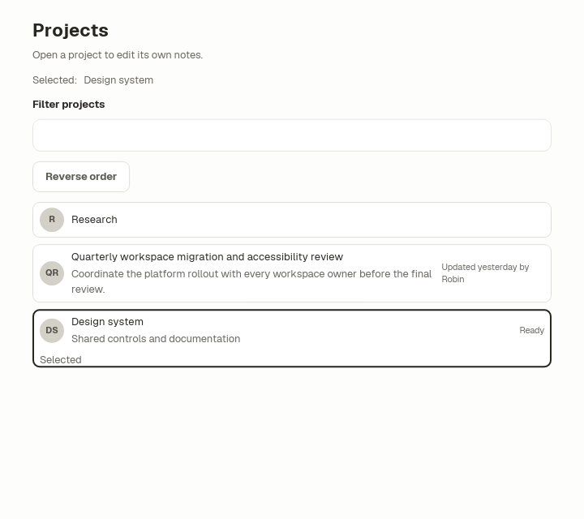
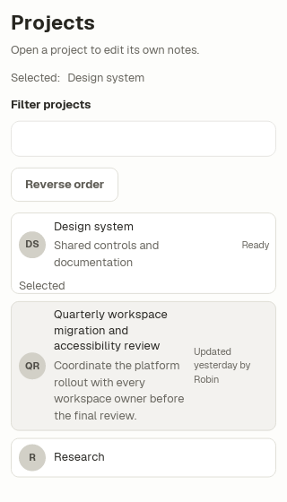
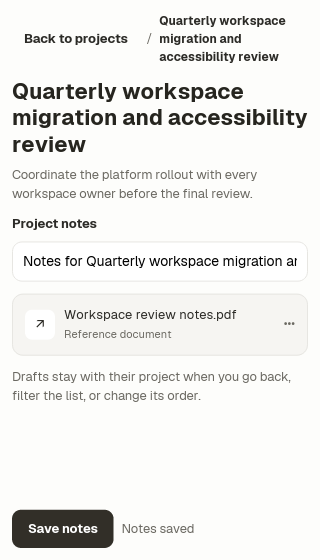
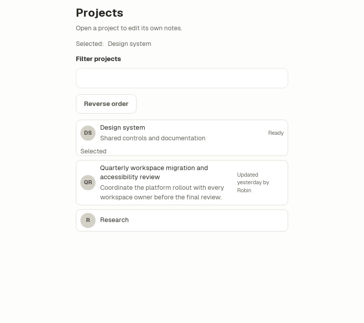

# List/detail navigation with retained project drafts

The [executable project browser](../../../examples/showcase/tests/cases/ui/list_detail_navigation.ice)
combines `Page`, `PageHeader`, `Item`, `Avatar`, `Breadcrumb`, `TextField` and
`Attachment`. Its [small Rust data boundary](../../../examples/showcase/tests/list_detail_navigation.rs)
provides project records and pure filtering, lookup and draft updates. Import
the default Ice library and select a loaded default font. This example registers
Geist regular/bold and selects Geist; shared text recipes inherit that choice.



## State and navigation

Keep the selected **domain ID** separate from whether the detail screen is
open. This example stores `selected_id`, `showing_detail`, the filter and order
in app state. A filter changes visible records; it does not select another
record. The selected-project label remains visible even when its row is hidden.
Reordering uses the same IDs, never the current visible index.

Each project owns its draft in the records collection. Opening a project copies
that draft into the editor buffer. Back and Save copy the buffer to that same
project ID before changing location or acknowledging the action. Reopening a
project retrieves its own draft; another project's edits cannot overwrite it.
The example's Save is an in-memory demonstration. A product's durable save,
validation and failure handling belong behind its typed Rust boundary.

Back restores the list with its existing filter/order and focuses the project
that was opened. Opening a row focuses the detail input. Assign the destination
state before issuing the focus task so its widget exists when the operation
runs. The checked path includes both the native keyed-row scope and component
scope:

```ice
on back
  projects = edit(projects, selected_id, draft)
  showing_detail = false
  task widget focus #page/root/content/list/rows/key(selected_id)/project(selected_id)/open
```

The selected ID always exists in this small fixed collection. Products that
remove records need an explicit missing-selection policy. Filtering preserves
records and is not deletion.

## Rows and keyboard contract

The bounded scroll contains a keyed column with a per-record `lazy` boundary.
The selected ID is an extra lazy dependency so checked state updates when
selection changes. Variable-height rows wrap long titles, descriptions and
metadata. This composition renders its small collection in full; use the
[VirtualList boundary](virtual-list.md) for large fixed-height collections.
A keyed row does not retain native widget state after removal from the mounted
list. App-owned drafts and selection survive because they live above that list.

Each row is one named button. Tab follows the filter, order control and visible
rows in source order; Enter opens the focused row. Back is a named button with
the same keyboard and accessibility activation contract. `checked` distinguishes
the selected row from other rows, and the visible Selected label conveys the
same state. These are navigation buttons, not a listbox with arrow-key selection.
Keep additional row actions beside the row button instead of nesting buttons.

`Item(title, description="", meta="")` omits empty description/metadata
content and the associated layout gap. Its required leading slot accepts an
avatar or caller-owned control. `Attachment(name, meta="")` likewise omits an
empty metadata line. Breadcrumb and Attachment text remain readable when long
content wraps at narrow widths; their native owner tests inspect the painted
text bounds.

## Customization and compact windows

| Input | Default | Customized preset |
| --- | --- | --- |
| Page inset | 24px | 12px |
| Readable content cap | 640px | 420px |

A centered box owns the cap for the entire list/detail composition. Give the
body scroll the remaining height and keep Save outside it. The same title,
Back action and Save route remain in the compact view. At the declared minimum
320×360 window, the detail body scrolls while Save remains reachable.





## Verification

The native tests drive pointer, keyboard and accessibility focus operations;
they check both selected/unselected rows, actual focus after Back, independent
drafts after filtering/reordering, empty results, compact painted text and
custom geometry. Owner tests additionally cover optional Item/Attachment text
and long Attachment/Breadcrumb content. Captures use native light theme, the
default app palette, Geist fonts, scale 1, en-US, Linux metadata and reduced
motion at 720×640, 320×560 and 320×360.

This evidence covers the generated native composition. It does not establish
window-manager behavior, platform screen-reader announcements, touch navigation,
durable persistence or large-list performance.
