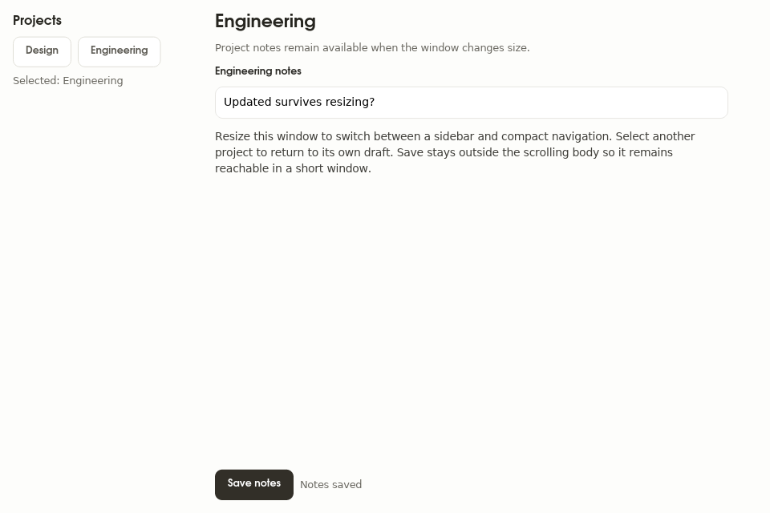
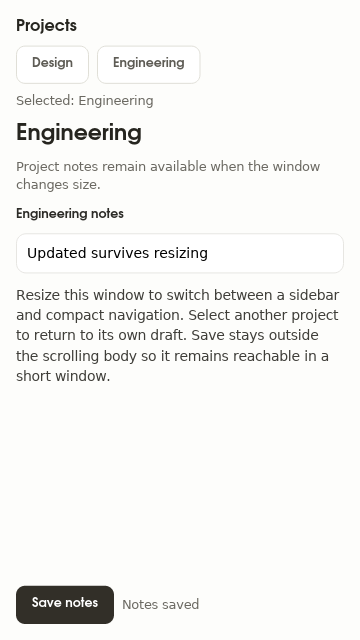
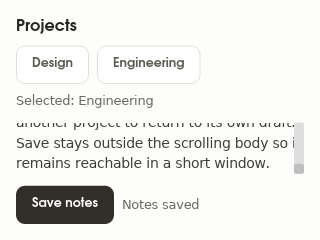
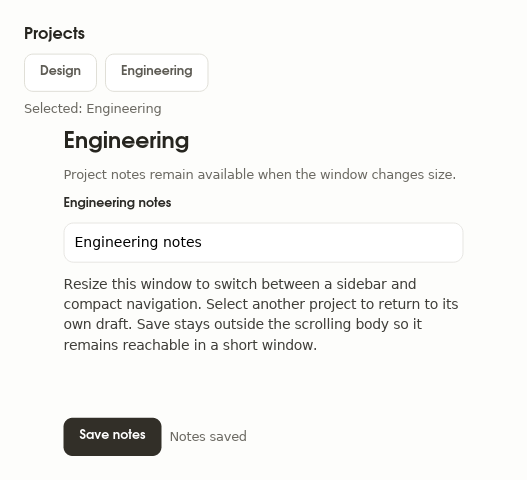

# A responsive sidebar and detail workspace

Use the [executable Ice example](../../../examples/showcase/tests/cases/ui/responsive_workspace.ice)
for a native project workspace built with `Page`, `PageHeader`, `Form`, `TextField`, and the default
action recipes. Its tests select projects, edit their independent drafts,
resize the same running application, and save through rendered buttons.

The compact presentation keeps both project controls above the detail. The wide
presentation puts them in a sidebar. Neither presentation clears the selected
project or its notes. Application state owns both drafts; the navigation is a
stateless component with explicit inputs and emitted selection routes.

## Choose the breakpoint from usable content width

The `responsive` size is the space its parent supplies, after `Page` padding.
The default example switches at 640 logical pixels of **content** width, which
is a 672-pixel window with 16-pixel insets on each side. Its 200-pixel sidebar
and 16-pixel gutter leave 424 pixels for the detail at that boundary. Below the
boundary the detail gets the content width and navigation wraps its buttons.

Use one threshold and complementary `<` / `>=` branches. Test the pixel on
either side of the threshold; testing only very wide and very narrow windows
misses overlaps and gaps. Choose a minimum supported window from the actual
controls and text. This example declares 320 × 240 logical pixels.

The `customized` preset demonstrates a 480-pixel content breakpoint, a
160-pixel sidebar, 24-pixel page insets, and a 400-pixel reading width. Its window
boundary is 528 pixels.
These are application layout choices, so the example supplies them as ordinary
Ice values instead of adding another default component API. A reusable screen
can expose the same values as typed component props.

## Keep state and essential actions reachable

Store the selected location and unsaved document values above presentation
branches. A component that owns a draft needs one stable identity across those
branches, or explicit caller-owned bindings. Reusing a label does not establish
component identity, and a `lifetime mounted` component deliberately drops its
state when it disappears.

Use `Form` for the detail body: it owns a vertical scroll with `h=fill` and
limits the content to a readable width. Put the save row beside that scrolling
region in the surrounding column. The example sets `Form padding=0.0` because
`Page` already owns its outer insets. The action row uses the same reading-width
cap and horizontal centering as `Form`, keeping Save aligned with the fields.
This allows long copy to scroll without pushing the action below a short window.
Keep labels and help text at `w=fill wrap=word`, and let compact navigation wrap
its controls.

Do not treat a surviving draft string as proof that editing continued. Focus,
caret position, and scroll state belong to native widgets. A resize test should
type immediately after switching presentation, without another `focus` step,
and verify the resulting value. Replacing a focused widget or changing its
position in an unkeyed child list can reconstruct that native state even when
its bound application value remains intact.

The example keeps an always-present row around the optional sidebar and an
always-present column around compact navigation. Adding or removing navigation
changes those containers' children; it does not move the `Form` or editor among
its parent's children. This preserves native focus, selection, and caret during
the resize. Keeping the same `#id` on separately rebuilt editors would not
reparent their native widget state.

## Run the contract

```sh
cargo test -p showcase --test responsive_workspace -- --nocapture
```

The tests cover the round trip from 960 × 640 to 360 × 640, the exact default
boundary, the customized boundary, and a short 320 × 240 window. They assert
geometry, accessible navigation names, real button routes, independent drafts,
and the ability to reach the body end while save remains visible. Captures use
Linux metadata, scale 1, `en-US`, reduced motion, the default `app` palette, and
the native light theme.
This is headless native Iced evidence; it does not establish operating-system
window-manager behavior or touch interaction.

## Rendered states



| Compact, 360 × 640 | Short window at the body end, 320 × 240 | Customized, 527 × 480 |
| --- | --- | --- |
|  |  |  |
