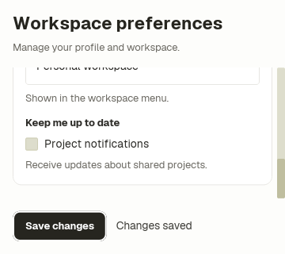

# Workspace preferences authoring observation

This is the result record for the [predeclared request and criteria](protocol.md).
Both submitted screens have passed independent review. A fresh after-agent
could not be created; its reused context is the explicit deviation recorded
in the protocol. These observations do not isolate documentation's causal effect.

## Before guidance

Source baseline: `ffb89ea1920bb42ef529276495868708ad8210c4`.
Submitted revision: `dd2706193b21c360945cf77d889f2a331d175b6e`,
[original draft PR #1058](https://github.com/byeongsu-hong/ducktape-ui/pull/1058).
The agent used inherited model/reasoning defaults with a fresh conversation.

| Observation | Result |
| --- | --- |
| Agent's first recorded timestamp | 2026-09-09 05:25:44 UTC |
| Submission complete | 05:38:16 UTC; 752 seconds |
| Coordinator independently verified usable | 05:40:10 UTC; 866 seconds from recorded start, including review queue/review time |
| Initial dependency build command | 140.321 seconds |
| Reported measured command total | 349.045 seconds; some commands overlap, so this cannot be subtracted to derive reasoning time |
| Distinct unmet UI criteria at submission | 0 |
| Coordinator UI repair interventions | 0; initial assignment only |
| Independent final native rerun | 9 passed |

The original submission said no Cargo lock waiting was observed. The reviewer
found `Blocking waiting for file lock on package cache` in
`red-empty-explanation.log`. Its duration is not separately recorded. This is
an evidence-report correction, not a UI repair; do not describe the run as
lock-free or attribute all command duration to compilation.

### Criterion review

| Criterion | Inspected evidence |
| --- | --- |
| Discovery | The existing default source import is unchanged. Only Settings Ice, README and captures change; no new import mechanism, catalog adapter or framework code. |
| Layout | The bounded Form is between fixed heading/footer siblings. Wide capture is 960×820; native short-window test and captures are 360×320. Save bottoms are 804/304 respectively. A real wheel event reaches the notification control while Save stays visible. |
| Customization | Workspace input radius 4 and padding 14 remain native TextField props. Actual editing, End, typing, Tab, Space and Enter update the workspace, notification and saved values. |
| State | Empty email produces wrapped feedback. Correction at 360×320 clears it and saves while preserving edited name `Sam`, workspace `Research` and notifications off. Error and corrected captures were inspected. |
| Content | Long workspace label wraps within its field. Empty explanation has heading bottom equal to title bottom, with Save still visible. |
| Verification | Baseline Save visibility fails before the layout change. Resetting the name on save fails preservation; reserving an explanation row fails the empty-copy geometry assertion. All are intended assertion failures, and restored final tests pass. |

The source and screenshots support all six requested criteria. Partially
visible fields at a scroller's edge are ordinary viewport clipping; the last
field and error feedback have explicit fully visible states. This observation
does not establish arbitrary translations, platform accessibility or external
persistence, which the request did not include.

### Authoring friction

The agent corrected an invalid test expression and a target declaration placed
after steps, an incorrect value supplied to a flag-only inspection option, and
a scratch `.ice` backup accidentally discovered by the formatter. None counts
as regression Red or as a structural UI defect.

One failed geometry assertion compared unscrolled child coordinates directly
with the viewport. The agent inspected a diagnostic capture and accounted for
`form.scroll_y`. This is a concrete test-authoring obstacle to compare with the
after run, even though it did not require coordinator intervention.

The coordinator's follow-up source/capture audit found a real tool defect:
structured paint inspection compared transformed screen primitives with
unscrolled layout bounds. In the stored short-window manifest, the visible
notification description had no attached text, while an invisible profile
heading inherited another field's text. The PNG and `visible_*` geometry agreed
with the actual screen. A focused runtime inspection fix is being verified
separately; it is not silently included in either comparison baseline. This
finding explains part of the authoring friction without treating successful
compilation as proof that the inspection tool was correct.

Evidence is archived at `/tmp/ice-agent-authoring-evidence/before/`:
`timing.tsv`, `review.md`, the three Red logs,
`final-tests.log`, `root-review-tests.log`, `clippy.log`,
`final-format-check.log`, and the `inspect/` and `captures/` directories.
The archive was copied and byte-verified before worktree cleanup.

## After guidance

Source baseline: `c4524da0`, the same framework/app baseline plus six guidance
files. Submitted revision: `85fb44ba034481ba5975a8f1f9c9307978062a96`,
[original draft PR #1060](https://github.com/byeongsu-hong/ducktape-ui/pull/1060).
The reused agent retained prior repository context and inherited model settings.

| Observation | Result |
| --- | --- |
| Agent's recorded start | 2026-09-09 05:29:30 UTC |
| Submission complete | 05:48:57.807 UTC; 1,167.807 seconds |
| Coordinator independently verified usable | 05:50:07 UTC; 1,237 seconds from recorded start, including review queue/review time |
| Initial dependency build command | 111.802 seconds |
| Recorded command total | 335.177 seconds; excludes unaggregated read/edit calls and cannot isolate reasoning time |
| Distinct unmet UI criteria at submission | 0 |
| Coordinator UI repair interventions | 0 |
| Independent final native rerun | 9 passed |

The coordinator answered one delivery question: open the draft against main,
document the supplied baseline and isolated task commit, and preserve the pin.
The later review noted that three mutations were bundled; no UI correction was
requested. Package-cache lock messages occur in command logs; their separate
duration is unavailable. Both targets reused caches from earlier work.

### Criterion review

| Criterion | Inspected evidence |
| --- | --- |
| Discovery | Existing relative default import retained; no framework, adapter or import-mechanism change. |
| Layout | Fixed heading/actions surround the sole bounded Form. Save is fully visible at 960×820 and 360×320, with bottoms 808/308. Native wheel scrolling reaches the fully visible notification control. |
| Customization | Workspace input retains radius 4 and padding 14. Actual typing, Tab/Space/Enter and bound-value assertions verify normal editing and save. |
| State | Short-window empty email shows wrapping inline feedback and a fixed-footer cue. Correcting it clears the error and preserves `Sam Rivera`, `Design studio`, email and notification state. |
| Content | Empty explanation has no reserved heading row. The long workspace label occupies two lines, remains fully visible in its captured state and fits its field. |
| Verification | Baseline Save visibility and suppressed success reach intended Reds. A bundled mutation run independently reaches radius, empty-heading-row and edit-preservation assertions; it is not claimed as three isolated runs. Restored tests and the coordinator's native rerun pass; captures were inspected. |

Like the before agent, this agent initially compared layout coordinates with
viewport coordinates and encountered missing structured text paint after
scrolling. It used full visible height and inspected images to verify clipping
and wrapping. A scratch backup/formatter race caused a setup failure and was
corrected. These did not require coordinator UI repair.

Evidence is archived at `/tmp/ice-agent-authoring-evidence/after/`:
`INDEX.md`, `summary.json`, `commands.jsonl`, `run.md`, Red/Green and Clippy/format
logs, `root-review-tests.log`, eight PNG/JSON capture pairs and two inspections.
The archive was copied and byte-verified before cleanup. Exact dispatch timestamps were not captured
by the coordinator; elapsed values use the explicitly recorded agent starts and
must not be presented as precise end-to-end scheduling latency.

## What the pair supports

Both agents produced a usable default-component screen without UI repair
instructions. This pair demonstrates neither fewer submitted structural errors
nor faster verified delivery after the guidance change. The after run took
longer, and differing context, cache state, command overlap and review timing
prevent a causal speed comparison.

The recurring concrete obstacle was test-coordinate interpretation, including
an actual structured-paint association bug.
[PR #1063](https://github.com/byeongsu-hong/ducktape-ui/pull/1063) corrects direct
and captured paint association using translated, clipped visible bounds. Its
nested-scroll tests reject missing visible text and hidden-neighbor paint;
[coordinate guidance](../../testing.md) explains the distinction. This finding
does not justify a new layout DSL or a rule that agents must read the whole
component catalog.

The maintained example uses the after implementation because it retains field
explanations and shows an email-error cue beside the always-visible Save action.
That is a product choice, not a benchmark win. The original submitted revisions
remain the comparison evidence; final integration and additional verification
are recorded separately.

At the same 360×320 viewport, both submitted examples reach the final control
and retain the Save action after saving. These are unchanged native captures,
not recreated mockups:

| Before guidance | After guidance |
| --- | --- |
|  |  |

## Integration verification

The original comparison PRs #1058 and #1060 were closed without merging.
The selected Settings implementation, authoring guidance and this report are
consolidated in [PR #1061](https://github.com/byeongsu-hong/ducktape-ui/pull/1061).
The archived original commits remain the evidence for the two runs.

The chosen Settings commit was applied to the guidance branch on the current
framework. All nine native tests passed. The coordinator then checked the
three previously bundled changes **one at a time**: default radius instead of
the override fails the radius assertion, a blank explanation row fails heading
geometry, and clearing the name during save fails edit preservation. Each
mutation was restored before the next; the exact source was restored and all
nine tests passed again. These additional checks strengthen delivery evidence;
they do not change either original run's reported time or intervention count.

The final local integration with the scrolled-paint correction at `b288dcbc`
passes all nine Settings tests. All eight resulting PNGs are byte-identical to
the reviewed gallery; the inspection correction changes structured association,
not the rendered screen. Rust formatting and 240 relative document targets also
pass their checks.
