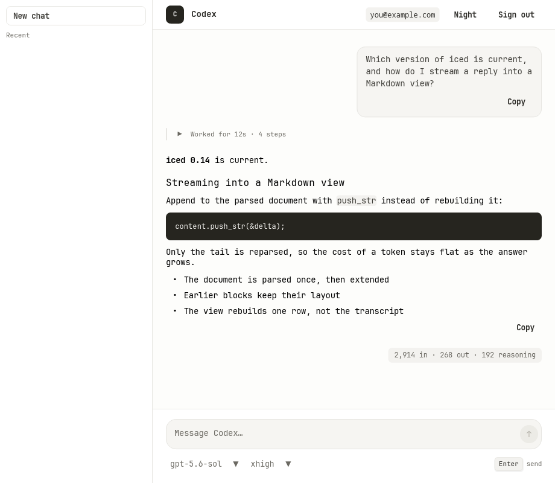
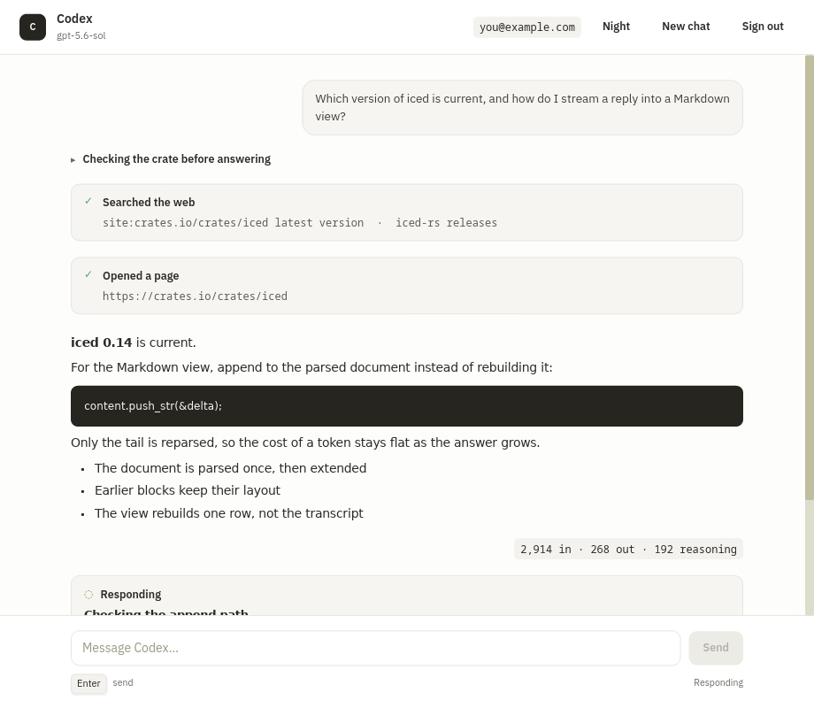
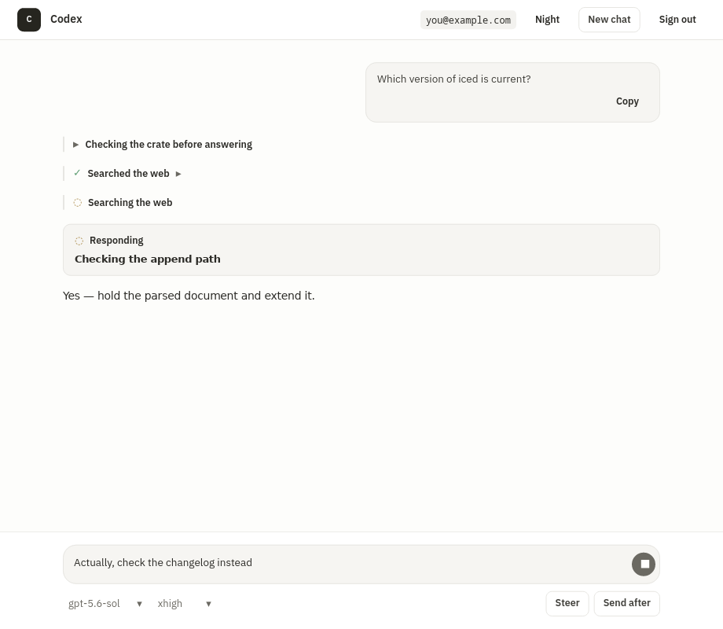
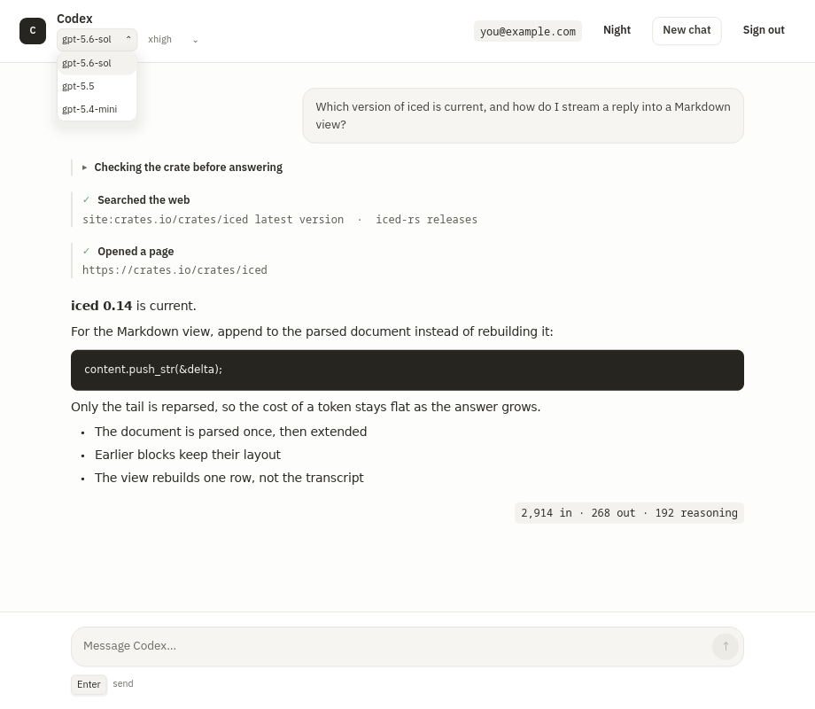
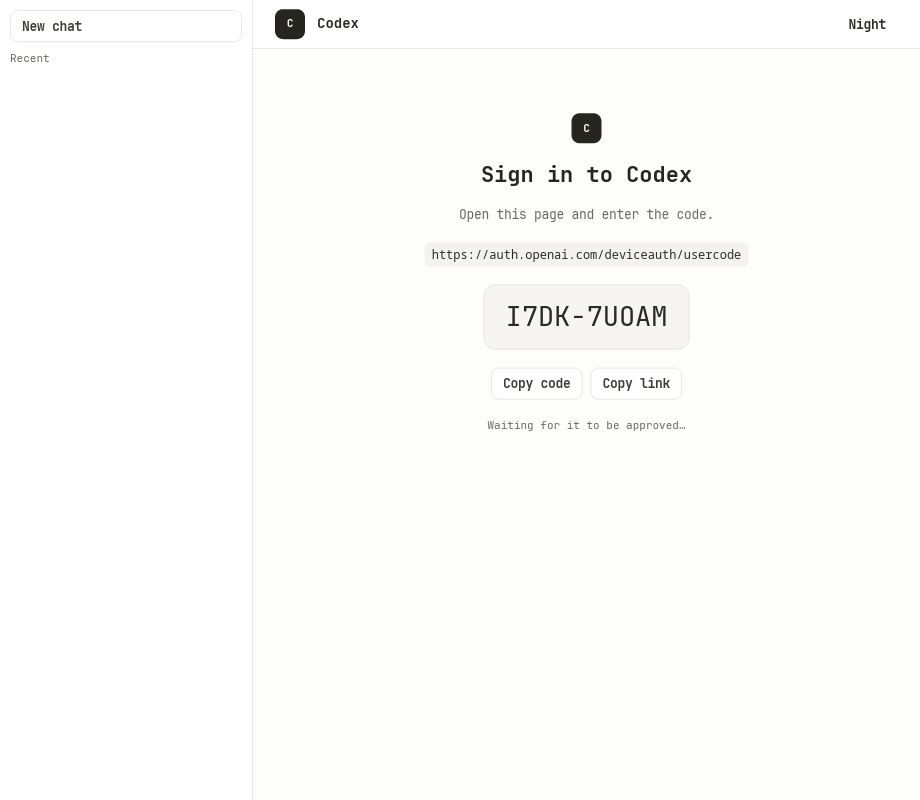
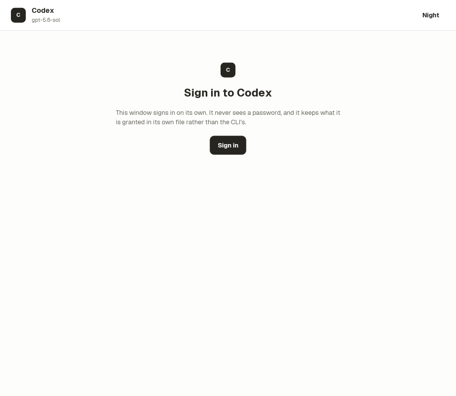
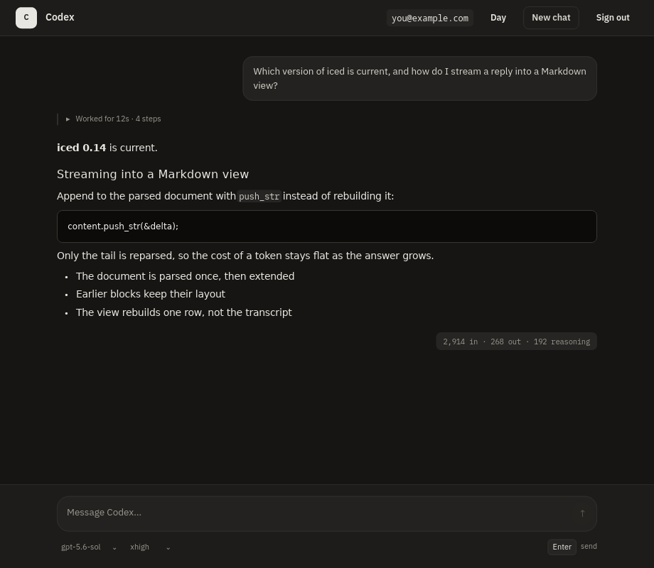

# AI chat

A desktop chat client for Codex, built to answer one question: can the kind of
chat screen the web has settled on — streaming Markdown, folded reasoning, tool
calls, a composer — be built as-is on this stack, and be quicker at it?

It talks to the ChatGPT backend the Codex CLI talks to, using the OAuth tokens
the CLI's own login already wrote. There is no second login, and no token is
stored, printed, or copied anywhere by this app.

```sh
cargo run -p ai-chat-example
```

It signs in on its own — the device flow `codex login --device-auth` runs, with
the code shown in the window — and it also accepts a login `codex login` already
made, so an already-signed-in machine needs nothing.

Tokens go in this app's own file (`~/.config/ducktape-ai-chat/auth.json`, owner
only) and never in the CLI's. A refresh rotates the token it is given, and
rotating the CLI's would break `codex` for a login this window only borrowed —
so a borrowed login is read but never refreshed, and says to run `codex login`
when it expires.



## What it draws

A turn is not one answer, and the screen does not pretend otherwise. The
transcript is a flat, ordered list of everything the turn produced:

| Row | What it is |
| --- | --- |
| prompt | what was asked, in a bubble on its own side |
| work | one line — `Worked for 12s · 4 steps` — holding everything below it |
| reasoning | a summary, folded under the subject it names |
| tool | a search or page open; its arguments are behind its own fold |
| answer | Markdown — headings, lists, code blocks, links |
| usage | what the turn cost |

A turn is watched while it happens and read once it is done, and it folds
accordingly. The step running now stays open; each step collapses to its own
title as it finishes; and when there is an answer to read instead, the whole
turn's working-out gathers under one line. Nothing is thrown away — every fold
opens — but a finished transcript reads as questions and answers.

Folded rows are left out of what the screen is handed rather than drawn and
hidden, so a folded turn costs no widgets at all.

An item this build does not model still becomes a row rather than being
dropped, because a chat window that silently swallows part of a turn is
misreporting it.

The model and how hard it thinks are both picked in the header, from the
catalogue the CLI keeps — so the lists are the ones `codex` would offer rather
than ones this app invented, and what is in force is always in them. Levels
differ by model, so changing the model carries the effort with it: a level the
new model does not offer would be rejected on the next turn, and is replaced by
that model's own default.

Both belong to the chat, not the machine. They apply from the next turn, they
survive `New chat`, and `~/.codex/config.toml` is only ever read.

The message box is a real editor. Enter sends; Enter held with shift, command
or both writes a line, so a paragraph can be typed without fighting the box.
Backspace erases a word with alt and back to the start of the line with
command — iced maps every Backspace to one character whatever is held with it,
so both of those had to be said explicitly or they did nothing.

A turn already running can be answered in three ways rather than only waited
out. **Stop** ends it and keeps what was already said — a stopped answer is
still an answer. **Steer** cuts it short and sends what has been typed instead.
**Send after** holds the message until the turn finishes and then sends it on
its own. Steer and Send after appear only once something has been typed to use
them with.

Clicking a link copies it; which browser you wanted is not this window's call.
`Night`/`Day` switches palettes, and settled rows follow.

| Mid-turn | Steering one |
| --- | --- |
|  |  |

| The model menu | Waiting for a code |
| --- | --- |
|  |  |

| Signing in | Night |
| --- | --- |
|  |  |

Every one of these is generated, not staged: the first by the test that types
into the composer and presses Send, the rest by `cargo ice inspect` against a
named preset.

## How a turn arrives

Two channels, on purpose:

- `codex_turn` is a `sip`: text token by token, plus what the composer should
  say while it runs.
- `codex_entries` is a `stream`: the row list, published only when it changes —
  a tool starting, a block settling. Putting the list on every token would copy
  the whole transcript once per token.

Ice appends streamed text into a parsed Markdown document rather than reparsing
it, so a long answer costs the same per token as a short one.

## Why some of it looks the way it does

Three constraints shaped the design, and each is worth knowing before changing
it:

- **A parsed Markdown document cannot live in Ice component state**, which
  holds cloneable values only. `src/render.rs` is the typed adapter that holds
  it instead, parsed once per row and kept.
- **A `lazy` body cannot see anything but its dependency.** So a row carries
  everything that decides how it is drawn — including whether it is folded and
  which palette it was stamped for. That is what makes a fold, or a theme
  switch, actually reach a settled row.
- **`lazy` hashes its dependency every frame.** A derived hash would walk every
  row's full answer text, which costs about as much as rebuilding the row and
  defeats the boundary. `Entry` hashes its identity instead — sound because a
  row's prose never changes after it settles.

## Checks

```sh
cargo test -p ai-chat-example          # unit tests + first-class Ice tests
cargo test -p ai-chat-example --release perf -- --ignored --nocapture
cargo ice inspect examples/ai-chat/src/ui/app.ice \
  --viewport 920x800 --preset conversation --name conversation
```

`sending_a_message_runs_a_whole_turn` chats: it types into the real composer,
presses the real Send button, and asserts that the reasoning, both searches, the
answer and the cost all reach the transcript. The turn it drives is played from
fixed events through the same parser and channels the wire uses, so the suite
needs no login and spends no tokens.

To chat with the model instead, open the wire — one flag for the process, so
only a run of the live tests may set it:

```sh
AI_CHAT_LIVE=1 AI_CHAT_ASK="your question" \
  cargo test -p ai-chat-example -- --ignored --nocapture a_live_turn
```

Every preset names its own account — `conversation`, `conversation_night`,
`streaming`, `signed_in` and `signed_out` — so no real address reaches a
committed artifact.

### Measured

One full Elm cycle — `update` with a token, then a whole view rebuild — on a
release build, 200 tokens per sample:

| Transcript | Per token | Same cycle, every row changed |
| --- | --- | --- |
| 1 turn (6 rows) | 24 µs | 20 µs |
| 8 turns (48 rows) | 44 µs | 51 µs |
| 24 turns (144 rows) | 92 µs | 121 µs |

24× the transcript for 3.8× the per-token cost. What remains is the keyed
column building one wrapper per row whether or not the row is reused;
virtualising the transcript is the next thing that would flatten it.

## Limits

- An overlay's contents are outside the tree the test harness scans, so a
  menu's appearance is reviewed from a capture rather than asserted. The test
  that produces it says so.
- **The sign-in is not fully verified.** Minting a code and telling waiting from
  refused are both checked against the live host; the half past approval — what
  the host returns once a code is typed, and the token exchange — is read off
  the CLI's own strings. `a_real_sign_in_completes` settles it and needs a
  person to approve one code.
- Codex's own shell and patch tools would need this window to execute them,
  which is a different program. The hosted `web_search` tool is served by the
  backend, so a real tool call still reaches the screen.
- A turn cannot be stopped once it starts.
- The Markdown cache is never emptied: clearing a chat orphans its entries for
  the life of the process.
