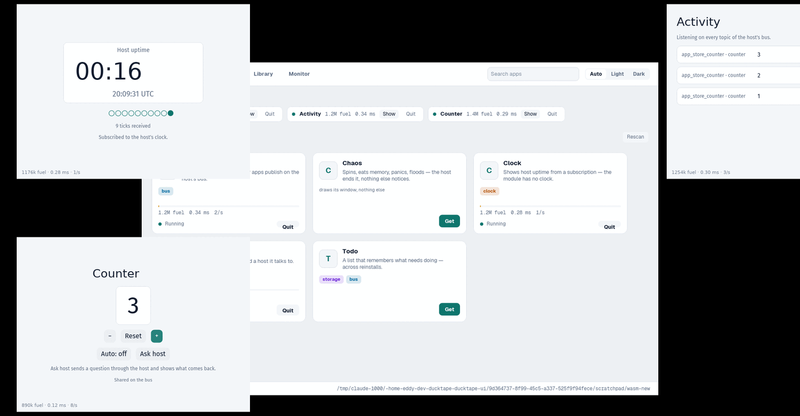
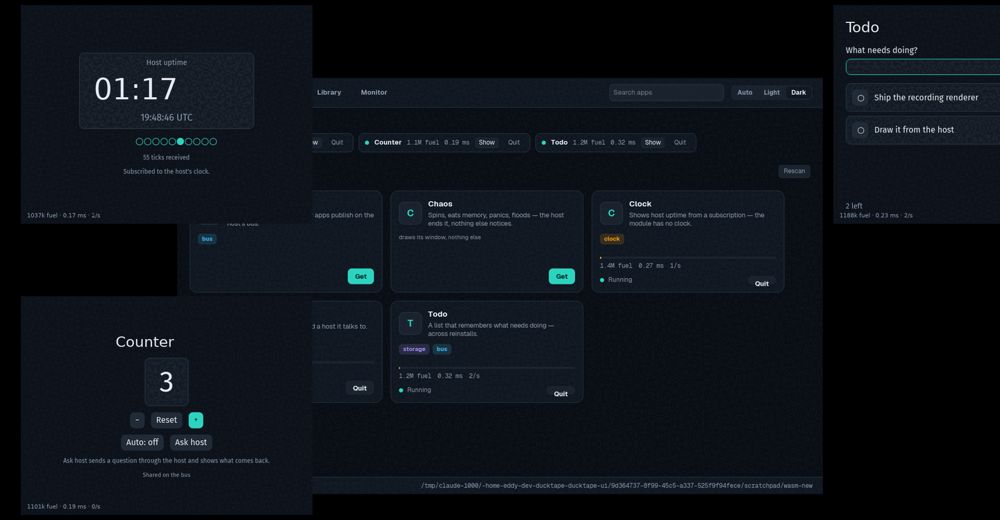

# app-store — an OS-shaped host for Ice apps compiled to wasm

A native Ice daemon that reads a catalog of wasm modules, installs one on
Get inside a fuel and memory budget, gives it a native window of its own, and
drops the instance when that window closes. Every app in the catalog is an
ordinary Ice application; nothing in the language or the code generator
changes to make it installable. What the host adds is everything an app
cannot do alone — time, storage, other apps, the colour mode — and it adds
them as capabilities the app's manifest has to declare.





```
frame/          the wire: events in, a Frame of quads and laid-out text lines out,
                plus Request / Response for everything else
sdk/            what an app needs to run in wasm: a headless Driver (layout, draw,
                task executor), `host::request` / `host::subscribe` / `host::theme`,
                and `export_app!`, which adds the four C exports and the manifest
apps/counter/   three buttons; Auto is a chain of host timers, every change goes
                on the bus and into the store's log
apps/todo/      a list kept in the host's storage — it survives uninstall/reinstall
apps/clock/     host uptime from a subscription, UTC from one `clock.now` plus
                arithmetic; the module has no clock
apps/activity/  a live feed of what the other apps publish, and who published it
apps/chaos/     spins, eats memory, panics, floods the host, asks for an
                undeclared capability
host/           the store: catalog, library, windows, capabilities (clock,
                storage, bus, theme), the fuel/memory sandbox, the module cache,
                and the widget that shows a guest
```

## Run it

```
cd examples/app-store
cargo build -p app-store-todo -p app-store-counter -p app-store-clock \
            -p app-store-activity -p app-store-chaos \
            --release --target wasm32-unknown-unknown
cargo run -p app-store-host --release
```

| variable | default | what it names |
|---|---|---|
| `APP_STORE_CATALOG` | `target/wasm32-unknown-unknown/release` | the directory scanned for modules |
| `APP_STORE_DATA` | `target/app-store-data` | app storage (`<app>/<key>`), the store's `installed` and `running` lists, and wasmtime's artifact `cache` |

The windowing backends the host asks iced for (`x11`, `wayland`) are
requested only on Linux, so a macOS or Windows build resolves without them —
only Linux is exercised here.

The gates are `cargo fmt --all -- --check`, `cargo clippy --workspace --tests
--no-deps` and `cargo test --workspace`. `--tests`, not `--all-targets`:
Ice generates a `#[cfg(test)]` harness that needs the runtime's test driver,
which pulls wgpu into a workspace built to stay on tiny-skia, so every crate
here sets `test = false` and keeps its tests in `tests/`. `--all-targets`
builds a test target anyway and fails on the missing driver.

## The store

One daemon, two kinds of window. The store window has three pages and a
segmented Auto / Light / Dark switch; every guest gets a native window of
its own, titled with the app's name, resizable and movable like any other.

- **Discover** lists every module the catalog directory holds, from its
  manifest: name, description, and a chip per capability, coloured by what
  it reaches. Get loads the module, adds it to the library and opens its
  window. While an app runs its card carries a fuel bar — the last tick's
  fuel against the 200M budget — and the figures under it. A strip at the
  top shows what is running now; Show raises its window, Quit closes it.
  Clicking a card opens the app's page: what each capability lets it do, the
  box it runs in, and its live figures.
- **Library** is what is installed, running or not. Open gives an installed
  app a window again; Uninstall removes it from the library and closes its
  window. What the app wrote to storage stays.
- **Monitor** is the dogfooding page: one row per running guest with fuel
  per tick, tick time, ticks per second, frame bytes and how many of the
  last frames crossed as "unchanged", ticks run against redraws skipped, and
  whether the module came from the cache or through cranelift.

Closing a guest's window quits the app — the wasmtime store, its memory and
its compiled code go with the last handle. Closing the store window ends the
store. What had a window at exit reopens at the next start, one load at a
time; the library comes back as it was.

The colour mode is the store's: Auto follows the system, Light and Dark are
the user's word. Every guest subscribes to `host.theme` in its `on mount`
and switches its own palette on each answer, so the windows change together.

## Writing an app

```rust
ui_lang::include_app!("src/ui/app.ice");
app_store_sdk::export_app!(Clock, __ClockMessage, "Clock", "Host uptime.", ["clock"]);
```

That is the whole crate. `export_app!` implements the sdk's `WasmApp` trait
over the generated `__boot` / `__view` / `__update` / `__theme`, emits the
exports, and writes name, description and capabilities into an
`ice.manifest` custom section, so the catalog lists the app — and shows what
it will touch — by reading the file: no compilation, no instantiation.

An app talks to the host from ordinary Ice tasks. A one-shot ask is
`host::request`; something that keeps coming is `host::subscribe`:

```ice
extern crate::host
  stream ticks(every_ms:i64) -> i64 ! ClockError
  stream theme_changes() -> str ! ClockError

on mount
  parallel
    stream every ticks(1000) -> ticked _ | clock_failed _
    stream every theme_changes() -> themed _ | theme_failed _

on themed(mode)
  dark = mode == "dark"
  active_palette = ClockTheme.light
  return if !dark
  active_palette = ClockTheme.dark
```

```rust
pub fn ticks(every_ms: i64) -> impl Stream<Item = Result<i64, ClockError>> + Send + 'static {
    host::subscribe("clock.ticks", &every_ms.to_le_bytes()).map(|answer| /* bytes → ms */)
}

pub fn theme_changes() -> impl Stream<Item = Result<String, ClockError>> + Send + 'static {
    host::theme().map(|answer| /* bytes → "light" | "dark" */)
}
```

## Capabilities

A request's kind is `<capability>.<operation>`. The host answers only what
the manifest declares; a request for anything else comes back as the `Err`
of the task, which the app's handler routes like any other error (Chaos's
"Use the clock" shows the refusal text, and its "Flood" the refusal past the
per-tick request cap).

| capability | operations | answer |
|---|---|---|
| `host` (always) | `echo` · `log` · `random` (`u32` LE count) · `theme` (stream) | the text back · nothing, the line goes to the store's stderr as `[<app>] …` · that many bytes · `light` or `dark` at once and on every change |
| `clock` | `sleep` (ms) · `ticks` (every ms, stream) · `now` | nothing at the deadline · host uptime per tick · the unix millisecond and the host uptime it was read at, two `u64` LE |
| `storage` | `get` (key) · `set` (`key\nvalue`) · `delete` (key) · `list` | the value or empty · nothing · nothing · every key, newline-separated; one file per key per app |
| `bus` | `publish` (`topic\ntext`) · `subscribe` (topic or `*`, stream) | how many heard it · every matching message, as `from\ntopic\ntext` |

Publishing does not need the topic: any app with `bus` may publish under
any name, and `from` — the publisher's app id, which the host fills in — is
what says who did. A real host would route `query` / `submit` / `page`
through the same table and answer from its own subscriptions.

## How a frame crosses

1. The sdk's driver polls the app's tasks (re-polling one that wakes
   itself, which every `Task::stream` does once), builds the view, lays it
   out with a `UserInterface`, and draws into `iced_tiny_skia`'s recording
   layers — the same renderer the desktop uses, minus the rasterization.
2. Those layers are flattened into a `Frame`: quads verbatim; every paragraph
   as the lines cosmic-text already broke, each with its position, size, line
   height and font family. Text crosses as lines, not glyphs, so the host can
   be any iced renderer. The frame also carries the requests the tasks made,
   the requests they dropped, and *when the tree wants to draw again* — the
   `RedrawRequest` iced's widgets answer `update` with (a caret blink, a
   hover transition), translated into host uptime.
3. A frame whose layers are the same as the last one's crosses without them:
   `unchanged` set and `layers` empty, a few bytes instead of every quad and
   line again. The host keeps the layers it already has and takes only the
   requests, the cancels and the redraw request.
4. The host widget translates iced events into the app's coordinates, ticks
   it once per redraw with a fresh fuel budget, answers its requests, and
   replays the frame inside `with_layer` / `with_translation`. A press inside
   a guest's bounds focuses it and a press anywhere else clears that focus, so
   only one guest at a time receives the keyboard — except the modifier state,
   which is state rather than input and goes to every guest, so one that lost
   focus with Shift down learns it came up. Answers are delivered as
   events: an echo on the next redraw, a timer at its deadline via
   `request_redraw_at`, a bus message when another guest publishes.
5. Not every redraw of a window is a tick of its guest. A guest with no
   event pending, no answer due, nothing in its inbox and no redraw request
   of its own is left alone: the frame the host holds is the frame it would
   draw. It still says when it next wants to run, and the widget schedules
   that wake-up.

There is no executor thread and no clock inside a module. `Instant::now()`
is a stub that answers zero; the host's uptime rides on every `Redraw`, and
added to zero it is a monotonic clock — enough for iced's own animations.
That uptime is measured from the moment the store starts, not from the first
guest, so an app installed an hour in reads an hour, and `clock.now` answers
the wall clock together with the uptime it was read at — which is what lets
an app anchor one to the other instead of drifting by however long the store
had been running when it was installed.

Both sides pin the default font by name (`Fira Sans`, embedded via iced's
`fira-sans` feature): natively fontdb resolves `Font::DEFAULT` through the
system font list, in wasm only the embedded family exists, and a mismatch
shows up as every button a few pixels wide of where the app put it. The
store's own chrome is set in Geist and Geist Mono; a guest's lines name
their family, so the store's default never reaches them.

## What it costs

Loading a module is cranelift's compile the first time and a file read the
next: wasmtime's artifact cache lives under the data directory, and a module
loaded once in a run is kept in memory, so Restart, Quit-then-Open and
reinstall are an instantiation — under a millisecond. The Monitor's Load
column says which it was.

Measured against the store before this redesign, each run under Xvfb
(software rendering, no GPU) with the same five apps restored at start,
sampling the process's CPU time over 10 s of nobody touching anything and
10 s of the pointer moving over a guest. Two runs of each, interleaved, on
the same machine:

| | idle | pointer moving over a guest | resident |
| --- | --- | --- | --- |
| before: one window, every guest ticked on every frame | 3.1–3.3 % of a core | 92–96 % | 145 MB |
| after | 1.6–1.7 % | 12 % | 153 MB |

What moved the numbers, in the order it mattered: a guest is ticked only
when something is due for it or its own tree asked for a frame, so Counter
sits at 0/s and Clock at 1/s; a mouse move reaches the window it happened
in, so one guest ticks instead of five; a frame that changed nothing crosses
as a flag instead of its layers. The 8 MB more comes with five native
windows instead of one and the in-memory module cache. The moving figure is
the software renderer's — it repaints the window, and the old store's was
1400×900 for every mouse move — so a GPU-backed window shows a smaller gap.
The Monitor page keeps the same counters per app: ticks against the redraws
it slept through, and how many of its frames crossed without their layers.

## The sandbox

Every tick runs with `FUEL_PER_TICK` (200M, roughly one per instruction)
and a 64 MB memory limit, in a store that allows one instance, one memory
and four tables of at most a million elements — a table is allocated at its
declared minimum when the module is instantiated, before any other limit is
consulted. An app that spins burns its budget and traps; an app that
allocates past the limit traps on the grow. A trap ends that instance — its
window shows the reason (the module's own panic message when the sdk's hook
left one) and a Restart button that asks the store to reload the module on
its executor, where the compile does not stall the window, and swap it into
the same handle, keeping the window and everything the app wrote to
storage — and nothing else notices: the other guests keep ticking, the
store keeps answering. The status line in every window is what the last
tick cost, plus the bus deliveries the guest was not there to take.

Fuel and memory bound what a module does to itself. What it can make the
*host* do is bounded by the constants in `limits.rs`:

| limit | value | what a guest past it gets |
|---|---|---|
| `MAX_FRAME_BYTES` | 8 MiB | the instance ends, "frame too large" |
| `MAX_REQUESTS_PER_TICK` | 256 | `Err "too many requests this tick"` for the rest |
| `MAX_PAYLOAD_BYTES` | 1 MiB | `Err`, whatever the request was |
| `MAX_TICKERS` | 16 per guest | `Err` from `clock.ticks` |
| `MAX_DUE` | 1024 answers the host still holds | `Err` from `clock.sleep` |
| `MAX_SUBSCRIPTIONS` | 64 per guest | `Err` from `bus.subscribe` |
| `MAX_TOPIC_BYTES` | 256 per subscription | `Err` from `bus.subscribe` |
| `MAX_CANCELS` | one tick's worth of everything the host holds | the rest of that frame's cancels ignored |
| `MAX_REPLY_BYTES_PER_TICK` | 4 MiB | `Err` for the rest of that tick, checked before the work: it counts the payloads the requests carried in and the copies a publish made, not only the answers |
| `MAX_BUS_BYTES` | 64 KiB per message | `Err` from `bus.publish` |
| `MAX_INBOX` / `MAX_INBOX_BYTES` | 1024 events, 1 MiB | its oldest bus deliveries dropped, and counted in its status line |
| `MAX_VALUE_BYTES` | 1 MiB | `Err` from `storage.set` |
| `MAX_APP_KEYS` | 1024 per app | `Err` from `storage.set` |
| `MAX_APP_STORAGE` | 64 MiB per app | `Err` from `storage.set`, summed over the app's directory, a block per key |
| `MAX_RANDOM_BYTES` | 4096 per answer | `Err` from `host.random` |
| `MAX_LOG_BYTES` | 1024 per line | the rest is cut, and the line is escaped before it reaches a terminal |
| `MAX_FAULT_BYTES` | 1024 | its window shows the first line of that |
| `MAX_NAME_BYTES` · `MAX_DESCRIPTION_BYTES` · `MAX_CAPABILITIES` | 64 B · 256 B · 16 of 32 B | its module is left out of the catalog — the sidebar shapes every manifest field of every entry, before anything is installed |

The numbers *inside* a frame are the other half of the same boundary: the
guest chooses every one, and the host's renderer panics on some (a colour
past 1, a font size of 0, a bordered quad narrower than a pixel) and
allocates by others — a shadow is a buffer the size of the quad, so a
100000-pixel one is 40 GB. `wire::sanitize` pulls them into range on the way
in: positions and extents to twice the window in every direction, colours to
`0..=1`, blur to 64 px, text size and line height to `1..=128` px. Clamped
rather than refused, because "not finite" is not the same as "hostile" —
every iced frame's base layer carries an infinite clip.

Counting is not enough on its own, because a frame that fits in 8 MiB can
still be minutes of drawing. `sanitize` therefore also clips and budgets:

| bounded | to | why |
|---|---|---|
| every layer's rectangle | the guest's own window | a layer *is* a clip, and iced's `push_clip` replaces the clip instead of intersecting it — without this a guest paints over the sidebar and its neighbours (the shadow pass had its own way out, fixed in `vendor/iced_tiny_skia`) |
| layers · quads · lines | 256 · 16384 · 4096 | each layer rebuilds a window-sized clip mask per redraw |
| text bytes | 64 KiB per frame | every line is shaped by cosmic-text on the window thread |
| filled pixels | 8 M per frame, charged for the part inside the window | 16000 window-sized quads is billions of pixel writes; a quad past the budget is dropped |
| rasterised glyph pixels | 4 M per frame (characters × size²) | a glyph is rasterised and cached at its size, so 64 KiB of distinct 128 px text is gigabytes of cache |
| shadow pixels | 1 M per frame | the shadow pass builds an SDF buffer the size of the quad plus its blur, before any clipping — past the budget a quad keeps its shape and loses its shadow |

## What is not here yet

An honest inventory, grouped by where the work would land. Items marked
**bug** are wrong today rather than merely absent.

### Wire and rendering

- Images, SVG, canvas geometry (paths, strokes, meshes) and shaders do not
  cross; gradients flatten to their first stop. Images and SVG need a
  host-side handle cache keyed by app so bytes cross once, not per frame.
- Rich text loses per-span colour, underline and strikethrough: a paragraph
  crosses with one colour per line.
- A changed frame re-encodes and re-sends every layer; there is no delta
  and no dirty rectangle, only the whole-frame "unchanged" short-circuit.
  Text is laid out in the guest and shaped again on the host, per line.
- Overlays (pick_list menus, tooltips, combo boxes) are clipped to the app's
  window; they cannot float outside it.
- No scale factor or locale reaches the guest. The colour mode does, as a
  `host.theme` stream the app has to subscribe to and act on itself; iced's
  own theme is not switched for it.

### Events and input

- Only a subset of named keys cross and physical key and location are always
  `Unidentified`. Mouse Back/Forward, touch, IME composition, window
  focus/unfocus, file drops and close requests do not cross at all.
- Focus is the host's, not the guest's: clicking a guest gives it every key,
  and `Tab` inside one never leaves it. No focus ring, no keyboard-only way
  to reach a window.
- Clipboard is `clipboard::Null`: copy and paste inside an app silently do
  nothing. A `clipboard` capability (`read` request, `write` in the frame)
  is the shape.
- No accessibility tree leaves the guest, although the runtime still
  builds its snapshot machinery into every module (dead weight).

### Tasks and runtime

- Only `Action::Output` of a task is honoured. Widget operations (focus,
  scroll-to), clipboard, window, font and exit actions are dropped.
- Ice `subscribe` blocks never run: the driver never calls
  `__subscription`, and iced's timers (`every`) have no executor in wasm.
  Host streams (`clock.ticks`, `bus.subscribe`) are the only long-lived
  sources.
- Task fairness is fixed: 8 rounds of messages per tick, 64 self-wakes per
  stream. A task that produces more waits for the next tick — and nothing
  schedules one for it: the frame cannot say it was cut short, so the rest
  arrives whenever the next event, timer or foreign redraw ticks the guest.
- No cooperative long computation: work heavier than one fuel budget
  cannot be spread over ticks except by chaining host sleeps. No
  preemption short of the trap that ends the app.
- `println!` and `tracing` inside a module still go nowhere; `host::log` is
  the way out and the host prints it on its own stderr. Nothing shows the
  lines inside the app store itself.
- Inside a module `SystemTime::now()` still aborts and `getrandom` still
  needs JS glue; `clock.now` and `host.random` are how an app gets the time
  and entropy. No locale, timezone or environment.

### Capabilities and security

- The manifest is self-declared and unsigned: any module can claim
  `storage`. No signature or hash check on modules, no consent prompt at
  install, no per-operation prompt, no runtime revocation, no policy file.
- Storage: a write is atomic (a sibling temp file, then a rename) but not
  fsync'd, so a power cut can still lose the last one. Keys are compared
  byte for byte, so on a case-insensitive filesystem (the default on macOS
  and Windows) `Items` and `items` are one file that the quota and
  `storage.list` count as two. The quota is one scan of the app's directory,
  kept on the instance and moved by every write — one `stat` for the key a
  `set` replaces, another scan after a `delete` — so it is only as true as the
  host being the sole writer, and a reinstall or a restart scans again. No
  sharing between apps, no migration on app upgrade, and nothing outside the
  app can read or list what it stored.
- Bus: no topic ownership — any app with `bus` can publish `counter\n999`
  under its own name. No rate limit beyond the per-tick byte budget the
  fan-out is charged to, no replay for late subscribers, no request/reply
  between apps, no wildcard beyond `*`.
- Beyond the sandbox table: no cumulative CPU budget (an app may burn its
  200M every frame) and no wall-clock timeout. A request answered this tick
  wakes the window at once, so an app that asks in a loop pins the whole
  window's redraw rate.
- `define_unknown_imports_as_default_values` stubs every import a module
  declares; a module built against JS glue loads and misbehaves instead of
  failing at install.

### Store and lifecycle

- Only the installed set comes back. App state is not persisted or
  suspended — a restart, like a restart-in-place after a trap, leaves an app
  with nothing but what it wrote to storage.
- Windows are fixed at 500×380: no resize, move, z-order, minimise or
  maximise; the app's own `window size` is ignored. One instance per
  module.
- The manifest has no icon, version, author or preferred size.
- The catalog is one local directory, rescanned only when the user presses
  Rescan: no watch, no remote catalog, no download, no upgrade path, no data
  migration. Each install —
  and each Restart — compiles from scratch (about 1.7 s) — no `Module::serialize` cache, no
  sharing between installs of the same module. Scanning reads every module
  in full just for its manifest.
- Uninstall keeps the app's storage — an app can delete its own keys, the
  store cannot — and asks no confirmation.
- A guest that asks for `NextFrame` every frame ticks on every redraw of
  its window; nothing rate-limits an app that animates forever.

### SDK and developer experience

- `export_app!` needs the generated message enum's name (`__XMessage`), a
  coupling to codegen internals.
- Capability payloads are ad-hoc bytes (`key\nvalue`, little-endian
  integers) with no schema, no generated bindings, no versioning and no
  `host.capabilities` introspection; every app declares its own
  `HostError`.
- Building needs the manual `cargo build --target wasm32-unknown-unknown`;
  no `cargo ice bundle` / `dev` integration, no `wasm-opt`, and every module
  embeds Fira Sans and the full widget set (about 2.9 MB).
- Native tests drive the app by clicking on text positions; the Ice test
  harness (`agent_inspect`) is not available inside a module
  (`test = false`). No frame snapshot tests, no request-log or fuel
  profiler for debugging.

### What a ducktape host would add

- The real capabilities — `query`, `submit`, pages, identity, `duck://`
  navigation, signing prompts — and the permissions UI around them.
- Modules from the network: content-addressed ids, signatures, version
  pinning, upgrade with migration, precompiled artifacts.
- Typed intents between apps instead of a broadcast bus, notifications,
  badges, detached windows, background (daemon) apps, suspend when hidden.

Numbers behind the design are in `docs/decisions/0010-view-in-wasm-spike.md`.
