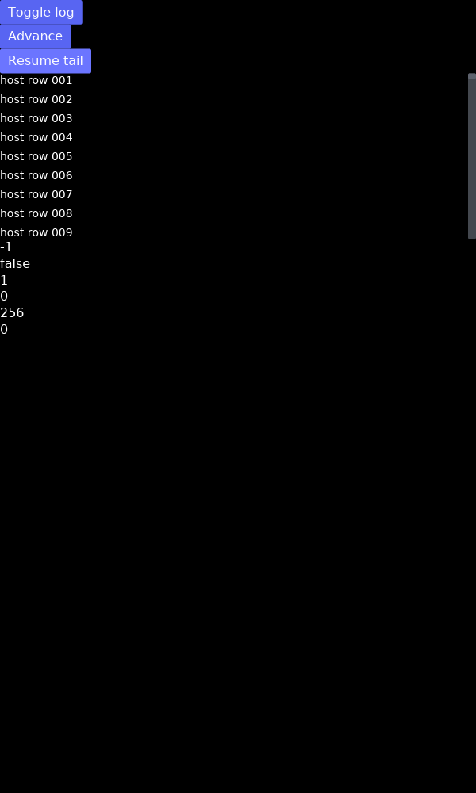
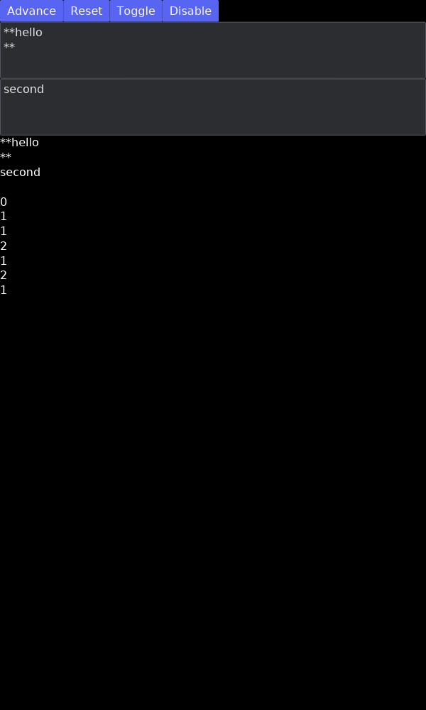
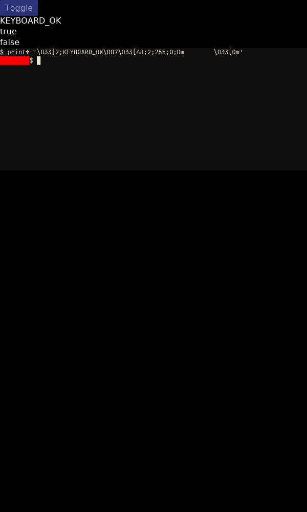
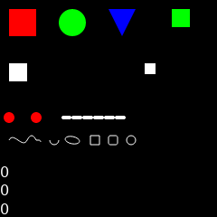
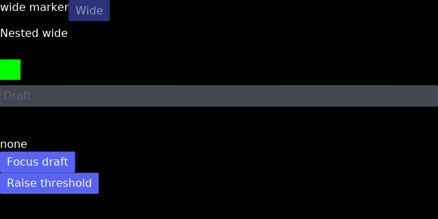
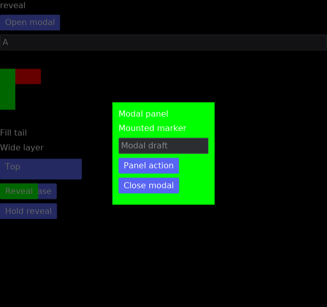
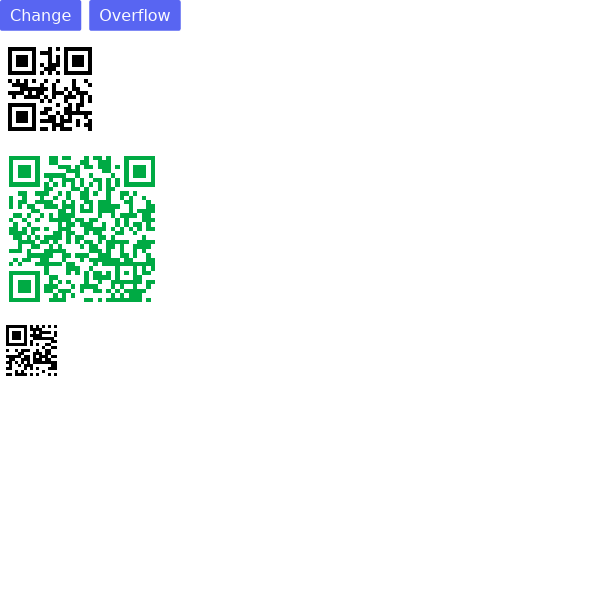

# app-store — an OS-shaped host for Ice apps compiled to wasm

A native Ice daemon that reads a catalog of `ice:view` components, installs
one on Get inside a fuel and memory budget, gives it a native window of its
own, and drops the instance when that window closes. Every app in the
catalog is an ordinary Ice application compiled for the `tree` target: its
view builds a widget tree the host renders with its own toolkit, and nothing
in the language changes to make it installable. What the host adds is
everything an app cannot do alone — time, storage, other apps, the colour
mode — and it adds them as capabilities the app's manifest has to declare.


```
crates/ui-lang-wire/   (workspace crate) the wire: a Frame carrying the app's
                widget tree out, meaning-level events (message 3, input 0 now
                reads "abc") in, plus Request / Response for everything else
crates/ui-lang-guest/  (workspace crate) what an app needs to run in wasm: a
                Driver (task executor, subscription tracker, per-frame message
                tables), `host::request` / `host::subscribe` / `host::theme`, and
                `export_app!`, which adds the `ice:view` component exports and
                the manifest
crates/ui-lang-runtime/view_tree   (workspace crate) the host's half: the tree
                rendered with iced's widgets, every input's text and every
                editor's content kept host-side
apps/counter/   three buttons and a card that is a `mouse` area — hover, move
                and wheel reach the guest; Auto is an Ice `subscribe every`,
                which the guest runtime routes to the host's ticker; every
                change goes on the bus and into the store's log
apps/todo/      a list and a notes editor kept in the host's storage — they
                survive uninstall/reinstall
apps/clock/     host uptime from a subscription, UTC from one `clock.now` plus
                arithmetic; the module has no clock
apps/activity/  a live feed of what the other apps publish, and who published it
apps/chaos/     spins, eats memory, panics, floods the host, asks for an
                undeclared capability
host/           the store: catalog, library, windows, capabilities (clock,
                storage, bus, theme), the fuel/memory sandbox, the component
                cache, and the widget that shows a guest
```

## Run it

```
cargo ice bundle --manifest-path examples/app-store/Cargo.toml \
    -p app-store-todo -p app-store-counter -p app-store-clock \
    -p app-store-activity -p app-store-chaos \
    --target wasm32-unknown-unknown
cd examples/app-store && cargo run -p app-store-host --release
```

The bundle needs `wasm-tools` (`cargo install wasm-tools`) and uses
`wasm-opt` when it is on `PATH`. An app builds as a core module whose
`ice:view` exports are already in place; the command wraps it as a
component and satisfies the imports iced's wasm target leaves behind
(wasm-bindgen's placeholders, from `web-time` and `web-sys`) with stub
adapters that trap if called — nothing on a guest's frame path calls them.
Components land in `target/app-store-catalog` under this workspace, or
wherever `--out` says. The catalog lists components only: a module that was
built but not bundled is skipped.

| variable | default | what it names |
|---|---|---|
| `APP_STORE_CATALOG` | `target/app-store-catalog` | the directory `cargo ice bundle` writes and the store scans |
| `APP_STORE_DATA` | `target/app-store-data` | app storage (`<app>/<key>`), the store's `installed` (one `id\thash` per line), `running` and `windows` lists, and wasmtime's artifact `cache` |

The windowing backends the host asks iced for (`x11`, `wayland`) are
requested only on Linux, so a macOS or Windows build resolves without them —
only Linux is exercised here.

The gates are `cargo fmt --all -- --check`, `cargo clippy --workspace --tests
--no-deps` and `cargo test --workspace`. `--tests`, not `--all-targets`:
Ice generates a `#[cfg(test)]` harness that needs the runtime's test driver,
which pulls wgpu into a workspace whose apps link no renderer at all, so
every crate here sets `test = false` and keeps its tests in `tests/`.
`--all-targets` builds a test target anyway and fails on the missing driver.

An app links iced for its types only. iced's null renderer — what it falls
back to with no renderer feature — exists only under `debug_assertions`, so
the workspace keeps that cfg on for `iced_core`, `iced_graphics` and
`iced_renderer` in release builds; nothing in a guest ever calls it.

## The store

One daemon, two kinds of window. The store window has three pages and a
segmented Auto / Light / Dark switch; every guest gets a native window of
its own, titled with the app's name, resizable and movable like any other.

- **Discover** lists every module the catalog directory holds, from its
  manifest: name, description, and a chip per capability, coloured by what
  it reaches. Get opens the app's page with a consent prompt — every
  capability the manifest declares and what it lets the app reach, and the
  hash of the file about to be pinned — and Install there loads the module,
  pins it in the library by that hash and opens its window. While an app
  runs its card carries a fuel bar — the last tick's fuel against the 100M
  budget — and the figures under it. A strip at the top shows what is
  running now; Show raises its window, Quit closes it. Clicking a card opens
  the app's page: what each capability lets it do, the box it runs in, its
  live figures, and the file's path and hash.
- **Library** is what is installed, running or not. Open gives an installed
  app a window again — if the module in the catalog still hashes to what was
  consented to. A rebuilt one is marked "changed since install" on its card
  and its row, Open is refused with the reason in the status line, it is not
  reopened at start, and its page carries the warning and a fresh Get; the
  new hash is pinned only through the consent prompt again. Uninstall removes
  it from the library and closes its window. What the app wrote to storage
  stays.
- **Monitor** is the dogfooding page: one row per running guest with fuel
  per tick, fuel per second over the last ten seconds (and whether that is
  being throttled), tick time, ticks per second, the bytes of the last whole
  frame and of the last patch frame with how many frames crossed as
  "unchanged", ticks run against redraws skipped, and whether the module came
  from the cache or through cranelift.

Closing a guest's window quits the app — the wasmtime store, its memory and
its compiled code go with the last handle. Closing the store window ends the
store. What had a window at exit reopens at the next start, one load at a
time; the library comes back as it was.

The keyboard reaches everything in the store window. `Tab` and `Shift+Tab`
move through its controls — the tabs, the search box, the colour switch,
every card's head and button — and `Enter` presses the one wearing the
ring. Two keys are the store's own: `Ctrl+F` (`⌘F` on macOS) puts the
cursor in the search box, and `Escape` steps back one layer — a search in
progress is cleared first, then an app's page returns to Discover. A
guest's window keeps its keyboard; what it does with Tab or Escape is its
own.

The colour mode is the store's: Auto follows the system, Light and Dark are
the user's word. Every guest subscribes to `host.theme` in its `on mount`
and switches its own palette on each answer, so the windows change together.

## Writing an app

```rust
ui_lang::include_app!("src/ui/app.ice");
ui_lang_guest::export_app!(Clock, "Clock", "Host uptime.", ["clock"]);
```

That is the whole crate, plus a `build.rs` that compiles the Ice sources
for the `tree` target (`ui_lang_build::compile_dir_for("src/ui",
Target::Tree)`): the generated view builds `ui_lang_wire` nodes instead of
iced widgets, and a construct the wire does not carry fails the build at
its `.ice` line. `export_app!` implements the guest crate's `App` trait over
the generated `__boot` / `__view` / `__update`, emits the `ice:view`
component exports (`init`, `tick`, `snapshot`, `restore`, and the `panicked` import the guest's
panic hook calls before it aborts), and writes name,
description, capabilities and the declared primary window size into an `ice.manifest` custom section, so the
catalog lists the app — and shows what it will touch — by reading the
file: no compilation, no instantiation.

An app talks to the host from ordinary Ice tasks. A one-shot ask is
`host::request`; something that keeps coming is `host::subscribe`. An Ice
`subscribe` block runs as it does natively — the driver diffs its recipes
every tick, so a subscription that stays the same keeps its stream and one
that goes away cancels what it asked the host for — with one difference: a
module has no clock, so `every` and `repeat` are the host's `clock.ticks`
under the hood (declare `clock`), and `every` routes without an instant.

```ice
extern crate::host
  stream ticks(every_ms:i64) -> i64 ! ClockError
  stream theme_changes() -> str ! ClockError

on mount
  parallel
    stream every ticks(1000) -> ticked _ | clock_failed _
    stream every theme_changes() -> themed _ | theme_failed _

on themed(mode)
  dark = mode == "dark"
  active_palette = ClockTheme.light
  return if !dark
  active_palette = ClockTheme.dark
```

```rust
pub fn ticks(every_ms: i64) -> impl Stream<Item = Result<i64, ClockError>> + Send + 'static {
    host::subscribe("clock.ticks", &every_ms.to_le_bytes()).map(|answer| /* bytes → ms */)
}

pub fn theme_changes() -> impl Stream<Item = Result<String, ClockError>> + Send + 'static {
    host::theme().map(|answer| /* bytes → "light" | "dark" */)
}
```

## Capabilities

A request's kind is `<capability>.<operation>`. The host answers only what
the manifest declares; a request for anything else comes back as the `Err`
of the task, which the app's handler routes like any other error (Chaos's
"Use the clock" shows the refusal text, and its "Flood" the refusal past the
per-tick request cap).

| capability | operations | answer |
|---|---|---|
| `host` (always) | `echo` · `log` · `random` (`u32` LE count) · `theme` (stream) | the text back · nothing, the line goes to the store's stderr as `[<app>] …` · that many bytes · `light` or `dark` at once and on every change |
| `clock` | `sleep` (ms) · `ticks` (every ms, stream) · `now` | nothing at the deadline · host uptime per tick · the unix millisecond and the host uptime it was read at, two `u64` LE |
| `storage` | `get` (key) · `set` (`key\nvalue`) · `delete` (key) · `list` | the value or empty · nothing · nothing · every key, newline-separated; one file per key per app |
| `bus` | `publish` (`topic\ntext`) · `subscribe` (topic or `*`, stream) | how many heard it · every matching message, as `from\ntopic\ntext` |

Publishing does not need the topic: any app with `bus` may publish under
any name, and `from` — the publisher's app id, which the host fills in — is
what says who did. A real host would route `query` / `submit` / `page`
through the same table and answer from its own subscriptions.

## How a frame crosses

1. The guest driver delivers the host's events — a message index the user
   activated, an input's whole new text, a response — runs the handlers
   they name, brings the `subscribe` block's streams in line with the
   state, polls every task that was woken (by an answer, by its own yield,
   by another task), and builds the view.
2. The view is a `ui_lang_wire::Node` tree with every value inlined: text,
   colours resolved from the app's own palette, sizes, paddings, button and
   input faces per state. A button carries the index of the message the
   guest queued for it this tick; an input carries its handler's index and
   the guest's copy of the value. The guest never learns where anything
   landed. The frame also carries the requests the tasks made and the
   requests they dropped.
3. A tree identical to the last one crosses as `unchanged` with no tree:
   a few bytes instead of every node again. The host keeps the tree it
   already has and takes only the requests and the cancels. A tree that
   changed crosses as patches against the last one — the driver keeps the
   tree it sent and diffs the new one against it: a changed field is a
   `Props` patch that keeps the node's children, a list of children is
   matched by key so a row that moved is a `Move`, a new one an `Insert`,
   a gone one a `Remove`, and a node of another kind a `Replace`, each at
   a path of child indices from the root. The tree crosses whole only when
   there is no last tree (the first frame, or the one after the host asked
   to `Resync`) or the patches would encode bigger than it.
4. The host sanitizes the tree, renders it with iced's own widgets
   (`ui_lang_runtime::view_tree`) — layout, fonts, IME, caret, selection,
   scrolling and focus are all the host's — and keeps every input's live
   text itself, adopting the guest's value only when the guest moved it
   (its handler cleared the field). What the user does comes back as
   meaning: a press is `Event::Message(i)`, typing is
   `Event::Input { handler, text }`, the pointer over a `mouse` area is
   `Event::Pointer { handler, x, y }` in the area's own pixels — at most
   one per handler per redraw, the last position, as a browser sends one
   `pointermove` per frame. The widget that wraps the rendered
   tree ticks the guest once per redraw with a fresh fuel budget, answers
   its requests, and rebuilds the window's view when the tree changed.
   Answers are delivered as events: an echo on the next redraw, a timer at
   its deadline via `request_redraw_at`, a bus message when another guest
   publishes.
5. Not every redraw of a window is a tick of its guest. A guest with no
   event pending, no answer due and nothing in its inbox is left alone:
   the tree the host holds is the tree it would send. It still says when
   it next wants to run, and the widget schedules that wake-up. A frame
   that says `busy` — the tick's budget ran out with work still ready — is
   the one exception: that guest is ticked again at the next redraw.

There is no executor thread and no clock inside a module. `clock.now`
answers the wall clock together with the host's uptime it was read at, and
`clock.ticks` streams that uptime — measured from the moment the store
starts, not from the first guest — which is what lets an app anchor one to
the other instead of drifting by however long the store had been running
when it was installed.

## What it costs

Loading a module is cranelift's compile the first time and a file read the
next: wasmtime's artifact cache lives under the data directory, and a module
loaded once in a run is kept in memory, so Restart, Quit-then-Open and
reinstall are an instantiation — under a millisecond. The compile itself
runs across every core (wasmtime's `parallel-compilation`), so a cold
restore of five apps takes about a second on a quiet machine rather than
their sum, and a warm one about a fifth of that. The Monitor's Load column
says which it was.

A guest is ticked only when something is due for it, so Counter sits at
0/s and Clock at 1/s; a press or a keystroke reaches the window it
happened in, so one guest ticks instead of five; a tree that changed
nothing crosses as a flag, and one that changed crosses as patches.
Pointer movement reaches a guest only over a `mouse` area with a `move=`
route, and then as one event per redraw — hover over anything else is the
host's widgets' — so a window with the pointer moving over it costs what
any native iced window does until the pointer is over such an area, and
then one tick per frame. The Monitor page keeps the counters per app:
ticks against the redraws it slept through, how many of its frames crossed
without their tree, and the bytes of the last whole frame beside the bytes
of the last patch frame.

What the patches save, on Todo with two hundred items and one of them
toggled (`cargo test -p app-store-todo --test delta -- --nocapture` from
`examples/app-store`, the same numbers on every run since the tree is
deterministic):

| frame | bytes |
|---|---|
| the list, whole (the frame before this change, and the first frame after it) | 133,358 (tree 133,332) |
| the toggle, as patches | 7,984 — three `Props` patches at 344 bytes (the checkbox, the progress bar, the "left" count); the rest is the `storage.set` request whose payload is the list itself |

Nearly four hundred times less tree on the wire, and on the host the
patches are applied to the tree it holds and that tree sanitized again
instead of a hundred kilobytes decoded; the render is the same either way.

What a pointer event costs in fuel, on Counter's card (`cargo test -p
app-store-host --test move_fuel -- --ignored --nocapture` from
`examples/app-store` after bundling the counter; the same figures on every
launch and every run, since a tick is deterministic; the component as
`cargo ice bundle` writes it without `wasm-opt`):

| tick | fuel |
|---|---|
| idle (no event, tree unchanged) | 69,408 |
| `+` pressed: handler, view, publish | 158,123 |
| the pointer entering the card: handler, view | 140,592 |
| one `move`: handler with the position, view, one `Props` patch | 142,007 |
| one wheel notch: handler, view, publish | 162,757 |

A move costs what a press does — the handler and the view, not the
event — and the host sends at most one per redraw, so a pointer sweeping
the card at 60 Hz spends under 9M fuel a second against the 600M budget.

## The sandbox

Every tick runs with `FUEL_PER_TICK` (100M, roughly one per instruction —
about a 60 Hz frame of wall clock, and two hundred times the busiest tick
any app here has) and a 64 MB memory limit, in a store that allows eight core instances (the
app, the stub adapters, the bindings' shims — all the component's own),
one memory and four tables of at most a million elements — a table is
allocated at its declared minimum when the component is instantiated,
before any other limit is consulted. An app that spins burns its budget
and traps; an app that allocates past the limit traps on the grow. A trap
ends that instance — its window shows the reason (the message the guest's
panic hook handed the host through `panicked` on its way out: a trapped
instance can never be entered again, so nothing is read back) and a
Restart button
that asks the store to reload the component on its executor, where the
compile does not stall the window, and swap it into the same handle,
keeping the window and everything the app wrote to storage — and nothing
else notices: the other guests keep ticking, the store keeps answering.
The app's card and its Monitor row show what the last tick cost, plus the
bus deliveries the guest was not there to take.

Fuel and memory bound what a module does to itself. What it can make the
*host* do is bounded by the constants in `limits.rs`:

| limit | value | what a guest past it gets |
|---|---|---|
| `MAX_FRAME_BYTES` | 8 MiB | the instance ends, "frame too large" |
| `MAX_PATCHES` (the wire's) | 1024 per frame | the patch frame is refused like any patch the held tree cannot take — a path to no node, an index past a list, a list edit on a fixed-arity node, `Props` of another arity: the window is blank for a tick, the guest hears `Event::Resync` and sends the tree whole |
| `TICK_DEADLINE` | 100 ms of wall clock per call into the guest, in 10 ms epochs | the instance ends, "tick exceeded 100 ms". Fuel counts wasm instructions, and time inside a host import is not fuel — this is what bounds a tick that spends its time on the host's side of an import |
| `TICK_BUDGET` / `MAX_REST` | 8 ms per redraw, 250 ms of waiting | its next redraw waits as long as this one overran: an expensive guest runs at a few frames a second instead of at the window's rate, and the windows sharing that thread keep theirs |
| `FUEL_PER_SECOND` / `FUEL_WINDOW` | 600M fuel a second, averaged over 10 s | its next redraw waits a share of `MAX_REST` that grows with the overspend — all of it at double the budget — until the window has drained back under. This is the one that notices a guest that is merely busy every tick, forever; the Monitor's Fuel / s column shows the figure and says "throttled" |
| `MAX_REQUESTS_PER_TICK` | 256 | `Err "too many requests this tick"` for the rest |
| `MAX_PAYLOAD_BYTES` | 1 MiB | `Err`, whatever the request was |
| `MAX_TICKERS` | 16 per guest | `Err` from `clock.ticks` |
| `MAX_DUE` | 1024 answers the host still holds | `Err` from `clock.sleep` |
| `MAX_SUBSCRIPTIONS` | 64 per guest | `Err` from `bus.subscribe` |
| `MAX_TOPIC_BYTES` | 256 per subscription | `Err` from `bus.subscribe` |
| `MAX_CANCELS` | one tick's worth of everything the host holds | the rest of that frame's cancels ignored |
| `MAX_REPLY_BYTES_PER_TICK` | 4 MiB | `Err` for the rest of that tick, checked before the work: it counts the payloads the requests carried in and the copies a publish made, not only the answers |
| `MAX_BUS_BYTES` | 64 KiB per message | `Err` from `bus.publish` |
| `BUS_WAKE_INTERVAL` | 50 ms | the other windows are woken for a guest's publishes at most twenty times a second; the messages are in the subscribers' inboxes at once, and the last of a burst wakes when the interval is up |
| `MAX_INBOX` / `MAX_INBOX_BYTES` | 1024 events, 1 MiB | its oldest bus deliveries dropped, and counted in its status line |
| `MAX_VALUE_BYTES` | 1 MiB | `Err` from `storage.set` |
| `MAX_APP_KEYS` | 1024 per app | `Err` from `storage.set` |
| `MAX_APP_STORAGE` | 64 MiB per app | `Err` from `storage.set`, summed over the app's directory, a block per key |
| `MAX_RANDOM_BYTES` | 4096 per answer | `Err` from `host.random` |
| `MAX_LOG_BYTES` | 1024 per line | the rest is cut, and the line is escaped before it reaches a terminal |
| `MAX_FAULT_BYTES` | 1024 | its window shows the first line of that |
| `MAX_NAME_BYTES` · `MAX_DESCRIPTION_BYTES` · `MAX_CAPABILITIES` | 64 B · 256 B · 16 of 32 B | its module is left out of the catalog — the sidebar shapes every manifest field of every entry, before anything is installed |
| `MAX_MODULE_BYTES` | 64 MiB | its `.wasm` file is left out of the catalog, unread — or, loaded by a path the catalog didn't just scan, `Err` naming the limit before cranelift ever sees it |
| the catalog's SHA-256 | the file as scanned | a file whose bytes no longer hash to what the catalog scanned is refused before cranelift sees it — "changed on disk since the catalog was scanned" — on Get, Open, Restart and the restore at start alike; the in-memory component cache is keyed by that hash |

The numbers *inside* a frame are the other half of the same boundary: the
guest chooses every one, and the host lays out what it is given and
allocates by the counts it is given.

The shape comes first, because reading a tree is itself recursive. A
`Node` holds its children, so a chain of containers is a chain of stack
frames in the decoder — and in `sanitize`, the renderer and `Drop` after
it. A few thousand links is a frame of about 100 KB, well inside any byte
cap, and walking one takes a host thread off its stack: an abort, not a
fault, with every window in the process gone. So `wire::decode` counts
what it descends into and refuses a frame nested past `MAX_DEPTH` or
carrying more than `MAX_DECODED_NODES` (16 × `MAX_NODES`) before there is
a tree to walk. That refusal ends the one instance, like any other.

What survives the door, `wire::sanitize` pulls into range: depth to
`MAX_DEPTH` (64, the host's layout recurses that far and no further),
nodes to `MAX_NODES` (8192, a screen's worth — a list past that is the
guest's to window), every string to `MAX_STRING_BYTES` (64 KiB), the
shaped text of the whole tree — contents, input values and placeholders,
plain button labels — to `MAX_TEXT_BYTES_PER_FRAME` (64 KiB, taken in
tree order so a tail past it comes out empty, because the 8 MiB of text
the frame cap alone allows is seconds of cosmic-text on the window
thread every redraw), text sizes to `MAX_TEXT_PIXELS` (512, since every
glyph at one is rasterized and cached), other sizes, spacings and
paddings to finite pixels no larger than a wall, colours to `0..=1`. A
key used twice is moved off the one already taken (`key`, then `key#2`):
a key is the node's widget state, its focus target, its accessibility id
and, for an input, the text the host owns on its behalf, so two nodes
sharing one share all of that.
Every frame passes through it, tree or no tree — an `unchanged` one still
carries request kinds the host formats into refusals and shows. A
well-behaved tree comes out untouched; a hostile one is cut, not refused,
so a guest that overshoots by one node still shows. A patch frame is
bounded by `apply`: the patches are applied to the tree the host holds and
the result goes through the same walk, since an inserted subtree can push
the whole past `MAX_NODES` or `MAX_DEPTH` or reuse a key the tree already
has, and only the whole can be checked for that.

## What is not here yet

Catalog polling and approved in-place replacement are implemented; state-schema
migrations and remote distribution are not. See [host replacement](#approved-host-replacement).

An honest inventory, grouped by where the work would land. Items marked
**bug** are wrong today rather than merely absent.

For module packaging requirements and the connected implementation phases, see
[module-owned wasm views](module-views.md).

### Wire and rendering

- Plain text carries `wrap=`, `shape=`, named font family/weight/stretch/style,
  `line-h=`, `h=`, `align-y=` and grapheme tracking. Hosts load font bytes and
  call `view_tree::register_font_family` with trusted static family names;
  unregistered names use the native sans-serif fallback. Untracked text remains
  selectable. Tracked graphemes consume the frame node budget. Boxes carry
  `max-w=`, `max-h=`, clipping and padding; buttons accept padding utilities.
  Host and guests must be rebuilt together for these wire fields.
  After input presentation support, the actual Ducktape typed node root passes
  the shared kit and input options and reaches the opaque `node_log_timeline`
  surface slot. The host must own that state and expose data-only arguments and
  events through the existing surface registry; this needs no new wire variant.

- Button `checked=`, `expanded=` and `description=` cross to the host's native
  accessibility wrapper. False remains distinct from omission; descriptions
  consume the shared text budget. Host and guests must be rebuilt together.
  Buttons also carry all eight native presets and resolved recipes, including
  guest default label typography, disabled treatment and keyboard focus rings.

- `row wrap` and `col wrap` reflow through native host layout, with copied
  `wrap-gap=` and `wrap-align=`. The text fixture checks resizing and a wrapped
  button route through actual wasm. Rebuild hosts and guests together.

- Boxes carry `shadow=`, signed `shadow-x=`/`shadow-y=` and `shadow-blur=`
  into native paint, sharing shadow values and sanitization with tooltips.
  Rebuild hosts and guests together. The bundled
  [text fixture](tests/text-guest/src/ui/app.ice) and
  [`text_wasm_box_shadow_paints_outside_its_bounds`](host/src/text_tests.rs)
  verify blurred, translucent shadow pixels outside the box.

- Tooltips use native delayed overlays with copied position, styling and
  viewport snapping. Visible tip text supplies an accessible description;
  explicit descriptions are preserved. The text wasm fixture exercises
  delayed show/hide and the native AccessKit snapshot. Delay is capped at
  60 seconds and both children share the frame budgets.

- The wire carries `box`, `mouse`, `col`/`row`, `keyed`, `lazy`, `flex`, `pin`, `grid`, `stack`, `hover`, `overlay`, `scroll`, `sensor`, `responsive`,
  `text`, `rich-text`, `qr`, `tooltip`, `svg`, `canvas`, `input`, `editor`, `button`, `space`, `rule`, `checkbox`, `toggler`,
  `slider`, `pick` and `progress`, with `if`/`for`/`match` around them, and an
  `extern` widget as a host surface: the host paints the region under the
  extern's name (`clock_face` is the one this store paints, with a sweeping
  second hand the guest never ticks), given the call's copied data arguments
  (`unit`, `bool`, `i64`, `f64`, `str`, lists, options and records); a name
  the host lacks renders a placeholder. Remaining refusals include combo box, images,
  mounted components inside lazy or host container conditions, gradients, and
  unsupported interaction utility styles. These fail the app's build at
  its `.ice` line with E190 and need additional lowering or host contracts.
  A layout's surface utilities (`@bg-…`, `@border-…`, `@r-…`) and a box's
  `px-snap` do cross.
- A `sensor` crosses with its show, resize and hide routes, `anticipate`
  and `delay`; the host measures the child after layout and answers with
  its local size, never a window position (the activity feed turns its
  height into a row count). A guest whose answer re-sizes the child is
  measured again on the next redraw, four times in a row at most: past
  that the host drops the size events and logs `sensor loop limit
  exceeded` until a user event, timer or window resize drives a tick.
  `key=` is refused with E190: the wire's node key is the identity, and
  a second key that resets the sensor has no field to cross in.
- A host surface takes positional scalar, list, optional and record values
  and returns a typed value through
  the extern's declared route. The provider receives the instance's node key
  and the values; the renderer attaches the route, and the guest rejects an
  event whose type differs from the declaration. Strings share the frame's
  text budget and arguments are capped at 256. Its size is its parent's;
  a `box w= h=` around the call sets it. Nested values have depth/count
  limits during decoding; returned records must match the declaration name,
  ordered field names and all nested types. Identifier text is never truncated.
  Recursive records, enums and opaque native editor/terminal/log state remain
  unsupported as copied arguments. Registries are now owned per guest; the
  `session_log` provider binds a host-owned log session and retains each native
  view independently. The `rich_composer` provider now keeps native input,
  IME and per-view history behind typed semantic notices (see its fixture
  below). A host-configured `terminal` provider retains a real PTY while its
  view is hidden. Application highlighting, page-specific events and module
  process/session adapters remain work for module-owned views.
- A `shader` call uses that same named surface registry and typed routes.
  Its `w=`/`h=` cross in a containing box, with Iced's 100×100 defaults
  and zero intrinsic size for `shrink`.
  The host provider fills that box and owns its rendering and redraws;
  an unknown shader name shows the usual placeholder. Native shader
  functions and GPU programs are not linked into the guest.
- `markdown` uses the named `ice.markdown` host surface. A custom
  `markdown-viewer` uses its declared name instead; its first argument is a
  `MarkdownDocument` record containing source, resolved settings and guest
  palette, followed by the declared wire arguments. Links return typed events.
  The guest preserves source through replacement and append and supports
  `markdown_images()`. The default host owns the parsed content and widgets,
  retaining link/scroll state across unchanged frames and dropping them on
  unmount. Source is limited to 64 KiB, native parsing to depth 32 and 4096
  events, and layout metrics to 512 pixels. Default and monospace fonts cross;
  named fonts and inline gradients remain E190. Custom providers and image
  asset loading remain the embedding host's responsibility.
- An `svg` is an embedded asset or a `memory` source, sized, fitted,
  rotated, faded and tinted with an idle and a hover colour; its bytes
  cross once under a content hash and the host keeps them for the guest's
  life, up to a fixed cap. `color=inherit`, a style callback and a path
  read at runtime are refused with E190.
- A form control's per-state style given as literal colours (`active
  checked bg=…`, `active rail-start=…`, `progress … style=success bar=…`,
  a pick list's states and `menu`, a rule's `style=weak`, `r=` and
  `snap=`) crosses as faces the host paints over its own theme. A style
  given as a Rust callback (`style=some_fn(…)`) is refused with E190, as
  are the shapes the faces have no room for: a toggler's knob border and
  padding ratio, a slider's handle shape, a rule's `fill=`. A slider
  carries `f64` values only.
- Border colour, width and corner radii retain their individual absence
  on the wire. Setting only `border=…` keeps the host's width and rounding;
  a hover face that sets only the width keeps the active face's colour and
  corners. An explicit transparent colour, `border-w=0.0` or `r=0.0`
  still clears that field. This applies to each host control's border style,
  including progress bars; a plain container starts from its default border.
- A `scroll` carries its bar options (`bar=hidden`, `bar-w=`, `bar-m=`,
  `scroller-w=`, `bar-gap=`), anchors (`anchor-y=end`, `anchor-y=keep`)
  and `auto=`. Its `scroll=` route reports absolute and relative X/Y offsets;
  the full `viewport=` route and status styles are refused with E190.
- A `mouse` area carries every route — press, release, double, right and
  middle buttons, enter, exit, `move=`, `press-at=`, `scroll=` — but not
  `cursor=`: the pointer's shape over it is the host's, and the option is
  refused with E190.
- An `editor` is its text in a view module: the host owns the
  `text_editor::Content` (caret, selection, undo) and the guest's `editor`
  state is a `String` it hears whole after every edit, like an input's. It
  carries a hint, a width in pixels, a height and min/max heights,
  `disabled=`, and text options (`size=`, `p=`, `line-h=`, `wrap=`, `font=`).
  Declarative active, hovered, focused, focused-hovered and disabled faces
  preserve native background, border/radius, value, placeholder and selection
  colors. Hosts and guests must rebuild together for `EditorOptions`. The
  [editor fixture](tests/editor-guest/src/ui/app.ice) and
  [host test](host/src/editor_tests.rs) exercise native layout, selection, edits,
  disabled state and paint through a real wasm bundle, including native edits
  followed by caret/IME queries in the same overlay event batch. Everything requiring
  a native callback remains E190: an `editor-action`, `editor-binding`,
  `editor-highlighter` or `editor-style` extern and `highlight=`.
  The caret builtins (`editor_cursor_line`, `editor_cursor_column`,
  `editor_has_selection`) are refused too — the guest never sees the caret
  — and, because an expression carries no origin, that E190 names the
  builtin but not its line. `editor_line_count` and `editor_line` read the
  string. Accessibility exports the editor's value, caret and one text run
  per line, and `SetTextSelection` moves the host's caret without a guest
  tick.
- No scale factor or locale reaches the guest. The colour mode does, as a
  `host.theme` stream the app has to subscribe to and act on itself.
- The host's accessibility tree names every node by its key, but nothing
  reads it back into the guest.

### Events and input

- Only a button's press, an input's edit and submit, a checkbox's or
  toggler's flip, a radio's or pick list's selection, a slider's drag and
  release, and what a `mouse` area hears — its buttons, enter and exit, the
  pointer's position in its own pixels, the wheel — cross. Keyboard events
  cross after native handling, preserving captured/ignored status. Scroll
  position, drag and drop, window focus and close requests remain host-side;
  the pointer over anything but a `mouse` area does too.
- Checked `task widget` statements can focus a named input, move focus
  forward/backward, query focus, move/select input text and scroll/snap a
  named region. `snap-end` respects either content anchor. Requests use
  `host.widget` and operate only inside that mounted guest, including its
  overlays. The first mount is awaited; superseded requests are refused,
  cancellation removes queued work, and native work counts toward host
  throttling. `scroll-to-key` reveals a keyed virtual row through the same
  scoped operation path. Widget selectors remain E190.

### Tasks and runtime

- Task outputs and clipboard actions are executed. Clipboard access requires
  the declared capability. Checked Ice widget statements lower to the mounted
  host channel; arbitrary native `Action::Widget` values returned by Rust
  extern Tasks are not serialized. Those actions, and window, font, image,
  reload and exit actions, are still dropped with a `host::log` diagnostic.
- `every` carries no instant in a module and refuses a route that binds
  one (E190): there is no `now` to make it from. Host-delivered keyboard
  press/release/modifier subscriptions are supported. Mouse, window and IME
  event subscriptions and `system theme` transport remain unsupported.
- Task fairness is fixed: 8 rounds of messages per tick, 64 poll passes
  per round. A task that produces more is cut short, and the frame says so
  (`busy`) so the host ticks the guest again at once; what it does not do
  is share the budget fairly between tasks, so one always-ready stream
  starves nothing but delays everything.
- No cooperative long computation: work heavier than one fuel budget
  cannot be spread over ticks except by chaining host sleeps. No
  preemption short of the trap that ends the app.
- `println!` and `tracing` inside a module still go nowhere; `host::log` is
  the way out and the host prints it on its own stderr. Nothing shows the
  lines inside the app store itself.
- Inside a module `SystemTime::now()` still aborts and `getrandom` still
  needs JS glue; `clock.now` and `host.random` are how an app gets the time
  and entropy. No locale, timezone or environment.

### Capabilities and security

- The manifest is self-declared and unsigned: any module can claim
  `storage`, and the store has no way to tell who built it. What *is*
  checked: the catalog records each component's SHA-256 at scan time; Get
  shows what the manifest declares and asks once, and the library pins the
  hash consented to; the loader hashes the bytes it is about to compile and
  refuses any that differ from the catalog's; a module whose catalog hash
  differs from the pinned one is shown as changed, refused by Open, left out
  of the restore at start, and installed again only through the prompt. What
  is not: no signatures or keys, so the check is against the store's own
  scan and never against an author; no per-operation prompt, no runtime
  revocation, no policy file; the consent prompt shows the manifest's word
  for what the app does and the store's word for what a capability reaches,
  nothing about the code itself.
- Storage: a write is atomic (a sibling temp file, then a rename) but not
  fsync'd, so a power cut can still lose the last one. Keys are compared
  byte for byte, so on a case-insensitive filesystem (the default on macOS
  and Windows) `Items` and `items` are one file that the quota and
  `storage.list` count as two. The quota is one scan of the app's directory,
  kept on the instance and moved by every write — one `stat` for the key a
  `set` replaces, another scan after a `delete` — so it is only as true as the
  host being the sole writer, and a reinstall or a restart scans again. No
  sharing between apps, no migration on app upgrade, and nothing outside the
  app can read or list what it stored.
- Bus: no topic ownership — any app with `bus` can publish `counter\n999`
  under its own name. No rate limit beyond the per-tick byte budget the
  fan-out is charged to, no replay for late subscribers, no request/reply
  between apps, no wildcard beyond `*`.
- Beyond the sandbox table: the cumulative budget is fuel, not wall clock,
  so a guest that spends its ticks on the host's side of an import is
  bounded per call by `TICK_DEADLINE` and per redraw by `TICK_BUDGET` but
  never summed over time; and it throttles, never ends — a guest at the cap
  still gets a few ticks a second forever. The deadline is checked at wasm
  loop back-edges and function entries, so a host import already running
  finishes first: it bounds how many long imports one tick makes, not how
  long one of them takes. A request answered this tick wakes the window at
  once, so an app that asks in a loop still runs at whatever rate the
  governors leave it.
- `define_unknown_imports_as_traps` accepts every import a component
  declares and traps the first call; a component built against JS glue
  loads, and fails at the first frame that touches it instead of at
  install.

### Store and lifecycle

- What comes back at start is the library and the list of apps that had a
  window; app state is not persisted or suspended — a reopen, like a
  Restart after a trap, leaves an app with nothing but what it wrote to
  storage.
- Guest windows open with a valid saved placement first, otherwise the declared
  primary `window size`, otherwise 560×420. The native open settings already
  contain that size; minimum size is 320×240 capped to the chosen size per axis.
  Restart retains the existing window. One instance per module.
- The manifest has no icon, application version or author.
- The catalog is one local directory, polled asynchronously every second and
  on Rescan. There is no remote catalog, download or state migration. Scanning
  reads each module in full for its manifest and content hash; unchanged results
  retain the existing rows. Changed hashes still require explicit consent.
- Uninstall keeps the app's storage — an app can delete its own keys, the
  store cannot. It asks once, on the app's detail page, and nowhere else.
- A guest that publishes on every tick makes the store update on every
  tick — that update is the wake that carries the message to the other
  windows, spaced only by `BUS_WAKE_INTERVAL`.

### SDK and developer experience

- Capability payloads are ad-hoc bytes (`key\nvalue`, little-endian
  integers) with no schema, no generated bindings, no versioning and no
  `host.capabilities` introspection; every app declares its own
  `HostError`.
- `cargo ice bundle` builds the catalog, but there is no `cargo ice dev`
  loop for a guest. Every component still links iced's widget set and
  winit's web backend as dead code (about 600 KB after the wasm-bindgen
  metadata is stripped); a guest needs only iced's types.
- Native tests drive the app through the wire — `press`, `type_into`,
  `submit` by key or label, `hover` / `move_to` / `scroll` on a `mouse`
  area by key, `answer` / `item` / `refuse` for the host —
  and read the tree back with `texts` and `find`; the Ice test harness
  (`agent_inspect`) is not available inside a module (`test = false`). No
  request-log or fuel profiler for debugging.

### What a ducktape host would add

- The real capabilities — `query`, `submit`, pages, identity, `duck://`
  navigation, signing prompts — and the permissions UI around them.
- Modules from the network: content-addressed ids, signatures, version
  pinning, upgrade with migration, precompiled artifacts.
- Typed intents between apps instead of a broadcast bus, notifications,
  badges, detached windows, background (daemon) apps, suspend when hidden.


The typed surface boundary has a dedicated generated guest under
`tests/surface-guest`; it is not part of the normal app catalog. Its native
route test and the renderer's clicked-button test cover both sides of the
boundary. To execute the same guest in wasm (also run by CI):

```sh
cargo ice bundle --manifest-path examples/app-store/Cargo.toml \
  -p app-store-surface-fixture --target wasm32-unknown-unknown \
  --out examples/app-store/target/surface-fixture
cargo test --manifest-path examples/app-store/Cargo.toml \
  -p app-store-host --test surface_routes -- --ignored
```

### Clipboard capability

A guest declaring `clipboard` may execute Ice clipboard read/write Tasks for
the standard or primary clipboard. The install hint describes both reading
and replacing clipboard text. The host checks permission before queueing work
and executes it only from the mounted window's clipboard interface. A denied
read completes as `None` and logs the refusal; write refusals are logged.
Read results preserve absent versus empty text and are bounded on UTF-8
boundaries. Cancellation or instance failure discards queued work.

The `tests/clipboard-guest` fixture is outside the app catalog. To run the
actual wasm boundary check from the repository root:

```sh
cargo ice bundle --manifest-path examples/app-store/Cargo.toml \
  -p app-store-clipboard-fixture --target wasm32-unknown-unknown \
  --out examples/app-store/target/clipboard-fixture
cargo test --manifest-path examples/app-store/Cargo.toml -p app-store-host \
  bundled_clipboard_ -- --ignored
```

### Mounted widget operation fixture

`tests/widget-guest` exercises focus, focused replies, selection/cursor and
scroll commands while a 16ms timer changes its view. The host test mounts two
actual wasm instances, clicks controls and types into native inputs. CI also
checks stale/canceled/over-budget requests and redraw-time accounting.

```sh
cargo ice bundle --manifest-path examples/app-store/Cargo.toml \
  -p app-store-widget-fixture --target wasm32-unknown-unknown \
  --out examples/app-store/target/widget-fixture
cargo test --manifest-path examples/app-store/Cargo.toml \
  -p app-store-host bundled_widget_ -- --ignored
```

## Retained host session fixture

Each guest owns its surface registry. Providers close over sessions the host
has authorized for that instance; a guest node key never selects another
instance's native resource. The `session_log` provider renders the runtime's
real virtualized log timeline. Native selection, scrolling, tail-follow and
unread counts remain in the mounted view; a typed `LogNotice` record reports
semantic changes to the guest. The session itself is an independently owned
`Arc`, so removing a view does not end host activity.

The example records this guest's host request names in a bounded ring of 256
rows, each at most 512 characters. Prefix eviction preserves surviving
selection and paused history via `LogTimelineState::reconcile_trimmed`.
The retained log provider includes registry identity in its cache key: replacing
a guest at the same tree position cannot inherit the previous view's state,
even when the host deliberately binds both registries to the same session.

```sh
cargo ice bundle --manifest-path examples/app-store/Cargo.toml \
  -p app-store-retained-fixture --target wasm32-unknown-unknown \
  --out examples/app-store/target/retained-fixture
cargo test --manifest-path examples/app-store/Cargo.toml \
  -p app-store-host bundled_retained_ -- --ignored
```

The fixture exercises same-window instances, replacement, native row selection,
wheel scrolling, hover paint, relayout notifications, ring eviction and
unmount/remount with host updates in between. This establishes session/view
ownership; it does not serialize native editor actions or terminal sessions.

Fixture capture (600×1000, dark theme, scale 1, pointer over Resume tail):




## Rich composer fixture

The example's `rich_composer(text, reset, placeholder, disabled)` provider
uses the runtime `RichTextEditor`. Text, caret/selection, composition and
undo/redo remain native; the guest receives a `ComposerNotice` record with
`text`, `selected`, `submitted`, `line`, `column`, `anchor_line` and
`anchor_column`. The guest owns draft/submission policy and echoes the text
in the next frame. Equal echoes preserve the native caret and history;
changed text or an explicit `reset` generation installs a new document and
clears its native input state. Reset generations let a guest clear or replace
a document even when its text happens to be equal.

Plain Enter reports submission without inserting a newline. Shift+Enter
inserts a newline. Focused Cmd/Ctrl+B and I wrap selection in bold/italic
markers; Cmd/Ctrl+Shift+C and 9 insert code/quote markers. Cmd/Ctrl+Z and
Shift+Z undo/redo per edit. History belongs to each mounted view, with at most
128 snapshots and 1 MiB of snapshot text across both stacks. The Tree holds
the document lease across Element rebuilds; unmount releases it. A later
mount starts from the guest draft with fresh caret/history. Provider registries
and native document identities isolate separate guests at identical node keys.
Disabling clears composing focus; enabling requires a fresh focus interaction.

Documents are limited to 32,640 UTF-8 bytes so a notice containing the full
text and full selection fits the shared event budget. Oversized edits are
rejected atomically, preserving text and selection; oversized initial/replacement
arguments show an explicit placeholder. The whole view still obeys the wire's
shared frame budget. The fixture limits its displayed previews to avoid
spending that budget again on duplicate long text.

```sh
cargo ice bundle --manifest-path examples/app-store/Cargo.toml \
  -p app-store-composer-fixture --target wasm32-unknown-unknown \
  --out examples/app-store/target/composer-fixture
cargo test --manifest-path examples/app-store/Cargo.toml \
  -p app-store-host bundled_composer_ -- --ignored
```

The actual wasm tests cover typing with guest echoes between keys, Enter and
Shift+Enter, formatting, selection, undo/redo, IME preedit/commit, non-pointer
reset/disable during composition, remount, replacement and concurrent guest
drafts, and full-selection/oversized-edit budgets. A native Tree ownership
test checks that a live registry cannot retain an unmounted document.

This provides a native input and semantic event boundary. It uses the default
plain highlighter; Ducktape's application-specific Markdown highlighting,
page todo/link/menu/gutter/comment adapters and terminal provider remain later
integration work. Native `Content` and editor `Action` are still not wire values.

Native fixture capture (600×1000, dark theme, scale 1, after editing both views):




## Native terminal fixture

The host registers `terminal() -> unit` for a guest declaring the `terminal`
capability. Set `ICE_TERMINAL_PROGRAM` to an absolute executable path before
starting the host. The host starts one process per installed guest with no
arguments in its own working directory; the guest cannot choose a program,
arguments, directory or send synthetic terminal input. With no configured
program, the provider is idle and reports that configuration is missing.
The existing capability consent applies before installation.

The native terminal handles keyboard, selection, clipboard and ANSI rendering.
A guest can subscribe to `terminal.events` with an empty payload. Each response
is a wire-encoded `SurfaceValue::Record` named `TerminalNotice`, with ordered
`running: bool`, `title: str`, `attention: bool` fields. Titles are capped at 512
characters. There are at most 32 subscriptions and one coalesced pending update
per guest; attention survives coalescing. Cancellation removes the subscription,
while the host retains the session. Removing the native view clears its focus
and pending clipboard work without ending the process. Dropping both guest and
view releases the session.

A host frame polls at most 256 native events every 16 ms, including while the node
is hidden or the wasm guest rests. Native output does not itself require a wasm
tick; subscribed metadata does. Exit stops polling after the engine drains its
last output. This workspace patches alacritty_terminal 0.26.0 to preserve buffered
PTY bytes and unfinished synchronized updates at exit; embedding workspaces
must also select that Cargo patch.

```sh
cargo ice bundle --manifest-path examples/app-store/Cargo.toml \
  -p app-store-terminal-fixture --target wasm32-unknown-unknown \
  --out examples/app-store/target/terminal-fixture
cargo test --manifest-path examples/app-store/Cargo.toml \
  -p app-store-host terminal_tests -- --ignored
cargo test -p ui-lang-components --features terminal --lib ui::terminal::tests
```

The fixture proves native keyboard-to-PTY input using an OSC title response,
paints explicit ANSI RGB output, and receives output/exit while hidden before
remounting the final display. It also checks a full pending-reply queue during
wasm rest, capability refusal, cancellation and separate instance ownership.
These are host boundary prerequisites. Ducktape's module-selected agent/SSH
processes, session routing and application policy remain separate integration.



## Declarative canvas fixture



`tests/canvas-guest` sends solid geometry, transformed and clipped groups,
guest loops and conditional drawing through an actual wasm bundle. The host
test checks pixels and clicks through a native mouse area to update guest
state. Geometry is copied data; native drawing state, host-size bindings,
gradients, canvas text and canvas images remain refused.

```sh
cargo ice bundle --manifest-path examples/app-store/Cargo.toml \
  -p app-store-canvas-fixture --target wasm32-unknown-unknown \
  --out examples/app-store/target/canvas-fixture
cd examples/app-store
cargo test -p app-store-host bundled_canvas_ -- --ignored
```

Canvas preparation also shares a 16,384-part host budget across the tree for
flattened segments and estimated dash expansion. Curves are flattened once
and those line paths are painted; excess draws and unstable arc-to tangents
are omitted before native tessellation. This bounds work beyond wire size.

## Responsive rules fixture



`tests/responsive-guest` lowers measured-size `if` conditions to bounded host
rules. Resizing selects row/column/grid children during native layout without a
guest tick. Rules can combine width/height arithmetic, comparisons and Boolean
operators with copied guest thresholds; nested containers can read named
ancestors. Measurements in ordinary widget arguments or native callbacks remain
E190. Each condition has at most 64 postfix operations.

Only the selected branch mounts native surface widgets. Same-size relayout
reuses its content; switching size releases old view leases. Shared inputs keep
their native focus and guest draft across branch changes, independently for each
guest instance. Canvas geometry budgets are assigned in wire-tree order,
including hidden branches, so resize history cannot change accepted paths.

```sh
cargo ice bundle --manifest-path examples/app-store/Cargo.toml \
  -p app-store-responsive-fixture --target wasm32-unknown-unknown \
  --out examples/app-store/target/responsive-fixture
cd examples/app-store
cargo test -p app-store-host bundled_responsive_ -- --ignored
```

Within a measured condition, copied independent operands are restricted to data
reads, literals and comparisons/Boolean combinations of those values. Independent
calls, arithmetic and lazy `derived` reads are E190: native short-circuit evaluation could skip them,
whereas copying would execute them before layout. Precompute such thresholds
explicitly in guest state. Arithmetic involving a measurement runs in the host.

The component regression fixture is built separately from the catalog:
`cargo ice bundle --manifest-path examples/app-store/Cargo.toml -p
app-store-component-fixture --target wasm32-unknown-unknown --out
examples/app-store/target/component-fixture` from the repository root. It checks
that a component invoked in a state loop compiles all the way to wasm, including
an imported palette and its generated scope bindings.

## Layered layouts fixture



`tests/layers-guest` exercises native stacks, hover controls, and modal overlays
through actual wasm. Stacks preserve union sizing and inferred Fill dimensions;
hover painting follows the host pointer without guest ticks, while `open` can
hold the reveal visible. Overlays suppress base keyboard/focus operations,
consume panel presses, route backdrop dismissal, and release mounted native
surfaces on close. The host forwards native overlays and their outputs to the
owning guest.

From the repository root:

```sh
cargo ice bundle --manifest-path examples/app-store/Cargo.toml \
  -p app-store-layers-fixture --target wasm32-unknown-unknown \
  --out examples/app-store/target/layers-fixture
cd examples/app-store
cargo test -p app-store-host store::layers_tests -- --ignored
```

Flex, pin and lazy caching are described below.
Host and guests must be rebuilt together for the added wire node variants.

### Tree SVG button colors

Memory SVG children support `color=inherit` through the nearest host button's
resolved text color, including hover on button padding, pressed and disabled
states. Explicit SVG palette colors stay independent. The guest copies only
the inheritance flag; the host owns the existing native button ink cell.
Rust SVG style callbacks remain refused. Rebuild host and guests together
for the SVG wire field.

### Tree input presentation

Tree inputs preserve native label semantics: the positional string (or
`label=` override) is the accessible name, while `hint=` supplies the visible
placeholder. Description and disabled state reach the native accessibility
wrapper; disabled inputs do not produce edits or submit events.

Padding, text size, relative line height, horizontal alignment and named or
default/mono fonts are copied. Absent typography options use guest app defaults.
Input recipes preserve utility padding and fill width, with explicit options
winning, and utility colors/borders precede active and status overrides. Focus
ring color applies after active and before explicit focused/focused-hovered
styles. Text metadata shares frame budgets and layout numbers are bounded.
Rebuild hosts and guests together for InputOptions and the extended InputStyle.
Secret handles, input icons, paste routes and Rust style callbacks remain
refused.

### Keyed and virtual rows

Tree guests emit `keyed` columns with copied bool/i64/f64 keys, spacing, padding,
lengths, max width and alignment. Host row state follows key occurrences through
rotations, insertions and removal. Repeated keys match old occurrences in order;
ordinary float keys use numeric equality, while virtual keys preserve their bits.
`virtual-row=` on keyed or ordinary columns delegates viewport mounting and
measurement to the host. The surrounding scroll keeps native synchronization.
No guest layout callback runs. `task widget scroll-to-key #list key` reveals a
virtual row using the same copied identity as its keyed column. The host lands
on its measured top; a missing key does nothing. Widget selectors remain E190.

The bundled keyed fixture verifies input and focus after reorder/prepend/remove
on both ordinary and virtual paths. Its 200-row case checks bounded mounted rows
and scrolling to the last row. Native tests count actual layout work separately.
Disabling virtualization fails the mounted-row bound; reverting ordinary keyed
reconciliation fails the focus assertion. These checks do not claim the entire
chat or storage graph is portable yet.

### Lazy module views

Tree `lazy`, including nested and `by` forms, caches copied guest subtrees and
restores their message and typed event routes on hits. The host memoizes native
views and layout, reflows on changed limits, and parks inner unmounts within the
module instance. Restart or module unmount releases that instance's native
resources. Cache entries are bounded to 1024 and evicted entries rebuild with
fresh generations. SVG cache hits retain hashes without resending picture bytes.
Guest and host must be rebuilt together.

The actual lazy wasm fixture checks native pointer clicks after unrelated-state
cache hits, a typed host surface event after a nested hit, hide/remount, changed
dependencies, expired routes and replacing one module with another in the same
native UI cache. A second test clicks component-local routes inside virtual keyed
lazy rows before and after reordering, preserving sibling state and generations.
Native tests separately count layout hits/reflows and verify
resource release and shared text/image budgets. Other Tree refusals, including
opaque native extern/data contracts, still block larger application graphs.

```sh
cargo ice bundle --manifest-path examples/app-store/Cargo.toml \
  -p app-store-lazy-fixture --target wasm32-unknown-unknown \
  --out examples/app-store/target/lazy-fixture
cd examples/app-store
cargo test -p app-store-host store::lazy_tests -- --ignored
```


### Flex module views

Tree flex delegates wrapping, directions, alignment, gaps, sizing, clipping and
per-item order/grow/shrink/basis/margins to the host's existing native engine.
The guest copies rules and children, including loop/component children, without
measuring pixels. Utility sizing of the outer painted container is preserved
separately from explicit inner dimensions. Host and guest must be rebuilt together.

The bundled fixture models wrapping reaction buttons inside lazy, an expanding
input beside Send, and the full checked flex option set. Native pointer and
keyboard events verify guest state before/after narrowing the view. Native tests
separately check geometry and wire tests check hostile numeric/metadata bounds.

```sh
cargo ice bundle --manifest-path examples/app-store/Cargo.toml \
  -p app-store-flex-fixture --target wasm32-unknown-unknown \
  --out examples/app-store/target/flex-fixture
cd examples/app-store
cargo test -p app-store-host store::flex_tests -- --ignored
```

### Pinned module children

`pin` sends local `x`/`y` and optional `w`/`h` to the host's native Pin widget.
Omitted dimensions fill available space. Nested pins retain signed local offsets;
wire sanitization bounds coordinates to ±8192 pixels and maps NaN to zero.
The layers wasm fixture checks nested geometry and clicks before and after the
guest moves its button. Rebuild host and guests together for this wire change.

### Rich text module views

`rich-text` sends one paragraph of copied spans. Literal and repeated spans keep
named fonts, emphasis, solid highlights, padding, borders and String links.
The host owns shaping, wrapping and link hit testing; links return through the
component's snapshotted route, including inside a cached lazy subtree. Tooltip
accessibility joins span fragments exactly as the paragraph displays them.

Span counts share both decode and rendered-node budgets, and their text/link/font
strings share the frame text allowance. Gradients and Rust style callbacks remain
refused. Rebuild host and guests together. The existing text fixture bundle and
`cargo test -p app-store-host text_wasm_ -- --ignored` verify this boundary.

### Mounted component module views

Tree supports `lifetime mounted` on components with guest-owned state. The first
render queues `boot` for the next tick, ahead of external input; its props are
snapshotted at the render site. Repeated frames do not boot it again. Removing an
instance synchronously drops its state and abort handles, and the next scheduled
tick drains cancellation. Reappearance creates fresh state and runs boot with
current props. `lifetime retained` already keeps state across absence and remains
supported.

Mounted descendants of explicit `lazy` or host-evaluated container conditions
remain refused at their component call: cached views skip mount sightings, and
host-selected branches do not report activation to the guest. Unconditional
responsive children and lazy content inside an already-mounted component are
supported. Host surfaces continue to own their native resources separately.

Bundle `app-store-component-fixture` to `target/component-fixture` from this
workspace, then run `cargo test -p app-store-host bundled_component_ -- --ignored`.
The tests use native clicks to distinguish mounted and retained counters, and
exercise pending request cancellation, obsolete replies and separate instances.

## QR module views

Tree `qr` sends copied string or byte data to the native host for encoding.
Correction levels, automatic or normal/micro versions, cell/total sizes and
cell/background colors use the native QR widget. Payloads that cannot encode
have zero layout. Limits drop whole payloads rather than encode partial data:
8192 bytes per code, the shared frame text budget, and 32 encodings per frame.
Hosts and guests must rebuild together for the `Qr` wire variant.

The `tests/qr-guest` wasm fixture compares rendered pixels with independently
constructed native QR widgets for a normal code, a green version-4 High code,
and a binary Micro-4 Low code. Native Change clicks update the guest payload
and matrix; Overflow removes the oversized codes. CI bundles and runs
`cargo test --locked -p app-store-host bundled_qr_ -- --ignored`.



Captured on Linux with TinySkia, Light theme, at 600×600 in the default state.

The retained log surface now builds an owned native Element directly from its
row snapshot. `log_timeline` borrows rows only during construction when its row
closure returns owned elements; an `Arc<[T]>` snapshot can be borrowed the same
way without a new API or self-referencing wrapper. Borrowing row closures keep
their ordinary lifetime requirements.

## Keyboard module views

The app-store gives each guest its own window. Its native view forwards keyboard
press/release/modifier events after widgets handle them, preserving captured
status. Captured overlay keys are forwarded at the overlay; ignored keys reach
the base view once. The guest runs the existing Ice keyboard subscription filters
and reconciles them between events.

Hosts call `init(macos: bool)` before the first tick; generated modifier meanings
use the host platform even though the guest targets wasm. Shared-window hosts
must forward only the active module's relevant keys. Rust guest externs should
use `ui_lang_guest::keyboard::{command, jump, macos_command, command_modifiers}`
rather than Iced's target-OS-dependent modifier methods. Rebuild host and guests
together; the previous `init()` ABI is removed.

`tests/keyboard-guest` and `bundled_keyboard_` verify actual native key delivery,
overlay input capture, metadata, release, subscription removal and independent
instances, with both macOS and non-macOS host initialization. A guest regression
also sends 150 events in one batch to check bounded-channel draining.


## Guest state snapshots

A generated Tree guest exports `snapshot()` and `restore(bytes, macos)`, both
returning a typed error on refusal. A replacement can restore before any `init`
call, then tick to publish its complete tree. Restore preserves root draft data,
retained/mounted state and mounted boot markers without replaying initializers or
boot. A failed restore preserves the existing driver. Layout-only edits keep the
state schema; changed state types/fields require a fresh start, with no migration.

Snapshots include owned scalar/record/enum/list/option/result data, bytes, editor
text, markdown source, palette selection and keyboard modifiers. Native/opaque,
recursive and secret state rejects capture whole. Limits are 8 MiB, depth 32 and
65,536 values. Hosts drain pending UI events before capture; guest busy/deferred
work and any active Task refuse capture, including long-running Task streams.
Subscriptions rebuild from state after restore; routes and memo/task bookkeeping
are fresh. Host-owned editor selection/undo, resources and native focus/scroll
are not guest state.

The bundled component fixture tests native draft editing and counters, pending
requests, boot suppression/remount, untouched component initials and nested data
round trips with malformed-state rejection. Run its `bundled_snapshot` host tests
after bundling `app-store-component-fixture`. Hosts and guests rebuild for the
added exports. The host replacement tests below cover their integration.


## Approved host replacement

The store polls its local catalog every second on its executor, with at most one
scan in flight. Added, changed and removed artifacts update the list; unchanged
scans keep its rows. Neither polling nor a failed candidate changes the saved
consent hash. Review and Get a rebuilt running app to replace it in its existing
window; an incompatible state schema requires closing it and starting fresh.

Preparation compiles a separate instance without initialization, snapshots a
settled guest, restores its state and validates a complete first frame. Commit
runs on the UI thread and checks the current request, window, shared surface,
instance identity and tick count. New edits, close, uninstall or another install
invalidate an outstanding candidate. Failure reports its reason and keeps the
old instance and pin. Successful replacement retains the Surface Arc, window,
keyed native input focus/scroll and host session resources, then updates the pin.
Removed terminal permission drops its native provider. Guest subscriptions start
fresh; initializers and mount effects do not replay. The first frame dispatches
requests, cancellations and deferred clipboard/widget effects after commit.
Old native and overlay keyboard routes are refused by instance generation.
Startup restoration checks the current consent hash before opening each app,
so uninstalling during a load cannot restore its pin or request a new window.

Module-view integrations must keep their host Surface handle stable and route
module intents through the current instance; catalog discovery never grants a
changed artifact its predecessor's consent.

Bundle `app-store-reload-v1-fixture` and `app-store-reload-v2-fixture` to
`target/reload-v1-fixture` and `target/reload-v2-fixture`, plus the component fixture,
then run `cargo test -p app-store-host bundled_reload_ -- --ignored --test-threads=1`
with `APP_STORE_DATA` set to a temporary directory. The two artifacts have distinct
version labels and hashes but compatible schemas. Tests exercise the mounted
native draft, focus and scroll, pin/window identity, error categories, stale
completion/input rejection, capability removal and staged cancellation order.

## Scroll offset routes

`scroll=handler` sends the native absolute X/Y offsets and anchor-relative X/Y
fractions to the guest. This lets end-anchored chat scrollback request an older
page before reaching the top. The native scrollable suppresses unchanged
viewports; routes are opt-in and carry no window coordinates. The widget wasm
fixture exercises a real wheel event through the native host and generated
four-argument route. The added Scroll field/event require host and guest rebuilds.

### Pick module options

Tree `pick` supports native padding/text metrics, font/shaping, menu height,
arrow/static/dynamic/no handle, open/close routes, state styles and menu shadows.
The host applies the same style inheritance and selection/dismissal behavior as
native Ice. Rust style callbacks and gradients remain explicit refusals.

```sh
cargo ice bundle --manifest-path examples/app-store/Cargo.toml \
  -p app-store-pick-fixture --target wasm32-unknown-unknown \
  --out examples/app-store/target/pick-fixture
cd examples/app-store
cargo test -p app-store-host bundled_pick_ -- --ignored

### Preferred window size evidence

`ice.manifest.v1` has exactly five newline-separated fields: format version,
name, description, comma-terminated capabilities (or an empty line), and
`none` or `width,height`. Width and height preserve f32 fractions and must be
finite, positive and at most 8192 logical pixels. Tree reports an E190 diagnostic
at `window size` for values outside this range (including f32 underflow); native
target limits are unchanged. Malformed, duplicate and old
manifests are excluded from the catalog. Rebuild hosts and all guest modules;
`export_app!` keeps its four arguments and reads the generated declaration.

The [window-size fixture](tests/window-size-guest/src/ui/app.ice) declares
640.5×480.25. Its host test checks catalog discovery, instantiation and the
first native Open settings and layout geometry, saved-placement precedence,
move-only persistence and no post-open resize. A move confirms position; a resize
alone cannot turn an unknown position into a saved origin. Saved sizes apply even
when position is unknown. The local `windows` file now records exactly six
tab-separated fields: id, x, y, width, height, and a boolean position-known flag;
old five-field records are rejected, without migration.
The reload v1/v2 fixtures declare 600.5×400.25 and 900.5×700.25 respectively;
their mounted replacement test keeps the existing window and native state.
The install-completion test also checks that a stale consent token emits no
native window action and an accepted completion opens at the declared size.

```sh
cargo ice bundle --manifest-path examples/app-store/Cargo.toml \
  -p app-store-window-size-fixture --target wasm32-unknown-unknown \
  --out examples/app-store/target/window-size-fixture
cargo test --manifest-path examples/app-store/Cargo.toml -p app-store-host \
  bundled_preferred_size_ -- --ignored
```
