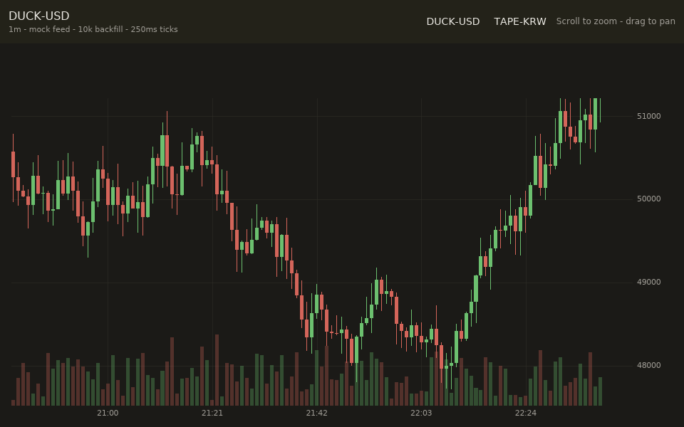

# Candles

A native lightweight financial chart written in Ice. The `candle-chart`
widget in [`crates/ui`](../../crates/ui/src/ui/candle_chart.rs) renders
OHLCV candlesticks, a volume histogram, price/time axes, a last-price line,
and a crosshair on an iced canvas. Grid, candles, volume, and axes live in a
cached geometry layer that is only rebuilt when the data or the visible range
changes; crosshair moves reblit that cache and redraw only the overlay.

Scroll to zoom around the cursor, drag to pan, hover for the OHLCV readout,
and switch symbols in the header. The app runs a production-shaped mock feed:
`market_connect` backfills 10k candles like a REST kline fetch, then a
detached exchange thread pushes ticks into the shared tape every 100ms —
no app message moves the market. The chart repaints on its own live beat
(the LiveSurface scheduling idea inside the canvas program), so ticks never
trigger an app update or view rebuild; a relaxed 500ms subscription samples
the tape for the header readout only. Measured: one Elm tick cycle
(update + whole-view rebuild, excluding tree diff and layout) costs 16us in
this small app and grows with app size, while the beat's repaint stays ~2us
flat — reproduce with
`cargo test -p candles-example --release perf::bench_tick_cycle -- --ignored --nocapture`. The tape
lives behind one shared lock (`SharedCandles`) that the subscription mutates
in place and the chart locks briefly per frame — no candle data is ever
copied per tick, per frame, or across the Ice boundary, and history is
capped at 100k candles with chunked eviction.

```bash
cargo run -p candles-example
cargo test -p candles-example
```

To render the authored Ice test headlessly and capture a screenshot:

```bash
ICE_TEST_ARTIFACT_DIR=target/candles-evidence \
  cargo test -p candles-example __ice_tests::candles_smoke -- --exact --nocapture
```

The capture lands in `target/candles-evidence/candles_smoke/` as `ready.png`
plus a `ready.json` with geometry, paint, and accessibility evidence.



## Performance

Frame-build cost of the widget at 1280x720, measured headlessly on the
tiny-skia backend in release mode (geometry recording; compositing is
bounded by viewport pixels for any chart):

| candles | view | static-layer rebuild | cached frame |
| ------: | :-- | ---: | ---: |
| 1k - 1M | last 120 | ~85us | ~2us |
| 1k - 1M | all visible | 600-900us | ~2us |

Every per-frame cost is bounded by plot width, not dataset size: the cached
(per cursor move) frame is memoized flat, and rebuilds run on an incrementally
maintained summary pyramid — per-pixel column aggregation and autoscale are
O(width x log candles) range queries, prefix sums answer volume/SMA in O(1),
and a tick updates only its block path in O(log). Memory cost: ~2 f64 per
candle. Reproduce with:

```bash
cargo test -p ducktape-ui --release --features candle-chart,tiny-skia,x11 \
  --lib candle_chart::tests::bench_frame_costs -- --ignored --nocapture
```

## Using the widget outside this workspace

`candle-chart` is a plain Rust widget behind a cargo feature; no `.ice`
sources from `crates/ui` are involved, because the extern block below lives in
your app. Until the first crates.io release, depend on the repository directly
and keep the crates on one revision (iced stays pinned to `=0.14.0`):

```toml
[dependencies]
iced = { version = "=0.14.0", features = ["smol"] }
ducktape-ui = { git = "https://github.com/byeongsu-hong/ducktape-ui", features = ["candle-chart"] }
ui-lang = { git = "https://github.com/byeongsu-hong/ducktape-ui" }
ui-lang-runtime = { git = "https://github.com/byeongsu-hong/ducktape-ui" }

[build-dependencies]
ui-lang-build = { git = "https://github.com/byeongsu-hong/ducktape-ui" }
```

Then copy this example's three-file recipe: the adapter module that re-exports
`Candle`/`CandleHit` and wraps `candle_chart(...)` in a component fn
([`src/market.rs`](src/market.rs)), the extern block declaring it
([`src/ui/extern/market.ice`](src/ui/extern/market.ice)), and the
`extern chart(candles) -> candle_hovered _` call site
([`src/ui/app.ice`](src/ui/app.ice)).

## Boundary

The Ice/Rust boundary is one extern block
([`src/ui/extern/market.ice`](src/ui/extern/market.ice)): an opaque
`MarketFeed` handle constructed once in top-level app state by a retained-
identity `sync` extern, a `subscription` extern that emits lightweight `Tick`
notices (revision, last price, direction), two `pure` formatting helpers, and
one `component` adapter that renders the chart from the shared tape. Candles
themselves never cross into Ice; the `Tick` notice is the Elm-side invalidation
signal and the header's live price.
