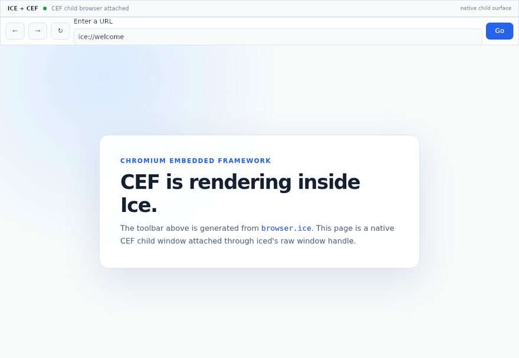
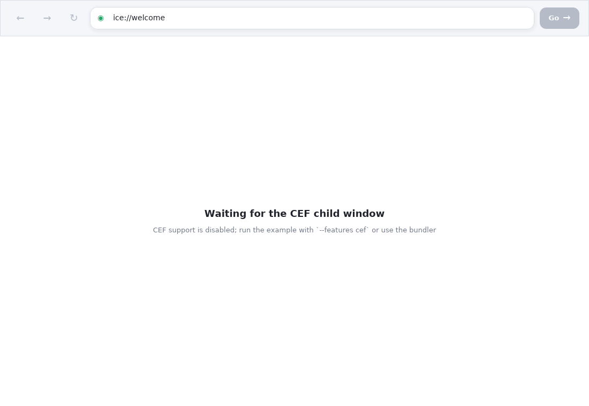
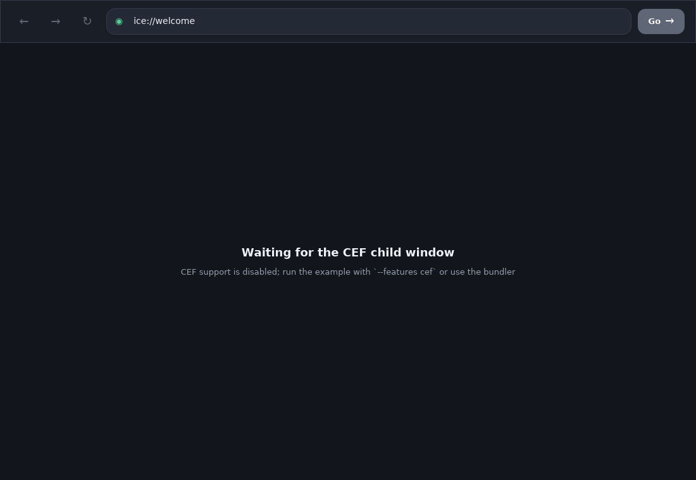

# CEF browser in an Ice app

This example embeds Chromium Embedded Framework as a native child of the iced
window. Ice owns the 68-pixel application chrome, address state, and navigation
handlers; Rust owns CEF initialization, message-loop integration, and the
native-window boundary.



The Ice-owned chrome follows the system theme:

| Light | Dark |
| --- | --- |
|  |  |

CEF is opt-in because its binary distribution is large. Build and stage the app
with the included bundler:

```sh
cargo run -p browser-example --features cef --bin bundle-cef-browser
```

The command prints the staged executable or macOS app path. Add `-- --release`
for a release bundle. On Linux, iced is deliberately built with X11 only because
CEF's windowed child embedding requires an X11 parent handle.

Run both the bundler and the staged app as your normal user; this example has no
sudo, elevation, installer, or system-wide setup path. Each run uses a private
temporary CEF profile and removes it after a clean shutdown. Credential saving,
automatic sign-in, passkeys, and the Web Authentication API are disabled. Linux
forces Chromium's local `basic` password backend instead of GNOME Keyring or
KWallet. On macOS, the main app and every CEF helper use Chromium's mock
keychain instead of accessing the user's Keychain; the generated app bundles
also omit the public-key credential usage description and add no Keychain
entitlements.

macOS uses CEF's external message-pump callback to enqueue the requested work on
the system main dispatch queue. Iced therefore keeps its stock event loop; no
private `iced_winit` runner or patched Iced crate is required.

The initial `ice://welcome` address is resolved by the Rust boundary to an
in-memory HTML page, so the first render does not depend on network access.
Replace it in the Ice-owned address bar with any HTTP(S) URL.

For repeated local builds, cef-rs recommends exporting a shared CEF directory
and setting `CEF_PATH`; otherwise its build script downloads CEF into Cargo's
build directory. The matching runtime library path must also be configured when
running the unstaged binary directly. See the
[cef-rs setup guide](https://github.com/tauri-apps/cef-rs#usage).

The window is intentionally fixed at 1100×760. Resizing a platform CEF child
requires platform window APIs, while this workspace forbids unsafe Rust. A
production resizable integration can isolate those calls in a separately
audited platform crate or use CEF off-screen rendering and forward input events.
