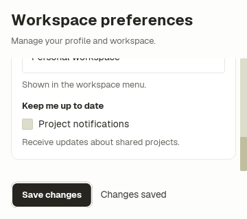
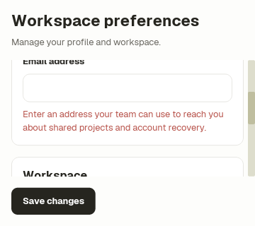

# Workspace preferences

A compact settings screen built from Ice's default `PageHeader`, `Form`,
`FormSection`, `TextField`, and `Field` components. Profile, workspace and
notification edits use the existing local save handler; nothing is persisted
or sent to a service.

```sh
cargo run -p settings-example
cargo test -p settings-example
```

The heading and Save changes footer sit outside the bounded Form. At 960×820
and 360×320, Save stays visible while fields scroll, including the final
notification control. Success feedback shares the footer row, preserving the
form's height and reading position.

The form has a 640-pixel maximum content width, 16-pixel outer padding, and
compact section spacing. The workspace input overrides only the default
component's radius (4 pixels) and padding (14 pixels); native editing, focus,
accessible naming and keyboard navigation remain intact. Its deliberately long
label wraps. The optional heading explanation can be omitted with the
`empty_explanation` preset.

The authored tests exercise native Iced layout, wheel scrolling, text editing,
Tab/Space/Enter navigation, wrapped email feedback, and successful correction
without losing other edits. Captures pin scale 1, en-US, Linux and reduced motion.

```sh
ICE_TEST_ARTIFACT_DIR="$PWD/examples/settings/screenshots" \
  cargo test -p settings-example -- --nocapture
cargo ice inspect examples/settings/src/ui/app.ice \
  --viewport 960x820 --theme light --scale 1 --locale en-US \
  --platform linux --reduced-motion --name wide
```





