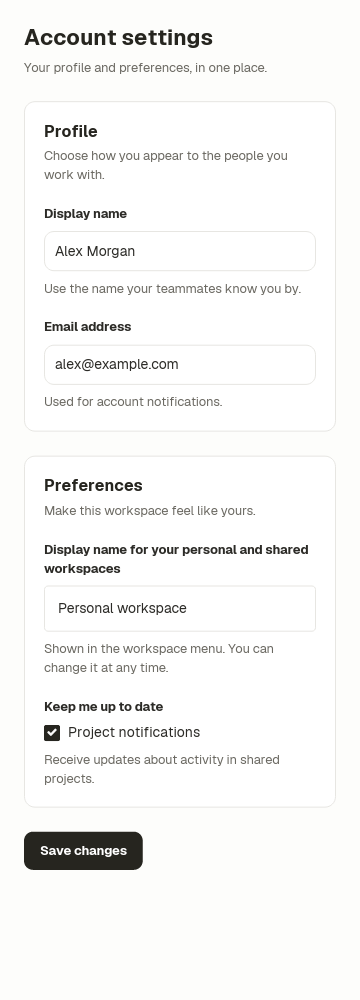
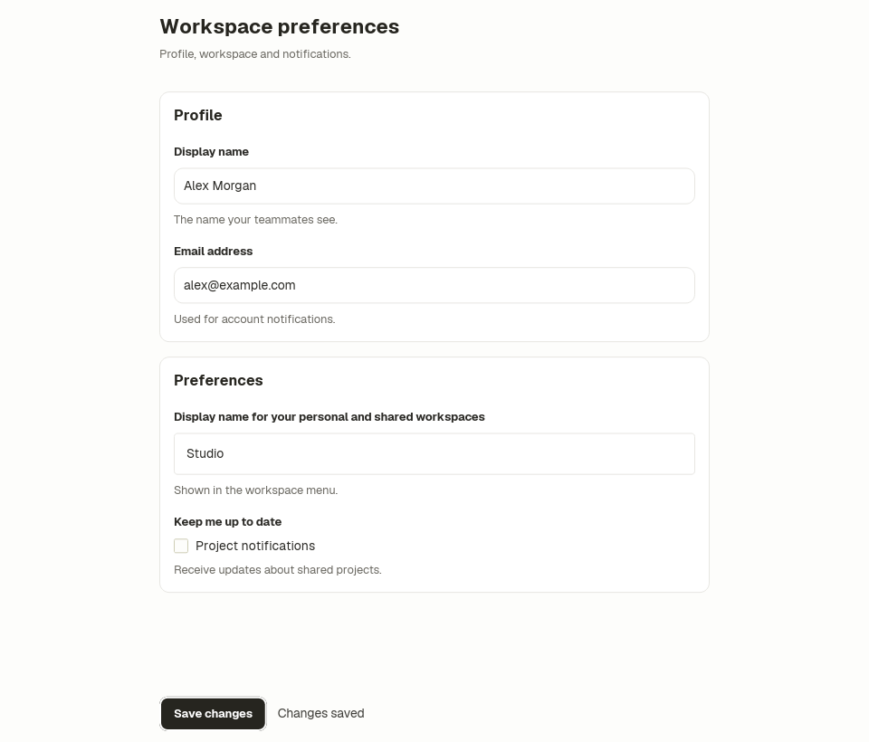
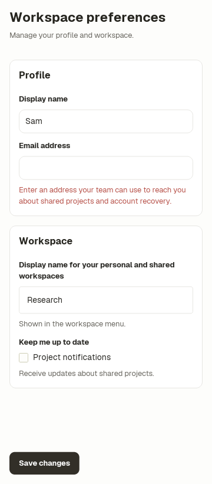

# Settings form

A complete settings screen built from the default Ice component library. The
application supplies labels, bound values, help text and handlers; Form owns
scrolling and readable content width, and FormSection/TextField supply the
shared spacing and control treatment.

Start here for a default-styled form. For list/detail, dialog or collection
screens, use the [screen authoring guide](../../docs/ui-authoring.md). This form
scrolls its Save action with its fields; the guide also links the existing
composition that keeps Save visible in a short window.

```sh
cargo run -p settings-example
cargo test -p settings-example
```

The workspace-name input changes only `radius` and `padding`. It retains the
same native input, binding, accessible name and focus behavior. The notification
row uses Field's content slot to supply a different native control. Validation
messages and saving are application-owned; this example does not persist data
or validate an email address against a service.

Form defaults to a 640 logical-pixel maximum outer content width and 24-pixel
padding. Labels and descriptions stack and wrap at the available width. This
predictable single-column layout works at 360 pixels without breakpoint code.
It remains a desktop example, not a mobile-platform support claim.

Capture the authored tests:

```sh
ICE_TEST_ARTIFACT_DIR="$PWD/examples/settings/screenshots" \
  cargo test -p settings-example -- --nocapture
```

The wide, narrow and error tests pin scale 1, en-US, Linux and reduced motion.
They cover 360×1000 and
960×1000 viewports, long labels, multiline error messages and customized input.






