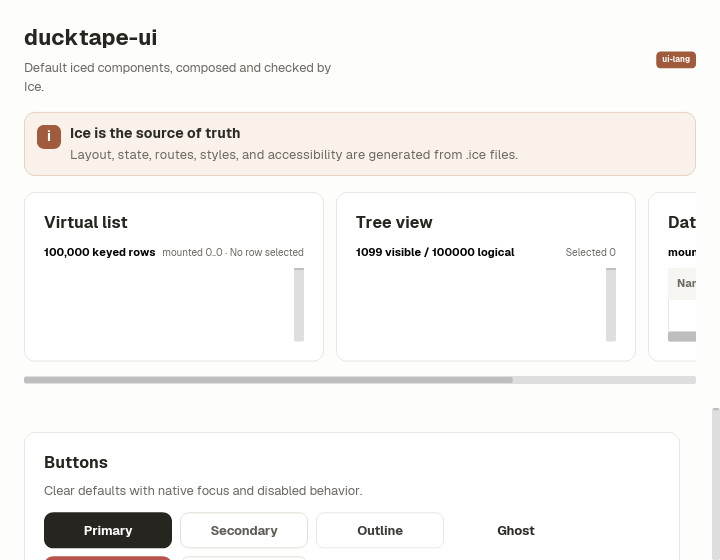

# Ice component showcase

For an application screen, use the [small composition examples](../../docs/ui-authoring.md#choose-the-closest-working-composition)
for forms, list/detail, dialogs and collections. Each entry identifies its
state/layout owner and a focused command; the full catalog below is for browsing.

Run the complete default component catalog with:

```sh
cargo run -p showcase
```

The catalog uses a paired grid at the default window size and stacks every
section into one column at the 720-pixel minimum width.

The `Retained data` screen contains the 100,000-row `VirtualList`, `TreeView`,
and 100,000-by-16 `DataGrid` without pinning them above the component catalog.
Each retained collection still owns its scroll axes and is never nested in the
catalog scrollable. At the 720-pixel minimum width, the three regions keep a
readable minimum width inside a horizontal feature strip.
The first-class `log_timeline_native_boundary` test exercises the separate
100,000-row append-only `LogTimeline`: moving into history pauses tail follow,
an append increments unread state, and an explicit resume returns to the live
edge. It deliberately reuses `VirtualList` rather than the variable-height
catalog `MessageScroller`.





The [native card collection example](tests/cases/ui/grid_collection.ice) uses
minimum-cell columns with 4:3 cards. It covers narrow windows, odd rows and
custom spacing/insets; [its rendered evidence](screenshots/grid-collection/README.md)
includes the failing before captures and exact reproduction command.
