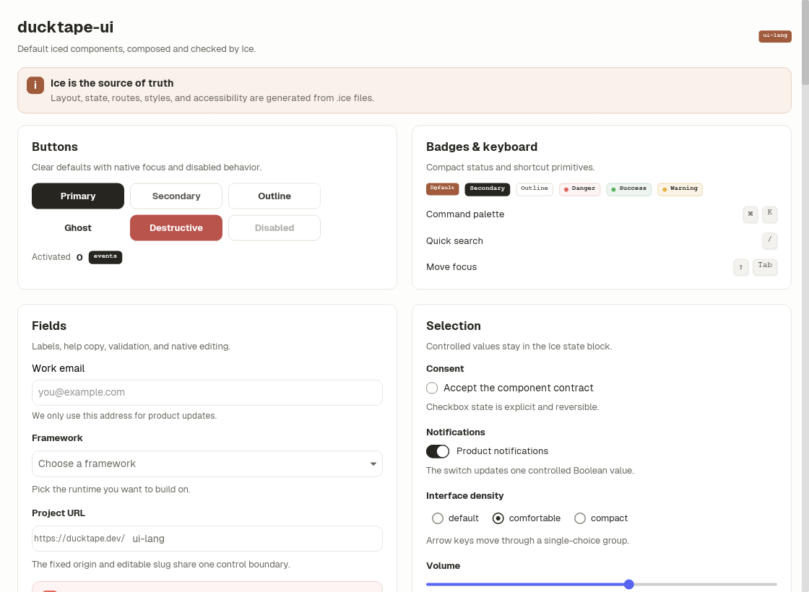
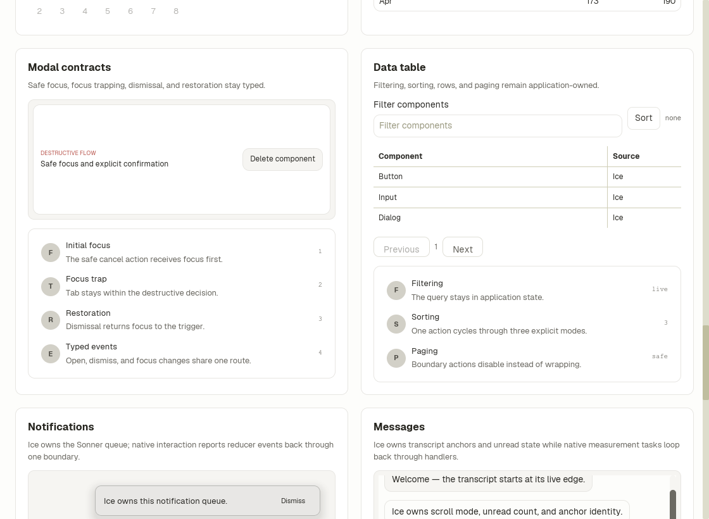
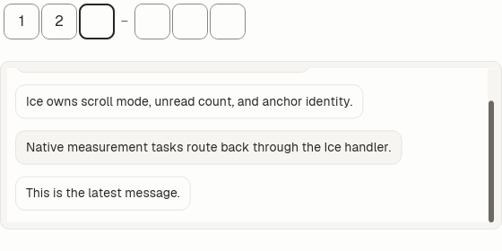
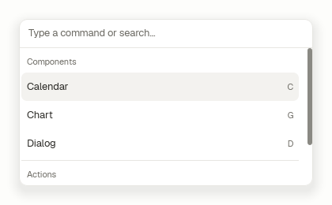
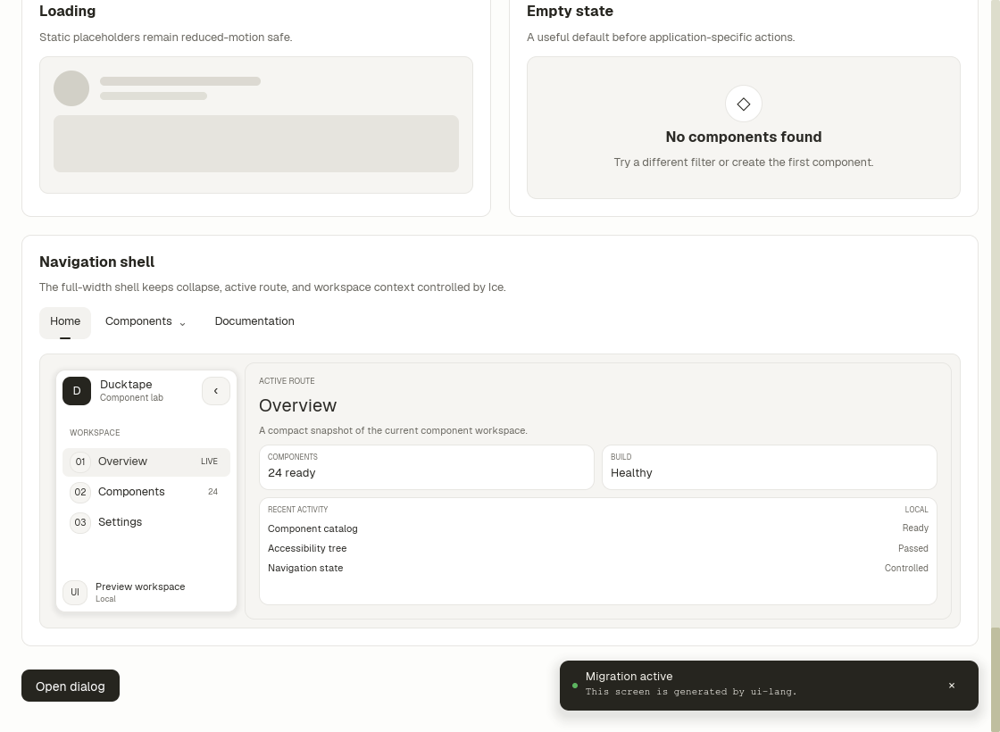
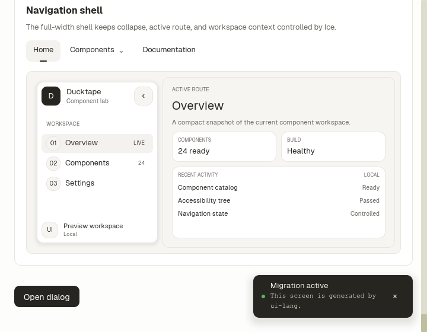

# Ice component showcase

Run the complete default component catalog with:

```sh
cargo run -p showcase
```

The catalog uses a paired grid at the default window size and stacks every
section into one column at the 720-pixel minimum width.












