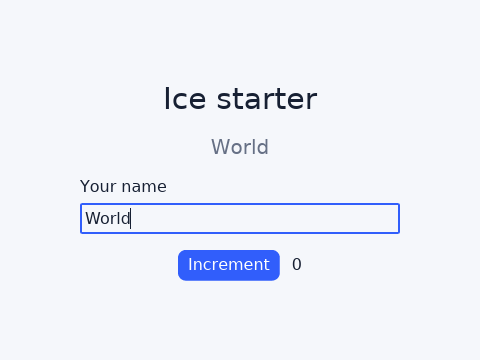

# Ice starter

This is the smallest runnable workspace application that keeps the complete
Ice delivery path visible: `build.rs` compiles `src/ui/app.ice`,
`ui_lang::include_app!` includes the generated program, and the authored Ice
test drives the real headless application.



```bash
cargo run -p ice-starter
cargo test -p ice-starter
cargo ice check
```

To render the authored test and inspect its source-mapped native evidence:

```bash
ICE_TEST_ARTIFACT_DIR=target/starter-evidence \
  cargo test -p ice-starter __ice_tests::starter_flow -- --exact --nocapture
```

When run from the workspace root, the capture is written below
`target/starter-evidence/starter_flow/` as `ready.png` and `ready.json`. The
JSON includes the capture source, resolved theme, geometry, paint output, and
accessibility snapshot used by the test.

Copy the package when starting another application inside this repository and
keep its workspace dependencies. After the first crates.io release, an external
copy can replace those entries with the lockstep released versions:

```toml
[dependencies]
ui-lang = "=0.1.0"
ui-lang-runtime = "=0.1.0"

[build-dependencies]
ui-lang-build = "=0.1.0"
```

An external copy is its own workspace, so also add the dev-loop stanza to the
workspace-root `Cargo.toml` (see "Fast dev loop for applications" in the
repository README — the Ice compiler runs as your build script on every
`.ice` edit and build scripts default to opt-level 0):

```toml
[profile.dev.build-override]
opt-level = 2
```

Leave the app crate at the default `opt-level = 0`; the generated
`__ice_view_fits_default_stack` contract is the gate that keeps that safe.

Those registry coordinates are the release layout, not a claim that `0.1.0` is
already published. `tests/downstream-app` remains the release gate: CI extracts
the actual `.crate` archives and builds that fixture outside this workspace.
The starter instead keeps the authored build/include/test path small enough to
copy and read.

The starter has no `ui-lang-components` or showcase dependency, and its Ice graph has
no repository-relative import. Its local `theme.ice` import is compiled through
the same `ui-lang-build` graph as a downstream multi-file application.
