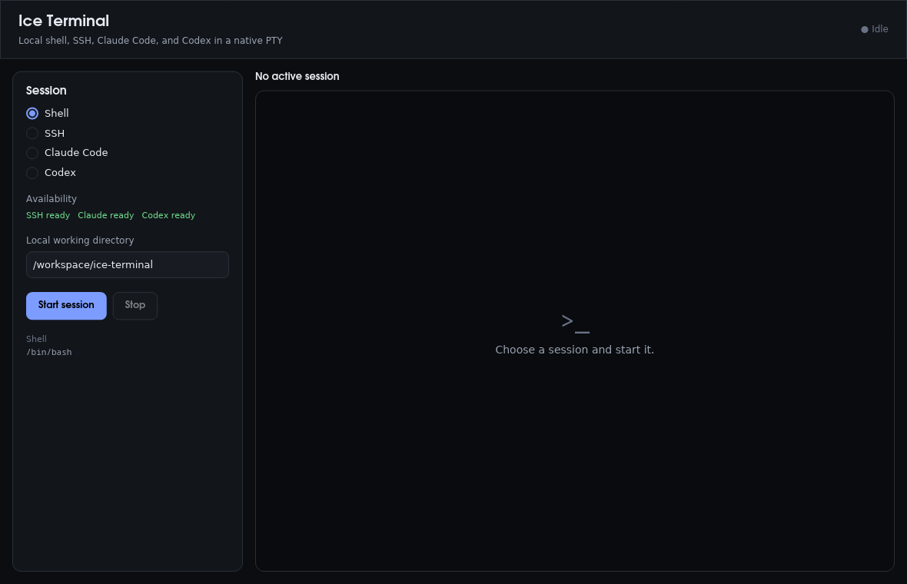

# Ice Terminal example

This example embeds a native terminal emulator behind Ice's typed Rust
boundary. It can launch the local shell, OpenSSH, Claude Code, or Codex in a
real PTY with ANSI colors, alternate-screen applications, keyboard and mouse
input, selection, clipboard bindings, scrolling, and resize propagation.

```bash
cargo run -p terminal-example
```

`ssh`, `claude`, and `codex` are discovered on `PATH`. The SSH field accepts
either `user@host` or a quoted command such as
`ssh -p 2222 "user@host"`; arguments are parsed and passed directly without a
shell. Claude Code and Codex inherit the parent process environment, so their
normal authentication and configuration continue to apply.

The launcher keeps its terminal palette for native form controls even when the
system theme is light:



The Ice layer owns the launcher form and session status. `src/terminal.rs`
owns process creation and wraps `iced_term` as an `extern component` plus an
`extern subscription`; no PTY handles or terminal protocol bytes cross into
Ice state. Each new session also receives a fresh terminal view state, so PTY
dimensions propagate correctly when switching between shell, SSH, Claude Code,
and Codex.
