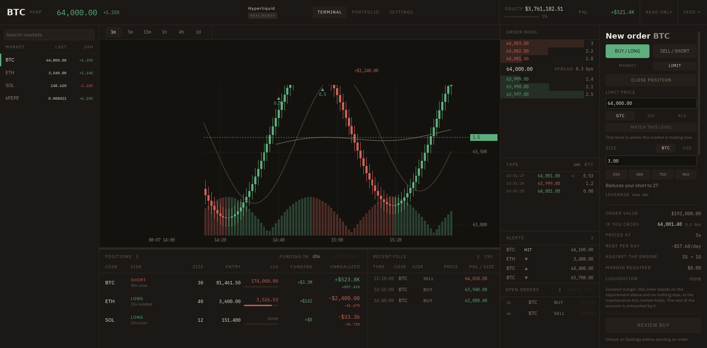
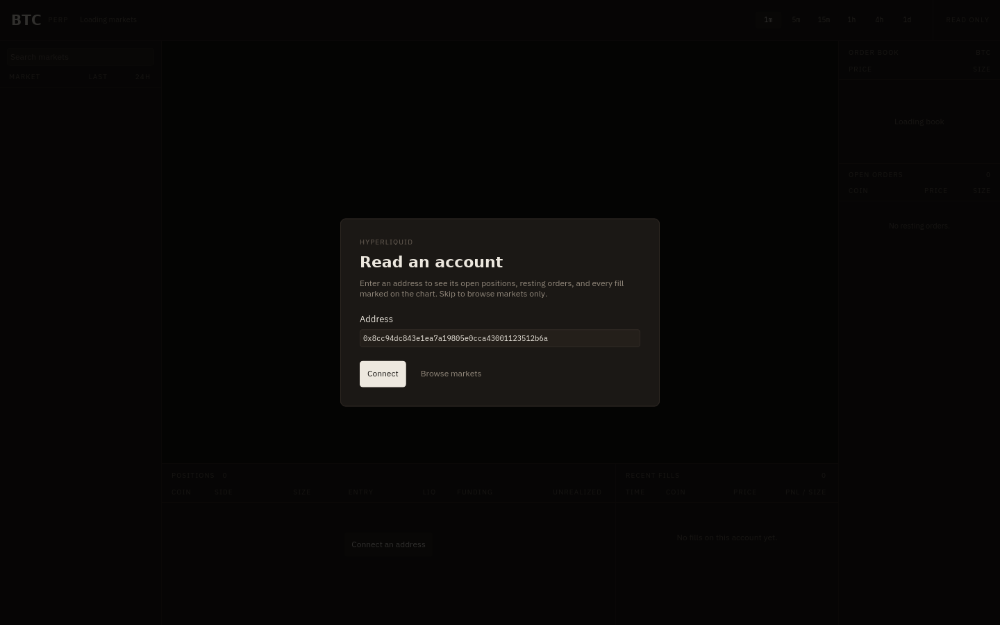

# Trading

A live Hyperliquid terminal written in Ice: the perpetuals list, candles and
the order book for the selected market, and — for any address you point it at
— that account's open positions, resting orders, recent fills, and every one
of those fills marked on the candle it landed in.

```bash
cargo run -p trading-example
cargo test -p trading-example
```

The app opens on an address prompt, prefilled with a well-known account so
there is something to look at on the first run. Press **Connect** to read it,
type your own, or **Browse markets** to use market data only; the positions
panel offers the prompt again if you change your mind. Browsing without one,
the three panels that need an account say so rather than reporting that the
account has nothing in it.

An address is checked before it is sent, because the exchange answers a
malformed one with a plain-text parser complaint rather than JSON — so without
the check, a typo reads as "Hyperliquid sent bad JSON", the one error that
blames the exchange for something you just typed.



## Design

The screen is an instrument panel, so it is set like one. Every figure is
Monoplex KR and every word is IBM Plex Sans KR — the same skeleton drawn twice,
one monospaced so a column of prices aligns on its digits, one proportional for
prose. The ground is a warm ink-black rather than the blue-black every exchange
ships, and the two money colours are a ledger green and an oxide red: printer's
inks, not phosphor. Nothing else on screen — no button, border, tab, or rule —
is allowed to be green or red, so long and short read at a glance.

The one thing this layout gives you that an exchange table does not is the
**risk rail** under each liquidation price: a bar showing how far the mark has
travelled from your entry toward the cliff. Distance to liquidation is the
number a leveraged position actually turns on, and it is the one number every
table makes you compute. Here it is a length.

The same rail runs under the equity figure, because cross positions do not die
one at a time: the account goes when its equity falls under the maintenance
requirement the margin engine holds against it. That bar is how much of the
equity the requirement has already claimed — empty with nothing open, full at
the call. Two rails, one reading, one for the position and one for everything.

That one carries its share as a number beside it as well as a length. The
position rail can be a bare bar because everything it measures — the entry, the
mark, the liquidation price — is written out in the row beneath it, so a reader
who cannot see the bar can still do the subtraction. Nothing else on screen
carries the maintenance requirement, so a bar alone would be its only copy, and
a bar has no accessible value.

The tape's header carries which side is crossing, weighted by size. The same
price with buyers taking it and with sellers hitting it are two different
markets, and that is not something the price alone says.

The **tape** under the book is everybody's trades rather than this account's:
the socket was already open and one more subscription costs nothing, so the
panel that tells you whether anything is happening at all is close to free.

A print is checked against the market on screen before it is folded in, the
same way a pushed candle is: switching markets clears the tape, but a message
already in flight for the market you just left arrives after that and would
otherwise read as this one's.

It reads the way the market traded rather than the way the wire reported. One
aggressing order that eats four resting orders arrives as four messages sharing
a hash — four rows would be the exchange's bookkeeping, not the market's. They
become one row, priced at what that order actually paid across the levels it
took and marked with how many it took. A sweep is the thing worth seeing, and
it is exactly what a raw message-per-row tape buries.

The tape takes whatever height the rail has left, because it is the panel that
gets better with more rows. Resting orders are few and keep a fixed slot.

A fill the account just printed is pushed onto the top of the list wearing its
side's colour, which fades over two beats and leaves the row cold. It is the
only motion on screen that is not a number changing, so it is the only thing
that can mean *something happened while you were looking elsewhere*. The
divider under the chart drags: positions and fills are worth more rows on some
days than others, and it stops at its limits rather than at the gesture: a
drag that overshoots pins to the bound instead of refusing to move.

A position row is a way back to its market. An account holding a hundred of
them has no other route to any but the one already charted.

Funding is the one figure here written to four decimals. Two is what every
other number wants, and it is exactly what funding cannot use: the hourly rate
is a hundredth of a percent on most of the exchange, so 166 of the 177 funded
markets would print the identical `+0.00%`. The header pays for those two
digits by calling volume `VOL` and open interest `OI`, which is what a book
calls them anyway, and it fits the window's own 1400pt minimum again.

The book quotes its spread in basis points rather than in dollars, because a
spread only means something against the price under it: two dollars is the
tightest market on the exchange on Bitcoin and no market at all on a coin worth
three. One number you can carry between markets beats one you have to divide
first.

## The ticket sends nothing

**NEW ORDER** on the book opens a ticket that prices an order and stops there.
It seeds the limit price from the book's mid, takes a size and a leverage held
inside what the market allows, and answers the only three questions worth
asking before an order exists: what it is worth, what it ties up, and where it
dies. The liquidation is isolated-margin arithmetic against the maintenance
requirement this market holds — a cross position dies against the whole
account instead, which is the rail under the equity figure.

Every row that does something is named by what it does, not by what it shows:
a book level announces the order it would start rather than the price it
displays, and a position row its side and size rather than its ticker. A row
carrying five figures is worth more than one of them to somebody who cannot
see the other four.

A level in the book opens it already filled: clicking an ask starts a buy at
that price, clicking a bid a sell, because the side you want is the side you
just clicked across. The size is cleared whenever it opens — 0.5 means a
different order on every market, and carrying it over is how you place one you
did not mean.

A market the app has not read yet gets no cliff quoted at all. What an order
is worth and what it ties up are multiplication and always answerable, but the
liquidation needs the venue's requirement, and treating an unknown requirement
as zero puts the cliff further from the entry than it really is. That is the
one direction a risk number must never be wrong in, so the panel says it does
not know.

Leverage is reported as it was priced rather than as it was typed. The field
takes anything; the market does not, so a 400 typed into a 5x market is held at
5 and the ticket says 5. A liquidation quoted at a leverage the panel is not
showing is the one number here that must never be wrong.

Escape closes it, and the subscription that listens for Escape exists only
while it is open. Escape with a search in the box clears the search instead,
on its own subscription with its own condition, so neither key listener exists
when there is nothing for it to do.

Nothing is signed and nothing is sent, and the panel says so in the place a
submit button would be. Sending would mean this app holding the key that signs
an EIP-712 order, which is not a thing an example should ask for. The boundary
is the interesting part: everything up to the signature is arithmetic worth
having, and the signature is where a real client starts.

The one figure in that arithmetic that is not arithmetic is the maintenance
requirement, and it belongs to the venue: Hyperliquid holds half the margin at
a market's maximum leverage, and another exchange holds something else. So the
market carries it and the ticket reads it, rather than the shared math knowing
one exchange's rule. It is stated once, next to the parser that knows whose
rule it is.

## What talks to the exchange

Everything the exchange pushes arrives on a websocket; everything it only
answers when asked goes through the `info` endpoint as a blocking `ureq` POST
moved off the UI thread with `smol::unblock`. Both live in
[`src/hyperliquid.rs`](src/hyperliquid.rs).

Two sockets, each a thread pumping into a channel that Ice consumes as a
`stream`:

| Ice stream | Subscriptions | Feeds |
| --- | --- | --- |
| `hl_market_feed` | `allMids`, `l2Book`, `activeAssetCtx`, `candle`, `trades` | every mid price, the book, the header's figures, the live candle, and the public tape |
| `hl_fill_feed` | `userFills` | a snapshot of recent fills, then each new one as it prints |

| Ice call | Request | Reads |
| --- | --- | --- |
| `hl_symbols` | `metaAndAssetCtxs` | the tradeable universe: tickers, maximum leverage, and the day's volume |
| `hl_candles` | `candleSnapshot` | 500 candles when a market or interval is opened |
| `hl_history` | `candleSnapshot` | 500 more, ending where the tape begins, when the chart is panned back that far |
| `hl_account` | `clearinghouseState` | equity, margin, open positions with PnL, ROE, leverage, and funding paid |
| `hl_orders` | `openOrders` | resting orders, listed with their age and drawn on the chart as levels |

Responses are read as `serde_json::Value` and mapped by hand, because the
exchange sends every number as a string — a derive would need a custom
deserializer per field. Prices, sizes, and PnL that are missing or unparsable
read as zero rather than failing the whole message.

Positions and resting orders are the one thing still polled, every 5s, because
Hyperliquid publishes no channel that pushes them. The universe is re-read once
a minute for the figures that move on a daily clock; the market on screen gets
its own `activeAssetCtx`, so the header is live. Both stop while the address
prompt is up (`when` conditions on the `subscribe` block, so iced drops the
timers instead of ignoring their messages), and `abort feeds` closes the
sockets with them.

Waiting five seconds to find out what a position is worth is not a position
panel, so between polls the feed values them itself. Every beat re-marks each
position at the price that just came in and moves its PnL by what the price
did — a delta, not a recomputation from the entry: the entry price the
exchange reports is an average rounded to five significant figures, and a
position of sixty million units turns that rounding into real money. The
return moves the same way, over the margin the position opened with, which is
what the exchange's own `returnOnEquity` divides by. The risk rail re-measures
against the new mark, equity moves by what the positions just made, and each
poll re-anchors all of it. What is withdrawable, what margin is tied up, and
what the maintenance requirement is stay with the poll: those are the margin
engine's answers, not arithmetic over positions. The health rail still closes
between polls, though — the requirement it measures against is fixed until the
next one, but the equity falling toward it is not.

The market feed re-reads the tape's focus on every beat, so switching markets
costs an unsubscribe and a subscribe on the socket already open rather than a
new connection. Candles are merged straight into the shared tape and never
cross into Ice: the chart repaints on its own 100ms beat, so a tick costs no
app message and no view rebuild. Everything else the feed carries is coalesced
into at most one message per beat, and each one holds the latest of everything
rather than only what changed, so a handler can assign it without asking which
kind of update it was.

A failure and a progress message share one slot under the positions header,
and a failure wins it. They are different things: "Loading candles" is the app
working and "Hyperliquid unreachable" is the app stopped, so they are separate
state and only one of them is red. The slot is also the chart's hover readout,
and that loses to both — a candle's open and close are worth less than knowing
the feed is gone.

Latency is the round trip of the socket's own ping, which needs no agreement
between our clock and the exchange's, and the ping is required anyway: a socket
that goes quiet for a minute is closed. A dropped feed clears it back to an em
dash rather than leaving the last good number in the header, because a stale
`42ms` is the panel claiming to be live while it reconnects. Only the market
feed's own failures do that; a poll that fails says so in the status line and
leaves the socket's reading alone.

`hl_candles` keeps one tape for the whole session. An empty tape backfills 500
candles and adopts the market that filled it, and the feed replaces the live
candle in place from there. Switching markets re-points the tape, and a
response — or a pushed candle — for the market you just left is dropped instead
of overwriting the one you are looking at. Panning back past the oldest candle
asks `hl_history` for the window before it, once per tape length; the chart
moves its own viewport by however many candles land in front of it, so the
screen stays on the bars it was showing.

## Marking trades on the chart

The chart is `candle-chart` from [`crates/ui`](../../crates/ui/src/ui/candle_chart.rs)
with three annotation overlays:

```rust
candle_chart_shared(tape, &chart_theme())
    .price_lines(position_lines(positions, coin))  // entry, liquidation
    .price_lines(order_lines(orders, coin))        // resting orders
    .markers(fill_markers(fills, coin))            // one glyph per fill
```

A buy is a triangle pointing up out of its fill price, a sell points down into
it, and each carries its size or, for a closing fill, what it realized. All
three are ordinary `ChartOverlay` implementations — the same extension point a
caller uses for anything the built-ins do not cover — so nothing about trading
leaks into the chart widget.

The chart is drawn by Rust and everything around it by Ice, so the palette
exists twice: as tokens in `theme.ice`, and as literals in `chart_theme`.
Nothing makes them agree, and the chart is half the screen — a drift would be
plain at runtime and invisible until then. A test reads the tokens out of
`theme.ice` and holds the chart to them.

## Boundary

One extern block
([`src/ui/extern/hyperliquid.ice`](src/ui/extern/hyperliquid.ice)): an opaque
`Tape` handle, five async fetches and two streams that return checked structs,
a set of `sync` formatters and list folds, and one `component` adapter that
renders the chart from the tape plus the current fills, positions, and orders.
Candles never cross into Ice; everything the panels list does, because the
panels list it — and only that. A struct crossing the boundary carries the
fields the screen reads and no others, so the extern block stays a description
of the interface rather than of the exchange.

The chart adapter reports back one `ChartSignal`: the candle under the cursor,
and whether the view has reached the oldest candle loaded. One handler reads
the first and guards on the second, so hovering and paging share a route
without the chart knowing what an exchange is.

## Tests

`cargo test -p trading-example` parses recorded payloads for every response
shape and checks the arithmetic they feed: the tape merge and its market
guard, how one aggressor's prints fold into one row, the book's depth and
spread, how fills stack and cool, the valuation between polls, and both rails.
It prices the ticket against the closed form of the liquidation it quotes, and
against the cases where it must refuse to quote one at all.

It also drives the app. The address prompt refuses a malformed address; the
ticket takes a price and a size, prices them, and closes on Escape; a search
survives being typed and clears on Escape; the panels that need an account say
so when there is none; and a failure outranks the progress line it shares a
slot with. None of those reach the network, so they run wherever the rest does.
One test reads the palette out of `theme.ice` and holds the chart to it, because
the chart is drawn in Rust and would otherwise drift in silence.

Two tests talk to the live exchange — one per endpoint shape, so the subscription names and payloads
are checked against Hyperliquid rather than against a recording, and the
account's own marks are fed back through the valuation to prove they are a
fixed point of it — and are opt-in:

```bash
cargo test -p trading-example -- --ignored
```

To capture the prompt as evidence:

```bash
ICE_TEST_ARTIFACT_DIR=target/trading-evidence \
  cargo test -p trading-example __ice_tests::trading_gate_gates_the_app -- --exact --nocapture
```


