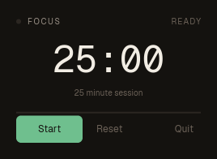
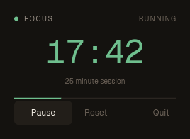

# Tray

A focus timer that lives in the menu bar: the minutes count down beside the
icon whether or not anything is open, and the panel under the icon is the
whole program.

```bash
cargo run -p tray-example
cargo test -p tray-example
```

There is no main window. `daemon` starts without one and stays alive after
every window closes, which is exactly what a menu bar app is — the icon is the
program, and the panel is a window it opens on demand.

```ice
daemon Tray
  tray
    icon-rgba "icon.rgba" 22 22
    icon-template true
    label clock(remaining)
    popover panel
  window panel
    size 268 196
    decorations false
```

`label` is an expression over state, so the menu bar reads `17:42` and keeps
counting because a `subscribe every 1s` moves the state — nothing pushes text
at the icon. That is the whole point of the tray being a language feature
rather than a handle you poke: the status item is another thing the view
layer keeps in step. `icon-template` hands macOS a black
and alpha image to recolour, so the icon reads on a light and a dark menu bar
from the one file. The icon itself is raw RGBA — `width × height × 4` bytes,
checked when the app is compiled — because an image codec is not something a
UI language needs to own.

`popover panel` is the whole interaction: the left click opens that window
under the icon, a second click closes it, and clicking anywhere else dismisses
it. The view knows which window it is drawing through the read-only `popover`
binding, so an app with a main window can answer for both from one view; here
there is only the panel, so it never has to ask.

## Tests

`tray click` presses the status item the way a person does, so the panel's
tests walk the same open-and-anchor path as the real thing rather than a
fixture standing in for it.

```ice
test tray_panel_opens_from_the_status_item
  viewport 268 196
  tray click
  expect text "25:00"
  capture panel
```




Everything above is macOS. On other targets the same source compiles and runs
against no-op stubs — the panel simply never opens. `ICE_TRAY_DEBUG=1` traces
the native boundary when a status item looks inert.
